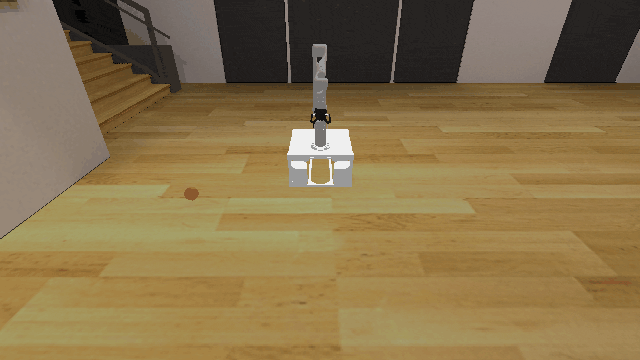
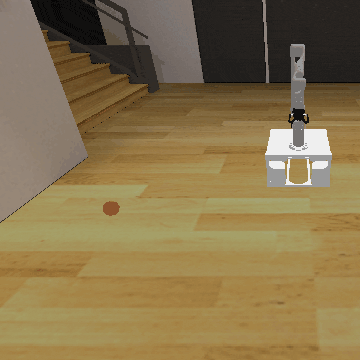

# BaseMotion3D

**Random Action Stats**: Total Reward: -25.00, Success: No, Steps: 25

## Description
A very simple environment where only base motion planning is needed to reach a goal.

## Available Variants
This environment has only one variant.

- [`kinder/BaseMotion3D-v0`](variants/BaseMotion3D/BaseMotion3D.md) (v0)

## Initial State Distribution

## Example Demonstration

## Observation Space
*(Differs per variant, see individual variant pages)*

## Action Space
An action space for mobile manipulation with a 7 DOF robot that can open and close its gripper.

Actions are bounded relative base position, rotation, and joint positions, and open / close.

| **Index** | **Description** |
| --- | --- |
| 0 | delta base x |
| 1 | delta base y |
| 2 | delta base rotation |
| 3 | delta joint 1 |
| 4 | delta joint 2 |
| 5 | delta joint 3 |
| 6 | delta joint 4 |
| 7 | delta joint 5 |
| 8 | delta joint 6 |
| 9 | delta joint 7 |
| 10 | gripper open/close |

The open / close logic is: <-0.5 is close, >0.5 is open, and otherwise no change.

## Rewards
The reward is -1 per timestep to encourage reaching the goal quickly.

## References
This is a very common kind of environment. The background is adapted from the [Replica dataset](https://arxiv.org/abs/1906.05797) (Straub et al., 2019).
