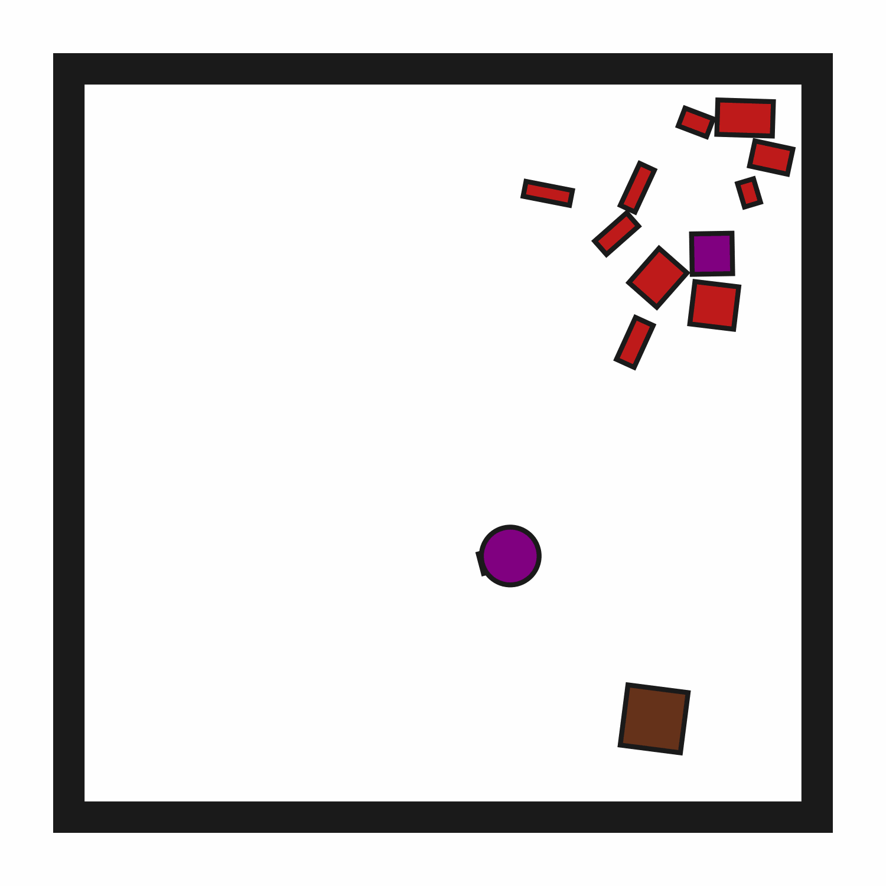
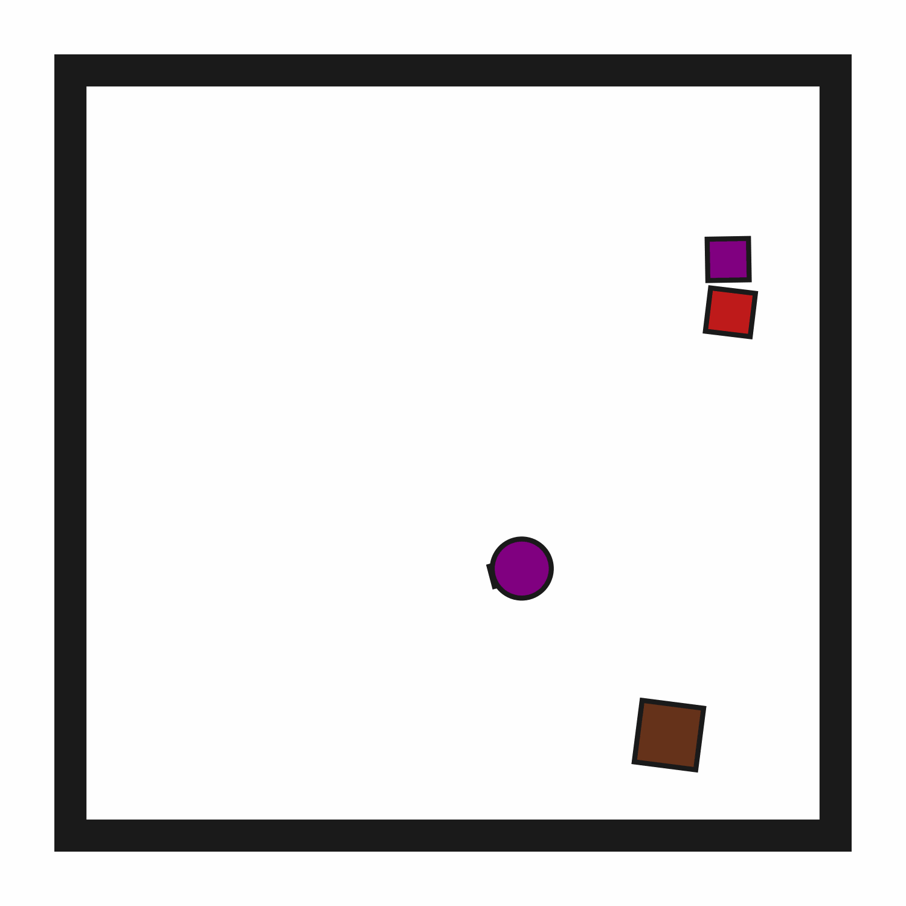

# ClutteredRetrieval2D

**Random Action Stats**: Total Reward: -25.00, Success: No, Steps: 25

## Description
A 2D environment where the goal is to retrieve a target block and place it inside a target region.

The target block may be initially obstructed.

The robot has a movable circular base and a retractable arm with a rectangular vacuum end effector. Objects can be grasped and ungrasped when the end effector makes contact.

## Available Variants
The number of obstructions differs between environment variants. For example, ClutteredRetrieval2D-o5 has 5 obstructions.

- [`kinder/ClutteredRetrieval2D-o1-v0`](variants/ClutteredRetrieval2D/ClutteredRetrieval2D-o1.md) (o1)
- [`kinder/ClutteredRetrieval2D-o10-v0`](variants/ClutteredRetrieval2D/ClutteredRetrieval2D-o10.md) (o10)
- [`kinder/ClutteredRetrieval2D-o25-v0`](variants/ClutteredRetrieval2D/ClutteredRetrieval2D-o25.md) (o25)

## Initial State Distribution

## Example Demonstration

## Observation Space
*(Differs per variant, see individual variant pages)*

## Action Space
The entries of an array in this Box space correspond to the following action features:
| **Index** | **Feature** | **Description** | **Min** | **Max** |
| --- | --- | --- | --- | --- |
| 0 | dx | Change in robot x position (positive is right) | -0.050 | 0.050 |
| 1 | dy | Change in robot y position (positive is up) | -0.050 | 0.050 |
| 2 | dtheta | Change in robot angle in radians (positive is ccw) | -0.196 | 0.196 |
| 3 | darm | Change in robot arm length (positive is out) | -0.100 | 0.100 |
| 4 | vac | Directly sets the vacuum (0.0 is off, 1.0 is on) | 0.000 | 1.000 |

## Rewards
A penalty of -1.0 is given at every time step until termination, which occurs when the target block is inside the target region.

## References
Similar environments have been considered by many others, especially in the task and motion planning literature, e.g., "Combined Task and Motion Planning Through an Extensible Planner-Independent Interface Layer" (Srivastava et al., ICRA 2014).
