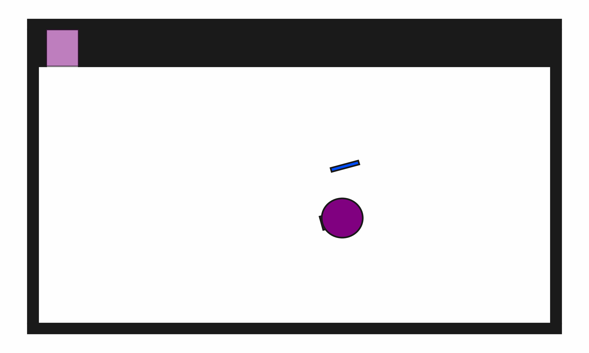

# ClutteredStorage2D

**Random Action Stats**: Total Reward: -25.00, Success: No, Steps: 25

## Description
A 2D environment where the goal is to put all blocks inside a shelf.

The robot has a movable circular base and a retractable arm with a rectangular vacuum end effector. Objects can be grasped and ungrasped when the end effector makes contact.

## Available Variants
The number of blocks differs between environment variants. For example, ClutteredStorage2D-b1 has 1 block, while ClutteredStorage2D-b15 has 15 blocks.

- [`kinder/ClutteredStorage2D-b1-v0`](variants/ClutteredStorage2D/ClutteredStorage2D-b1.md) (b1)
- [`kinder/ClutteredStorage2D-b3-v0`](variants/ClutteredStorage2D/ClutteredStorage2D-b3.md) (b3)
- [`kinder/ClutteredStorage2D-b7-v0`](variants/ClutteredStorage2D/ClutteredStorage2D-b7.md) (b7)
- [`kinder/ClutteredStorage2D-b15-v0`](variants/ClutteredStorage2D/ClutteredStorage2D-b15.md) (b15)

## Initial State Distribution

## Example Demonstration

## Observation Space
*(Differs per variant, see individual variant pages)*

## Action Space
The entries of an array in this Box space correspond to the following action features:
| **Index** | **Feature** | **Description** | **Min** | **Max** |
| --- | --- | --- | --- | --- |
| 0 | dx | Change in robot x position (positive is right) | -0.050 | 0.050 |
| 1 | dy | Change in robot y position (positive is up) | -0.050 | 0.050 |
| 2 | dtheta | Change in robot angle in radians (positive is ccw) | -0.196 | 0.196 |
| 3 | darm | Change in robot arm length (positive is out) | -0.100 | 0.100 |
| 4 | vac | Directly sets the vacuum (0.0 is off, 1.0 is on) | 0.000 | 1.000 |

## Rewards
A penalty of -1.0 is given at every time step until termination, which occurs when all blocks are inside the shelf.

## References
Similar environments have been considered by many others, especially in the task and motion planning literature.
