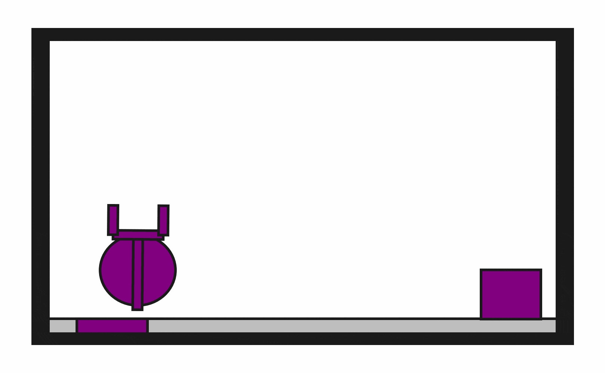
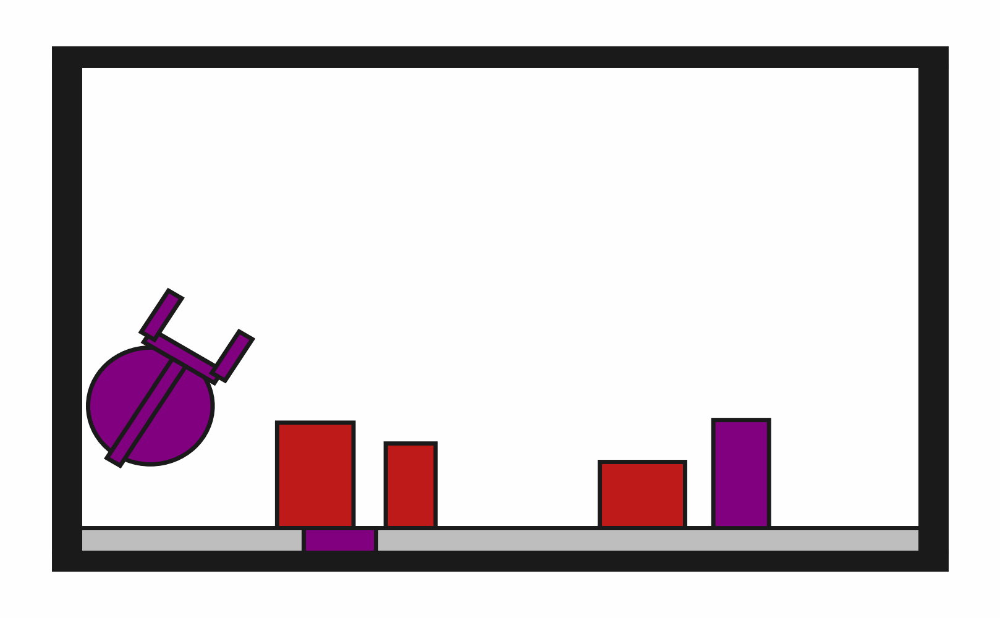

# DynObstruction2D

**Random Action Stats**: Total Reward: -25.00, Success: No, Steps: 25

## Description
A 2D physics-based environment where the goal is to place a target block onto a target surface using a two-fingered robot with PyMunk physics simulation. The block must be completely on the surface. The target surface may be initially obstructed.

The robot has a movable circular base and an extendable arm with gripper fingers. Objects can be grasped and released through gripper actions. All objects follow realistic physics including gravity, friction, and collisions.

Each object includes physics properties like mass, moment of inertia (for dynamic objects), and color information for rendering.

## Available Variants
The number of obstructions differs between environment variants. For example, DynObstruction2D-o0 has no obstructions, while DynObstruction2D-o3 has 3 obstructions.

- [`kinder/DynObstruction2D-o0-v0`](variants/DynObstruction2D/DynObstruction2D-o0.md) (o0)
- [`kinder/DynObstruction2D-o1-v0`](variants/DynObstruction2D/DynObstruction2D-o1.md) (o1)
- [`kinder/DynObstruction2D-o2-v0`](variants/DynObstruction2D/DynObstruction2D-o2.md) (o2)
- [`kinder/DynObstruction2D-o3-v0`](variants/DynObstruction2D/DynObstruction2D-o3.md) (o3)

## Initial State Distribution

## Example Demonstration

## Observation Space
*(Differs per variant, see individual variant pages)*

## Action Space
The entries of an array in this Box space correspond to the following action features:
| **Index** | **Feature** | **Description** | **Min** | **Max** |
| --- | --- | --- | --- | --- |
| 0 | dx | Change in robot x position (positive is right) | -0.050 | 0.050 |
| 1 | dy | Change in robot y position (positive is up) | -0.050 | 0.050 |
| 2 | dtheta | Change in robot angle in radians (positive is ccw) | -0.196 | 0.196 |
| 3 | darm | Change in robot arm length (positive is out) | -0.100 | 0.100 |
| 4 | dgripper | Change in gripper gap (positive is open) | -0.020 | 0.020 |

## Rewards
A penalty of -1.0 is given at every time step until termination, which occurs when the target block is completely "on" the target surface. The "on" condition requires that the bottom vertices of the target block are within the bounds of the target surface.

## References
This is a dynamic version of Obstruction2D.
