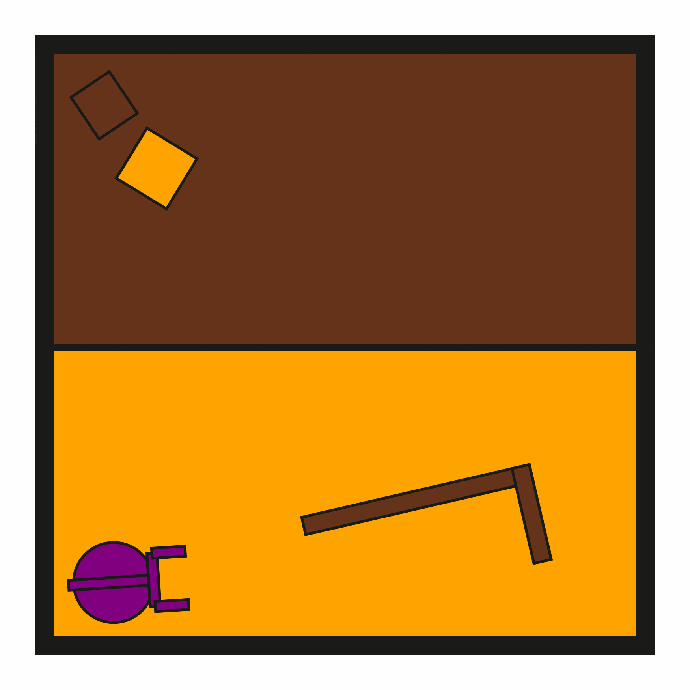
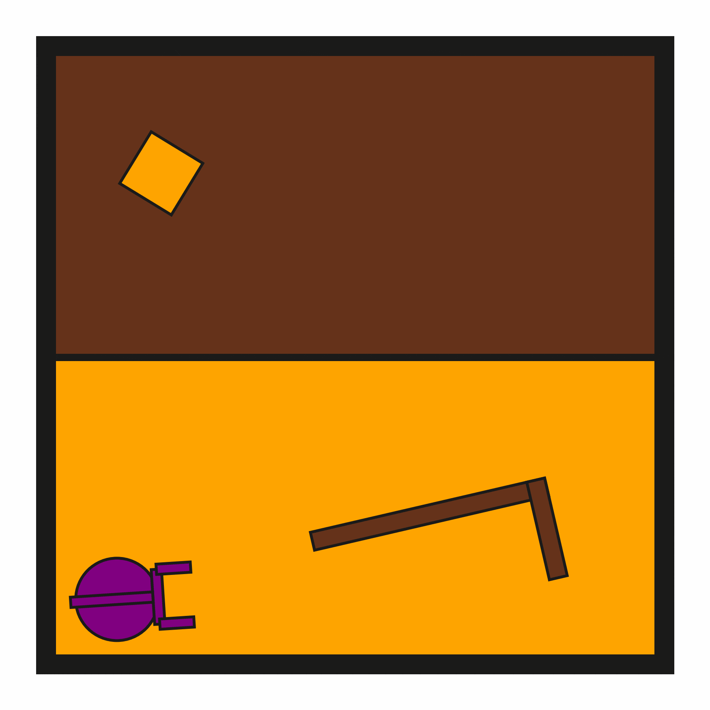
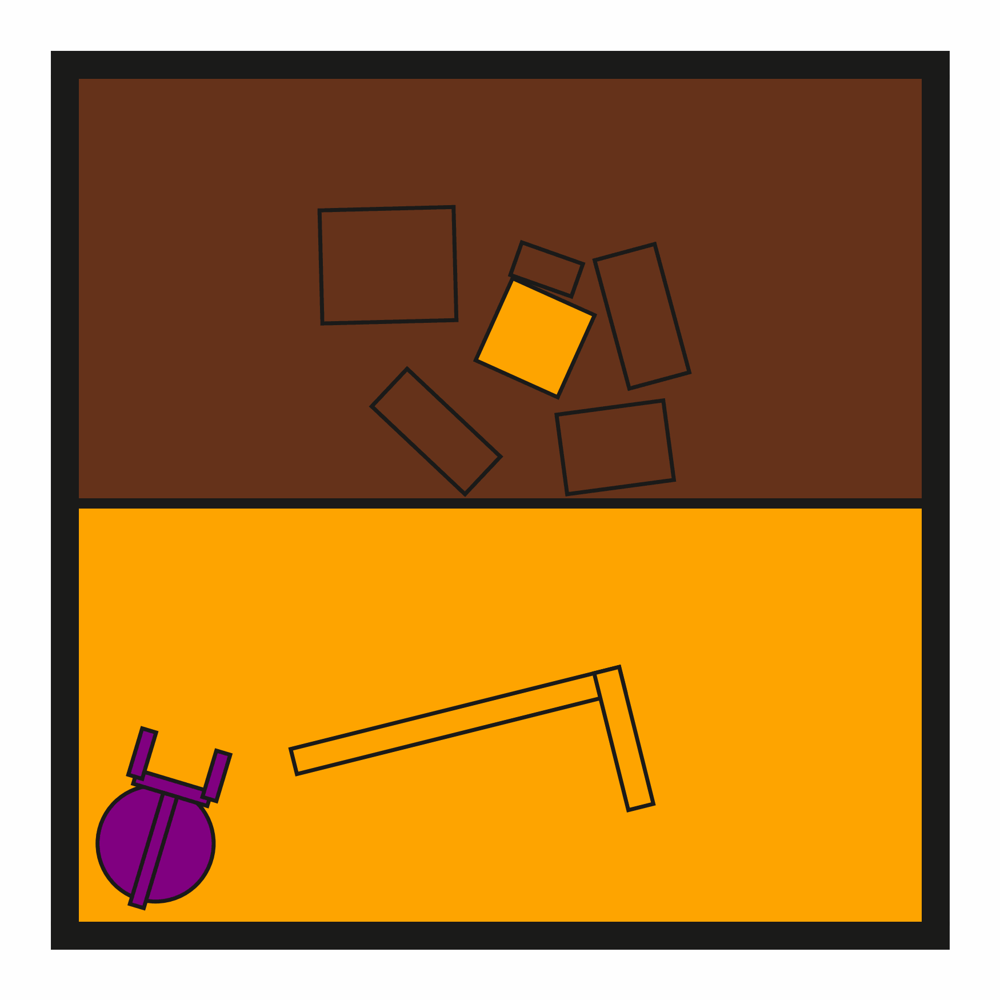

# DynPushPullHook2D

**Random Action Stats**: Total Reward: -25.00, Success: No, Steps: 25

## Description
A 2D physics-based tool-use environment where a robot must use a hook to push/pull a target block onto a middle wall (goal surface). The target block is positioned in the upper region of the world, while the middle wall is located at the center. The robot must manipulate the hook to navigate the target block downward through obstacles.

The target block is initially surrounded by obstacle blocks.

The robot has a movable circular base and an extendable arm with gripper fingers. The hook is a kinematic object that can be grasped and used as a tool to indirectly manipulate the target block. All dynamic objects follow PyMunk physics including gravity, friction, and collisions.

Each object includes physics properties like mass, moment of inertia (for dynamic objects), and color information for rendering.

## Available Variants
The number of obstructions differs between environment variants. For example, DynPushPullHook2D-o0 has no obstructions, while DynPushPullHook2D-o5 has 5 obstructions.

- [`kinder/DynPushPullHook2D-o0-v0`](variants/DynPushPullHook2D/DynPushPullHook2D-o0.md) (o0)
- [`kinder/DynPushPullHook2D-o1-v0`](variants/DynPushPullHook2D/DynPushPullHook2D-o1.md) (o1)
- [`kinder/DynPushPullHook2D-o5-v0`](variants/DynPushPullHook2D/DynPushPullHook2D-o5.md) (o5)

## Initial State Distribution

## Example Demonstration

## Observation Space
*(Differs per variant, see individual variant pages)*

## Action Space
The entries of an array in this Box space correspond to the following action features:
| **Index** | **Feature** | **Description** | **Min** | **Max** |
| --- | --- | --- | --- | --- |
| 0 | dx | Change in robot x position (positive is right) | -0.050 | 0.050 |
| 1 | dy | Change in robot y position (positive is up) | -0.050 | 0.050 |
| 2 | dtheta | Change in robot angle in radians (positive is ccw) | -0.065 | 0.065 |
| 3 | darm | Change in robot arm length (positive is out) | -0.100 | 0.100 |
| 4 | dgripper | Change in gripper gap (positive is open) | -0.020 | 0.020 |

## Rewards
A penalty of -1.0 is given at every time step until termination, which occurs when the target block reaches the middle wall (goal surface).

## References
This is a dynamic version of PushPullHook2D.
