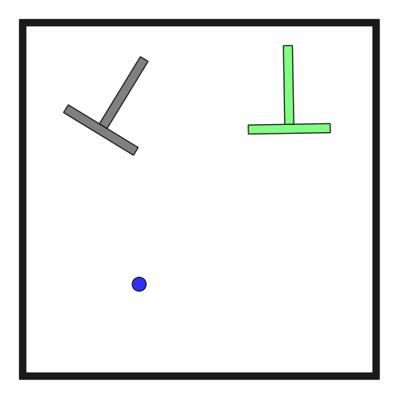

# DynPushT2D

**Random Action Stats**: Total Reward: -25.00, Success: No, Steps: 25

## Description
A 2D physics-based environment where the goal is to push a T-shaped block to match a goal pose using a simple dot robot (kinematic circle) with PyMunk physics simulation.

The T-shaped block must be positioned within small position and orientation thresholds of the goal.

## Available Variants
This environment has only one variant.

- [`kinder/DynPushT2D-t1-v0`](variants/DynPushT2D/DynPushT2D-t1.md) (t1)

## Initial State Distribution

## Example Demonstration

## Observation Space
*(Differs per variant, see individual variant pages)*

## Action Space
The entries of an array in this Box space correspond to the following action features:
| **Index** | **Feature** | **Description** | **Min** | **Max** |
| --- | --- | --- | --- | --- |
| 0 | dx | Delta x position for robot (positive is right) | -0.050 | 0.050 |
| 1 | dy | Delta y position for robot (positive is up) | -0.050 | 0.050 |

## Rewards
A penalty of -1.0 is given at every time step until the T-block is aligned with the goal pose within specified thresholds.

**Termination Condition**: The episode terminates when all of the following conditions are met:
- Position error in X: |x - x_goal| < 0.03
- Position error in Y: |y - y_goal| < 0.03
- Orientation error: |θ - θ_goal| < 8 degrees

These thresholds ensure the T-block is precisely aligned with the goal pose.

## References
This implementation is based on the Push-T environment introduced in the Diffusion Policy paper (Chi et al., 2023).
