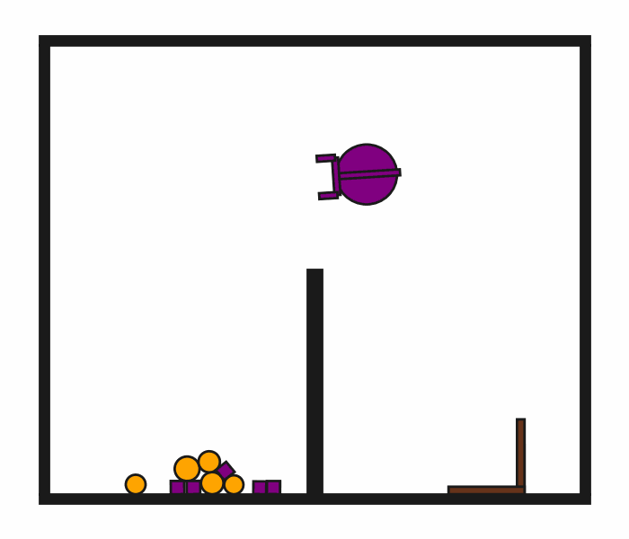
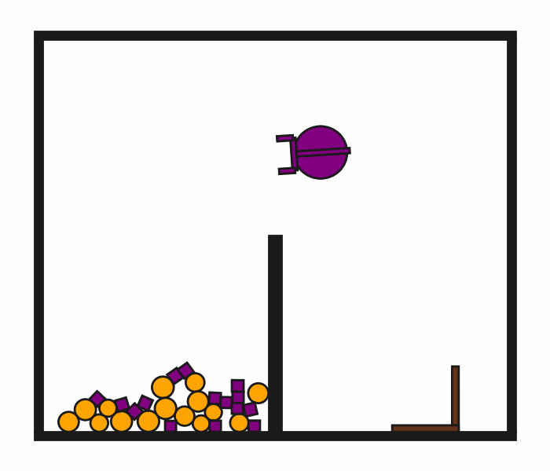

# DynScoopPour2D

**Random Action Stats**: Total Reward: -25.00, Success: No, Steps: 25

## Description
A 2D physics-based tool-use environment where a robot must use an L-shaped hook to scoop small objects from the left side of a middle wall and pour them onto the right side. The middle wall is half the height of the world, allowing objects to be scooped over it.

The robot has a movable circular base and an extendable arm with gripper fingers. The hook is a kinematic object that can be grasped and used as a tool to scoop the small objects. Small objects are dynamic and follow PyMunk physics, but they cannot be grasped directly by the robot.

All objects include physics properties like mass, moment of inertia, and color information for rendering.

## Available Variants
The number of small objects differs between environment variants. For example, DynScoopPour2D-o10 has 10 small objects, while DynScoopPour2D-o50 has 50 small objects.

- [`kinder/DynScoopPour2D-o10-v0`](variants/DynScoopPour2D/DynScoopPour2D-o10.md) (o10)
- [`kinder/DynScoopPour2D-o20-v0`](variants/DynScoopPour2D/DynScoopPour2D-o20.md) (o20)
- [`kinder/DynScoopPour2D-o30-v0`](variants/DynScoopPour2D/DynScoopPour2D-o30.md) (o30)
- [`kinder/DynScoopPour2D-o50-v0`](variants/DynScoopPour2D/DynScoopPour2D-o50.md) (o50)

## Initial State Distribution

## Example Demonstration

## Observation Space
*(Differs per variant, see individual variant pages)*

## Action Space
The entries of an array in this Box space correspond to the following action features:
| **Index** | **Feature** | **Description** | **Min** | **Max** |
| --- | --- | --- | --- | --- |
| 0 | dx | Change in robot x position (positive is right) | -0.030 | 0.030 |
| 1 | dy | Change in robot y position (positive is up) | -0.030 | 0.030 |
| 2 | dtheta | Change in robot angle in radians (positive is ccw) | -0.098 | 0.098 |
| 3 | darm | Change in robot arm length (positive is out) | -0.080 | 0.080 |
| 4 | dgripper | Change in gripper gap (positive is open) | -0.015 | 0.015 |

## Rewards
A penalty of -1.0 is given at every time step until termination, which occurs when at least 50% of the small objects have been moved to the right side of the middle wall.

## References
This is loosely inspired by the Kitchen2D environment from "Active model learning and diverse action sampling for task and motion planning" (Wang et al., 2018).
