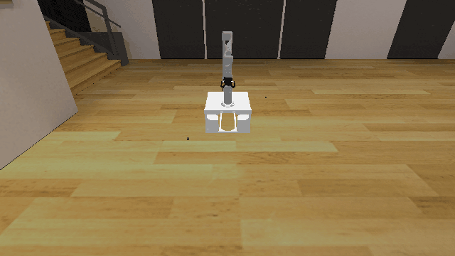
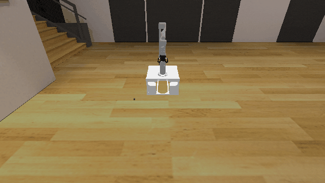

# Ground3D

**Random Action Stats**: Total Reward: -25.00, Success: No, Steps: 25

## Description
A 3D environment where the goal is to pick up a cube from the ground.

## Available Variants
The number of cubes differs between environment variants. For example, Ground3D-o1 has 1 cube, while Ground3D-o3 has 3 cubes.

- [`kinder/Ground3D-o1-v0`](variants/Ground3D/Ground3D-o1.md) (o1)
- [`kinder/Ground3D-o2-v0`](variants/Ground3D/Ground3D-o2.md) (o2)
- [`kinder/Ground3D-o3-v0`](variants/Ground3D/Ground3D-o3.md) (o3)

## Initial State Distribution

## Example Demonstration
*(No demonstration GIFs available)*

## Observation Space
*(Differs per variant, see individual variant pages)*

## Action Space
An action space for mobile manipulation with a 7 DOF robot that can open and close its gripper.

Actions are bounded relative base position, rotation, and joint positions, and open / close.

| **Index** | **Description** |
| --- | --- |
| 0 | delta base x |
| 1 | delta base y |
| 2 | delta base rotation |
| 3 | delta joint 1 |
| 4 | delta joint 2 |
| 5 | delta joint 3 |
| 6 | delta joint 4 |
| 7 | delta joint 5 |
| 8 | delta joint 6 |
| 9 | delta joint 7 |
| 10 | gripper open/close |

The open / close logic is: <-0.5 is close, >0.5 is open, and otherwise no change.

## Rewards
The reward is a small negative reward (-0.01) per timestep to encourage exploration.

## References
This is a very common kind of environment.
