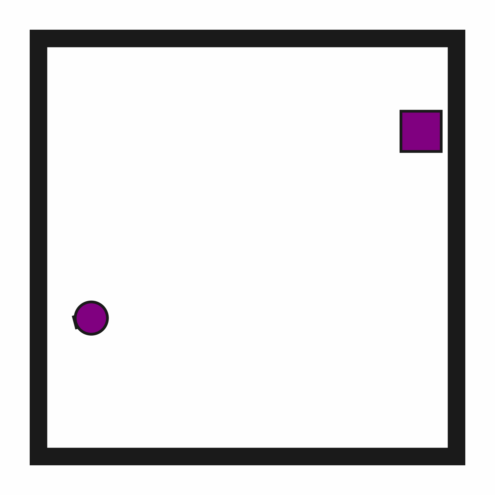
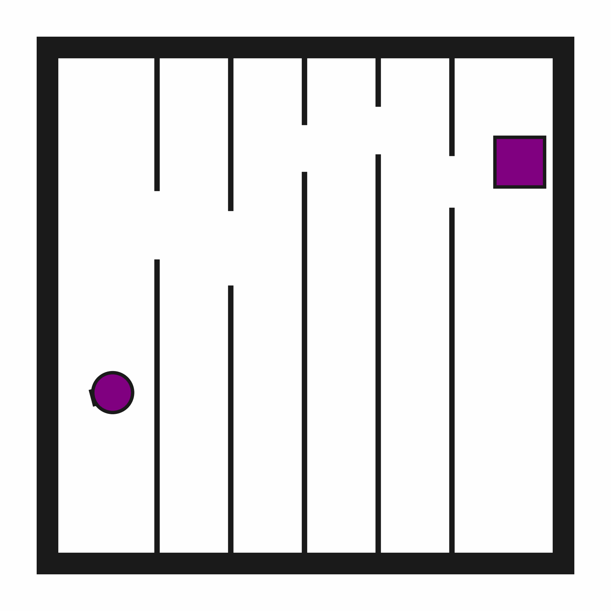

# Motion2D

**Random Action Stats**: Total Reward: -25.00, Success: No, Steps: 25

## Description
A 2D environment where the goal is to reach a target region while avoiding static obstacles.

There may be narrow passages.
        
The robot has a movable circular base and a retractable arm with a rectangular vacuum end effector. The arm and vacuum do not need to be used in this environment.

## Available Variants
The number of narrow passages differs between environment variants. For example, Motion2D-p0 has no passages (open space), while Motion2D-p5 has 5 narrow passages.

- [`kinder/Motion2D-p0-v0`](variants/Motion2D/Motion2D-p0.md) (p0)
- [`kinder/Motion2D-p1-v0`](variants/Motion2D/Motion2D-p1.md) (p1)
- [`kinder/Motion2D-p2-v0`](variants/Motion2D/Motion2D-p2.md) (p2)
- [`kinder/Motion2D-p3-v0`](variants/Motion2D/Motion2D-p3.md) (p3)
- [`kinder/Motion2D-p4-v0`](variants/Motion2D/Motion2D-p4.md) (p4)
- [`kinder/Motion2D-p5-v0`](variants/Motion2D/Motion2D-p5.md) (p5)

## Initial State Distribution

## Example Demonstration

## Observation Space
*(Differs per variant, see individual variant pages)*

## Action Space
The entries of an array in this Box space correspond to the following action features:
| **Index** | **Feature** | **Description** | **Min** | **Max** |
| --- | --- | --- | --- | --- |
| 0 | dx | Change in robot x position (positive is right) | -0.050 | 0.050 |
| 1 | dy | Change in robot y position (positive is up) | -0.050 | 0.050 |
| 2 | dtheta | Change in robot angle in radians (positive is ccw) | -0.196 | 0.196 |
| 3 | darm | Change in robot arm length (positive is out) | -0.100 | 0.100 |
| 4 | vac | Directly sets the vacuum (0.0 is off, 1.0 is on) | 0.000 | 1.000 |

## Rewards
A penalty of -1.0 is given at every time step until termination, which occurs when the robot's position is within the target region.

## References
Narrow passages are a classic challenge in motion planning.
