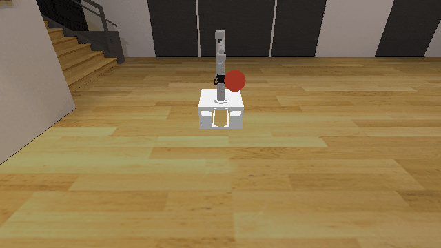
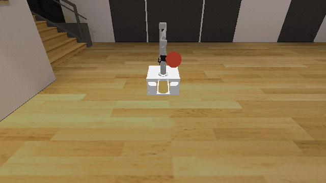

# Motion3D

**Random Action Stats**: Total Reward: -25.00, Success: No, Steps: 25

## Description
A 3D motion planning environment where the goal is to reach a target sphere with the robot's end effector.

The robot is a Kinova Gen-3 with 7 degrees of freedom. The target is a sphere with radius 0.100m positioned randomly within the workspace bounds.

The workspace bounds are:
- X: [0.1, 0.6]
- Y: [0.1, 0.9]
- Z: [0.4, 0.9]

Only targets that are reachable via inverse kinematics are sampled.

## Available Variants
This environment has only one variant.

- [`kinder/Motion3D-v0`](variants/Motion3D/Motion3D.md) (v0)

## Initial State Distribution

## Example Demonstration
*(No demonstration GIFs available)*

## Observation Space
*(Differs per variant, see individual variant pages)*

## Action Space
An action space for mobile manipulation with a 7 DOF robot that can open and close its gripper.

Actions are bounded relative base position, rotation, and joint positions, and open / close.

| **Index** | **Description** |
| --- | --- |
| 0 | delta base x |
| 1 | delta base y |
| 2 | delta base rotation |
| 3 | delta joint 1 |
| 4 | delta joint 2 |
| 5 | delta joint 3 |
| 6 | delta joint 4 |
| 7 | delta joint 5 |
| 8 | delta joint 6 |
| 9 | delta joint 7 |
| 10 | gripper open/close |

The open / close logic is: <-0.5 is close, >0.5 is open, and otherwise no change.

## Rewards
The reward structure is simple:
- **-1.0** penalty at every timestep until the goal is reached
- **Termination** occurs when the end effector is within 0.100m of the target center

This encourages the robot to reach the target as quickly as possible while avoiding infinite episodes.

## References
This is a very common kind of environment.
