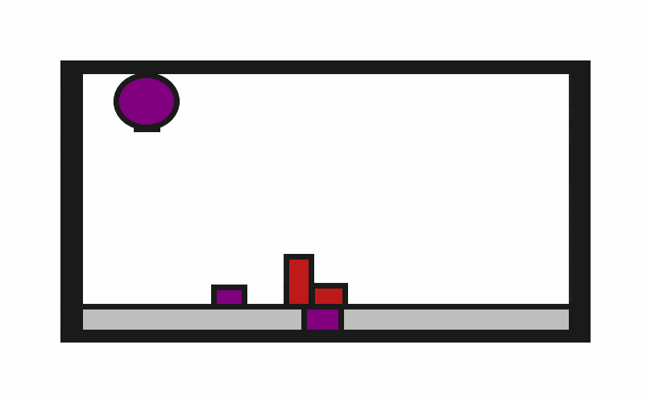
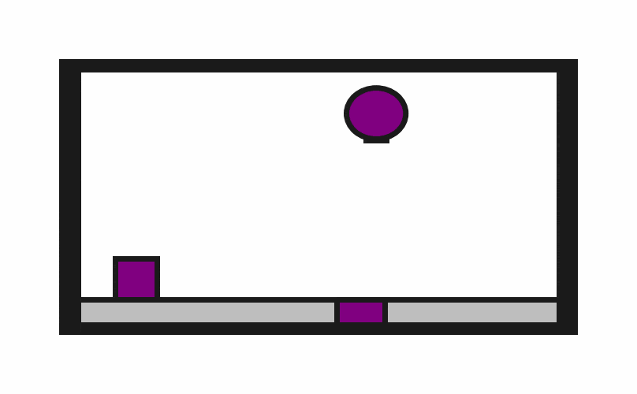
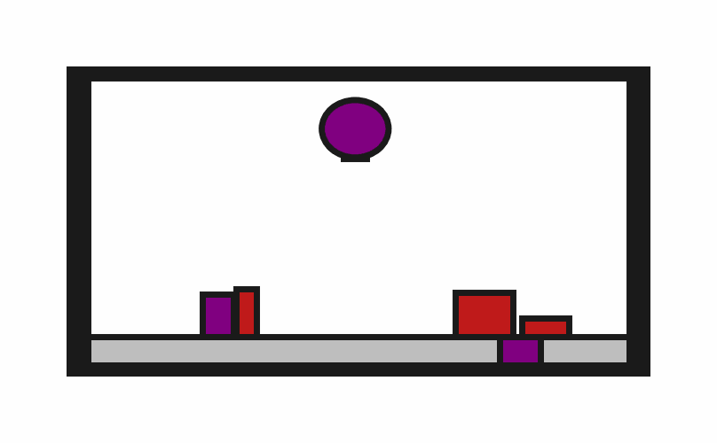

# Obstruction2D



**Random Action Stats**: Total Reward: -25.00, Success: No, Steps: 25

## Description
A 2D environment where the goal is to place a target block onto a target surface. The block must be completely contained within the surface boundaries.

The target surface may be initially obstructed.

The robot has a movable circular base and a retractable arm with a rectangular vacuum end effector. Objects can be grasped and ungrasped when the end effector makes contact.


## Available Variants
The number of obstructions differs between environment variants. For example, Obstruction2D-o0 has no obstructions, while Obstruction2D-o4 has 4 obstructions.

- [`kinder/Obstruction2D-o0-v0`](variants/Obstruction2D/Obstruction2D-o0.md) (o0)
- [`kinder/Obstruction2D-o1-v0`](variants/Obstruction2D/Obstruction2D-o1.md) (o1)
- [`kinder/Obstruction2D-o2-v0`](variants/Obstruction2D/Obstruction2D-o2.md) (o2)
- [`kinder/Obstruction2D-o3-v0`](variants/Obstruction2D/Obstruction2D-o3.md) (o3)
- [`kinder/Obstruction2D-o4-v0`](variants/Obstruction2D/Obstruction2D-o4.md) (o4)

## Initial State Distribution


## Example Demonstration


## Observation Space
*(Differs per variant, see individual variant pages)*

## Action Space
The entries of an array in this Box space correspond to the following action features:
| **Index** | **Feature** | **Description** | **Min** | **Max** |
| --- | --- | --- | --- | --- |
| 0 | dx | Change in robot x position (positive is right) | -0.050 | 0.050 |
| 1 | dy | Change in robot y position (positive is up) | -0.050 | 0.050 |
| 2 | dtheta | Change in robot angle in radians (positive is ccw) | -0.196 | 0.196 |
| 3 | darm | Change in robot arm length (positive is out) | -0.100 | 0.100 |
| 4 | vac | Directly sets the vacuum (0.0 is off, 1.0 is on) | 0.000 | 1.000 |


## Rewards
A penalty of -1.0 is given at every time step until termination, which occurs when the target block is "on" the target surface. The definition of "on" is given below:
```python
def is_on(
    state: ObjectCentricState,
    top: Object,
    bottom: Object,
    static_object_cache: dict[Object, MultiBody2D],
    tol: float = 0.025,
) -> bool:
    """Checks top object is completely on the bottom one.

    Only rectangles are currently supported.

    Assumes that "up" is positive y.
    """
    top_geom = rectangle_object_to_geom(state, top, static_object_cache)
    bottom_geom = rectangle_object_to_geom(state, bottom, static_object_cache)
    # The bottom-most vertices of top_geom should be contained within the bottom
    # geom when those vertices are offset by tol.
    sorted_vertices = sorted(top_geom.vertices, key=lambda v: v[1])
    for x, y in sorted_vertices[:2]:
        offset_y = y - tol
        if not bottom_geom.contains_point(x, offset_y):
            return False
    return True
```


## References
Similar environments have been used many times, especially in the task and motion planning literature. We took inspiration especially from the "1D Continuous TAMP" environment in [PDDLStream](https://github.com/caelan/pddlstream).
