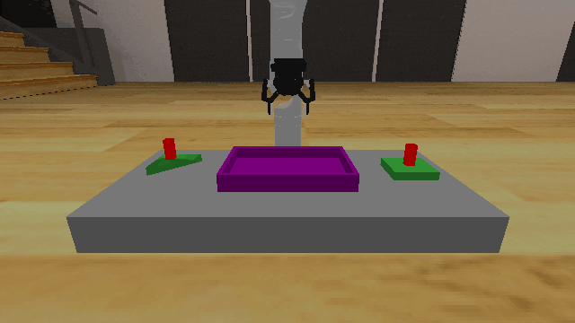
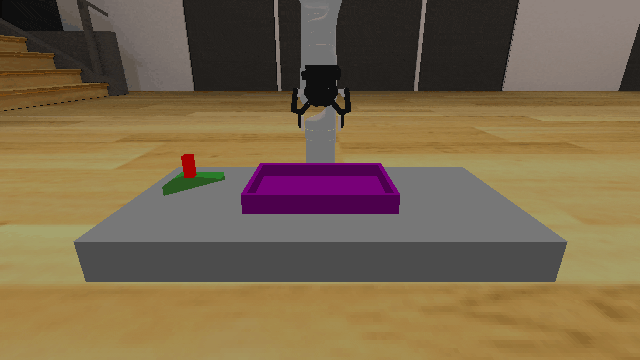
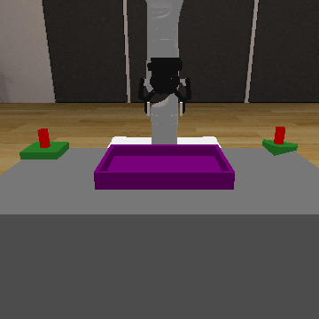

# Packing3D

**Random Action Stats**: Total Reward: -25.00, Success: No, Steps: 25

## Description
A 3D packing environment where the goal is to place a set of parts into a rack without collisions.

The robot is a Kinova Gen-3 with 7 degrees of freedom that can grasp and manipulate objects. The environment consists of:
- A **table** with dimensions 0.400m × 0.800m × 0.500m
- A **rack** (purple) with half-extents (0.1, 0.15, 0.02)
- **Parts** (green) that must be packed into the rack. Parts are sampled with half-extents in (0.05, 0.05, 0.01, 0) to (0.05, 0.05, 0.01, 0) and a probability 0.5 of being triangle-shaped (triangles are represented as triangular prisms with depth 0.020m when used).

The task requires planning to grasp and place each part into the rack while avoiding collisions and ensuring parts are supported by the rack (on the rack and not grasped) at the end.

## Available Variants
The number of parts to pack differs between environment variants. For example, Packing3D-p1 has 1 part, while Packing3D-p3 has 3 parts.

- [`kinder/Packing3D-p1-v0`](variants/Packing3D/Packing3D-p1.md) (p1)
- [`kinder/Packing3D-p2-v0`](variants/Packing3D/Packing3D-p2.md) (p2)
- [`kinder/Packing3D-p3-v0`](variants/Packing3D/Packing3D-p3.md) (p3)

## Initial State Distribution

## Example Demonstration

## Observation Space
*(Differs per variant, see individual variant pages)*

## Action Space
An action space for mobile manipulation with a 7 DOF robot that can open and close its gripper.

Actions are bounded relative base position, rotation, and joint positions, and open / close.

| **Index** | **Description** |
| --- | --- |
| 0 | delta base x |
| 1 | delta base y |
| 2 | delta base rotation |
| 3 | delta joint 1 |
| 4 | delta joint 2 |
| 5 | delta joint 3 |
| 6 | delta joint 4 |
| 7 | delta joint 5 |
| 8 | delta joint 6 |
| 9 | delta joint 7 |
| 10 | gripper open/close |

The open / close logic is: <-0.5 is close, >0.5 is open, and otherwise no change.

## Rewards
The reward structure is simple:
- **-1.0** penalty at every timestep until the goal is reached
- **Termination** occurs when all parts are placed in the rack and none are grasped

The goal is considered reached when:
1. The robot is not currently grasping any part
2. Every part is resting on (supported by) the rack surface

Support is determined based on contact between a part and the rack within a small distance threshold (configured by the environment).

This encourages the robot to efficiently pack the parts into the rack while avoiding infinite episodes.

## References
Packing tasks are common in robotics and automated warehousing literature. This environment is inspired by standard manipulation benchmarks and simple bin-packing problems; it’s intended as a deterministic, physics-based testbed for pick-and-place planning and task-and-motion planning approaches.
