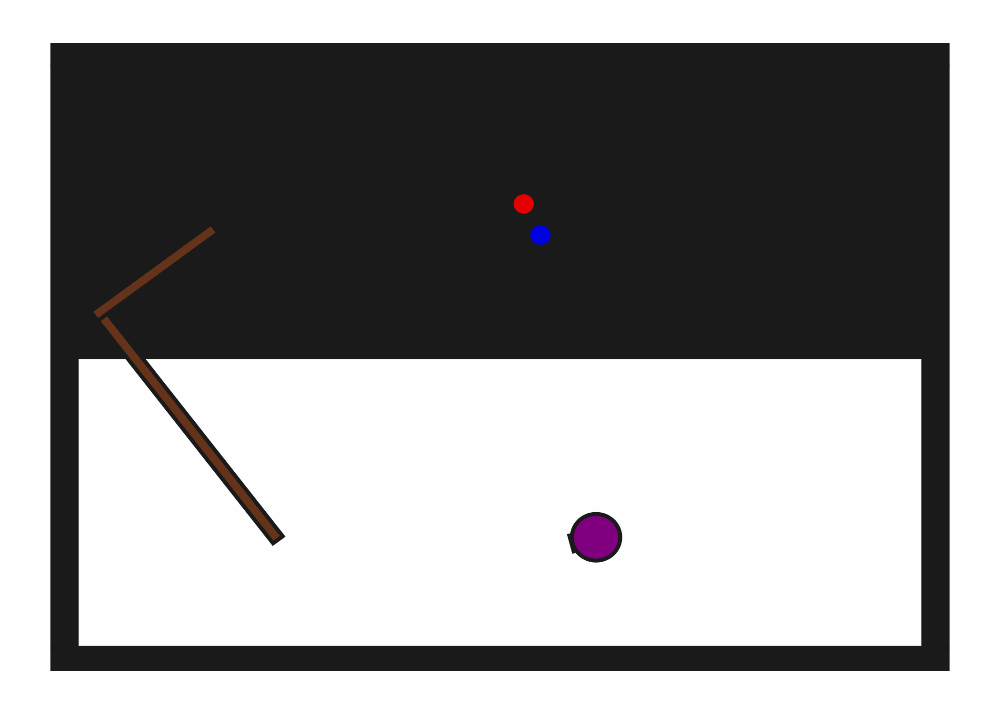

# PushPullHook2D

**Random Action Stats**: Total Reward: -25.00, Success: No, Steps: 25

## Description
A 2D environment with a robot, a hook (L-shape), a movable button, and a target button.The robot can use the hook to push the movable button towards the target button. The movable button only moves if the hook is in contact and the robot moves in the direction of contact.

## Available Variants
This environment has only one variant.

- [`kinder/PushPullHook2D-v0`](variants/PushPullHook2D/PushPullHook2D.md) (v0)

## Initial State Distribution

## Example Demonstration

## Observation Space
*(Differs per variant, see individual variant pages)*

## Action Space
The entries of an array in this Box space correspond to the following action features:
| **Index** | **Feature** | **Description** | **Min** | **Max** |
| --- | --- | --- | --- | --- |
| 0 | dx | Change in robot x position (positive is right) | -0.050 | 0.050 |
| 1 | dy | Change in robot y position (positive is up) | -0.050 | 0.050 |
| 2 | dtheta | Change in robot angle in radians (positive is ccw) | -0.196 | 0.196 |
| 3 | darm | Change in robot arm length (positive is out) | -0.100 | 0.100 |
| 4 | vac | Directly sets the vacuum (0.0 is off, 1.0 is on) | 0.000 | 1.000 |

## Rewards
A penalty of -1.0 is given at every time step until both the movable button and the target button are pressed (i.e., in contact and colored green, termination).

## References
This environment is inspired by StickButton2DEnv but uses a hook and push-pull mechanics.
