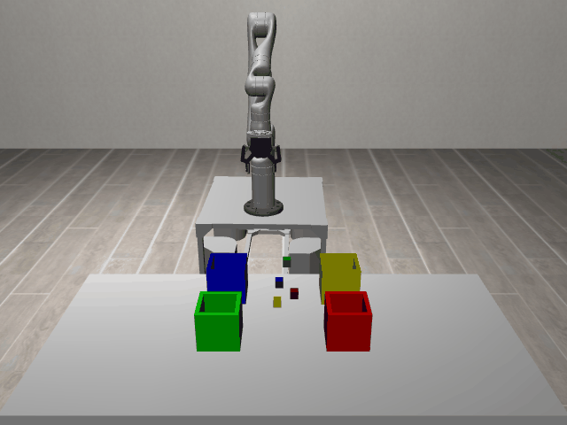
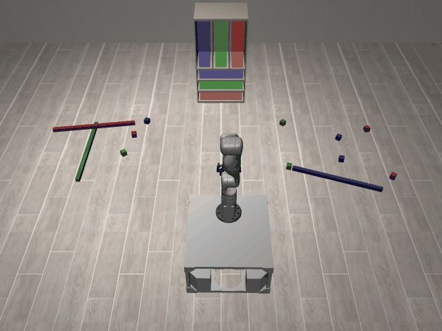
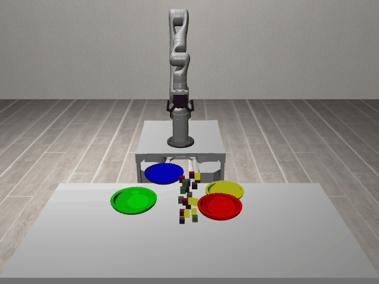

# SortClutteredBlocks3D

**Random Action Stats**: Total Reward: -0.25, Success: No, Steps: 25

## Description
A 3D task where the robot must sort a pile of objects into different receptacles based on their color. The objects may be initially in contact with each other, requiring singulation before grasping.

The robot has a holonomic mobile base with powered casters and a Kinova Gen3 arm.

The robot can control:
- Base pose (x, y, theta)
- Arm position (x, y, z)
- Arm orientation (quaternion)
- Gripper position (open/close)

## Available Variants
The variants differ in the number of objects to sort and in the types of receptacles (a cupboard or bins).

- [`kinder/SortClutteredBlocks3D-o12-sort_the_blocks_into_the_cupboard-v0`](variants/SortClutteredBlocks3D/SortClutteredBlocks3D-o12-sort_the_blocks_into_the_cupboard.md) (o12-sort_the_blocks_into_the_cupboard)
- [`kinder/SortClutteredBlocks3D-o20-sort_the_cluttered_blocks_into_bins-v0`](variants/SortClutteredBlocks3D/SortClutteredBlocks3D-o20-sort_the_cluttered_blocks_into_bins.md) (o20-sort_the_cluttered_blocks_into_bins)
- [`kinder/SortClutteredBlocks3D-o4-sort_the_cluttered_blocks_into_bins-v0`](variants/SortClutteredBlocks3D/SortClutteredBlocks3D-o4-sort_the_cluttered_blocks_into_bins.md) (o4-sort_the_cluttered_blocks_into_bins)
- [`kinder/SortClutteredBlocks3D-o20-sort_the_cluttered_blocks_into_bowls-v0`](variants/SortClutteredBlocks3D/SortClutteredBlocks3D-o20-sort_the_cluttered_blocks_into_bowls.md) (o20-sort_the_cluttered_blocks_into_bowls)

## Initial State Distribution

## Example Demonstration

## Observation Space
*(Differs per variant, see individual variant pages)*

## Action Space
Actions: base pos and yaw (3), arm joints (7), gripper pos (1)

## Rewards
The primary reward is for successfully placing objects at their target locations.
- A reward of +1.0 is given for each object placed within a 5cm tolerance of its target.
- A smaller positive reward is given for objects within a 10cm tolerance to guide the robot.
- A small negative reward (-0.01) is applied at each timestep to encourage efficiency.
The episode terminates when all objects are placed at their respective targets.

## References
TidyBot++: An Open-Source Holonomic Mobile Manipulator
for Robot Learning
- Jimmy Wu, William Chong, Robert Holmberg, Aaditya Prasad, Yihuai Gao,
  Oussama Khatib, Shuran Song, Szymon Rusinkiewicz, Jeannette Bohg
- Conference on Robot Learning (CoRL), 2024

https://github.com/tidybot2/tidybot2
