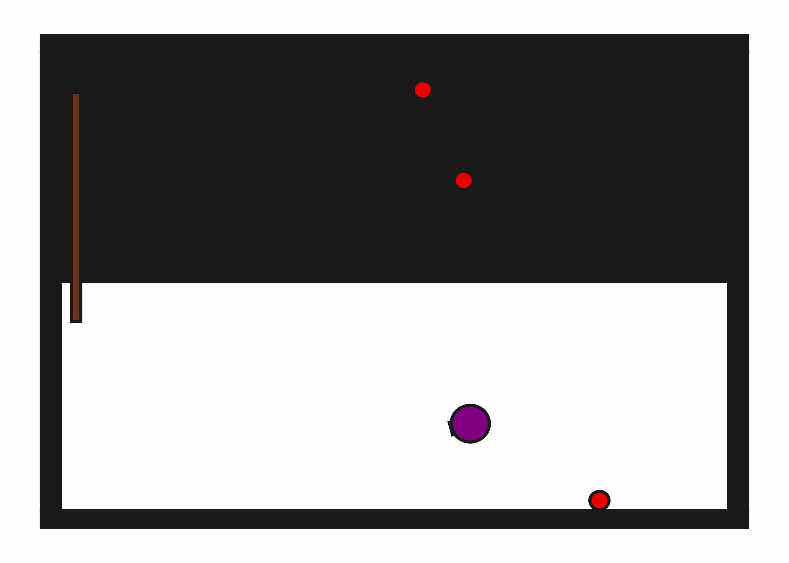
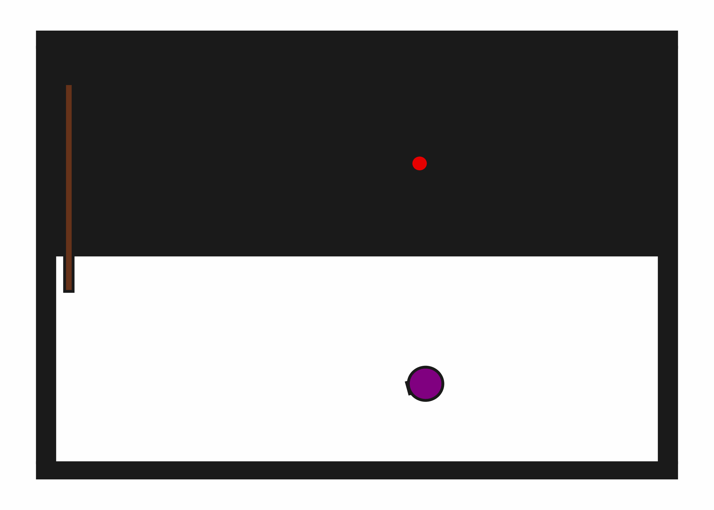
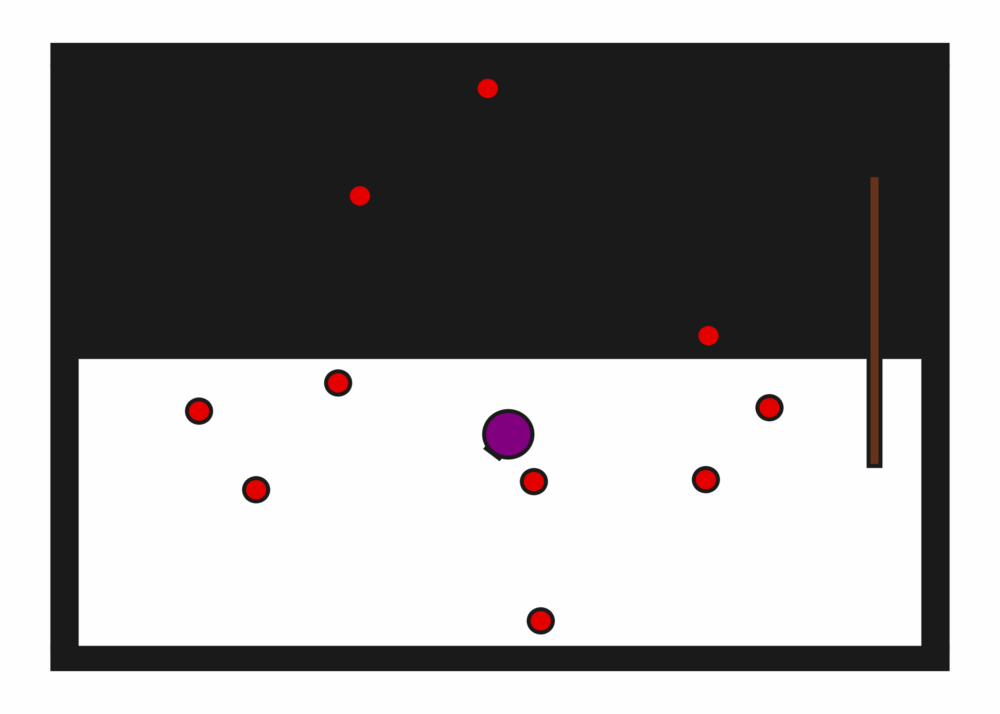

# StickButton2D

**Random Action Stats**: Total Reward: -25.00, Success: No, Steps: 25

## Description
A 2D environment where the goal is to touch all buttons, possibly by using a stick for buttons that are out of the robot's direct reach.

In this environment, there are always 3 buttons.

The robot has a movable circular base and a retractable arm with a rectangular vacuum end effector.

## Available Variants
The number of buttons differs between environment variants. For example, StickButton2D-b1 has 1 button, while StickButton2D-b10 has 10 buttons.

- [`kinder/StickButton2D-b1-v0`](variants/StickButton2D/StickButton2D-b1.md) (b1)
- [`kinder/StickButton2D-b2-v0`](variants/StickButton2D/StickButton2D-b2.md) (b2)
- [`kinder/StickButton2D-b3-v0`](variants/StickButton2D/StickButton2D-b3.md) (b3)
- [`kinder/StickButton2D-b5-v0`](variants/StickButton2D/StickButton2D-b5.md) (b5)
- [`kinder/StickButton2D-b10-v0`](variants/StickButton2D/StickButton2D-b10.md) (b10)

## Initial State Distribution

## Example Demonstration

## Observation Space
*(Differs per variant, see individual variant pages)*

## Action Space
The entries of an array in this Box space correspond to the following action features:
| **Index** | **Feature** | **Description** | **Min** | **Max** |
| --- | --- | --- | --- | --- |
| 0 | dx | Change in robot x position (positive is right) | -0.050 | 0.050 |
| 1 | dy | Change in robot y position (positive is up) | -0.050 | 0.050 |
| 2 | dtheta | Change in robot angle in radians (positive is ccw) | -0.196 | 0.196 |
| 3 | darm | Change in robot arm length (positive is out) | -0.100 | 0.100 |
| 4 | vac | Directly sets the vacuum (0.0 is off, 1.0 is on) | 0.000 | 1.000 |

## Rewards
A penalty of -1.0 is given at every time step until all buttons have been pressed (termination).

## References
This environment is based on the Stick Button environment that was originally introduced in "Learning Neuro-Symbolic Skills for Bilevel Planning" (Silver et al., CoRL 2022). This version is simplified in that the robot or stick need only make contact with a button to press it, rather than explicitly pressing. Also, the full stick works for pressing, not just the tip.
