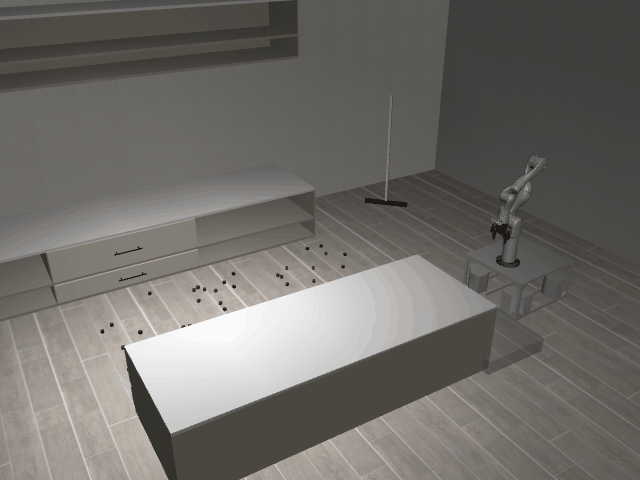

# SweepSimple3D

**Random Action Stats**: Total Reward: -0.25, Success: No, Steps: 25

## Description
A 3D task where the robot must sweep objects that are spread out on the floor into different regions around fixtures in the room. A broom tool is available that may be used for sweeping.

The robot has a holonomic mobile base with powered casters and a Kinova Gen3 arm.

The robot can control:
- Base pose (x, y, theta)
- Arm position (x, y, z)
- Arm orientation (quaternion)
- Gripper position (open/close)

## Available Variants
This variants have different numbers of objects to sweep, and multiple goal locations.

- [`kinder/SweepSimple3D-o10-sweep_the_blocks_to_the_left_side_of_the_kitchen_island-v0`](variants/SweepSimple3D/SweepSimple3D-o10-sweep_the_blocks_to_the_left_side_of_the_kitchen_island.md) (o10-sweep_the_blocks_to_the_left_side_of_the_kitchen_island)
- [`kinder/SweepSimple3D-o50-sweep_the_blocks_to_the_left_side_of_the_kitchen_island-v0`](variants/SweepSimple3D/SweepSimple3D-o50-sweep_the_blocks_to_the_left_side_of_the_kitchen_island.md) (o50-sweep_the_blocks_to_the_left_side_of_the_kitchen_island)
- [`kinder/SweepSimple3D-o1-sweep_the_blocks_to_the_left_side_of_the_kitchen_island-v0`](variants/SweepSimple3D/SweepSimple3D-o1-sweep_the_blocks_to_the_left_side_of_the_kitchen_island.md) (o1-sweep_the_blocks_to_the_left_side_of_the_kitchen_island)
- [`kinder/SweepSimple3D-o50-sweep_the_blocks_to_the_right_side_of_the_kitchen_island-v0`](variants/SweepSimple3D/SweepSimple3D-o50-sweep_the_blocks_to_the_right_side_of_the_kitchen_island.md) (o50-sweep_the_blocks_to_the_right_side_of_the_kitchen_island)
- [`kinder/SweepSimple3D-o50-sweep_the_blocks_to_the_right_side_of_the_kitchen_counter-v0`](variants/SweepSimple3D/SweepSimple3D-o50-sweep_the_blocks_to_the_right_side_of_the_kitchen_counter.md) (o50-sweep_the_blocks_to_the_right_side_of_the_kitchen_counter)
- [`kinder/SweepSimple3D-o5-sweep_the_blocks_to_the_left_side_of_the_kitchen_island-v0`](variants/SweepSimple3D/SweepSimple3D-o5-sweep_the_blocks_to_the_left_side_of_the_kitchen_island.md) (o5-sweep_the_blocks_to_the_left_side_of_the_kitchen_island)

## Initial State Distribution

## Example Demonstration
*(No demonstration GIFs available)*

## Observation Space
*(Differs per variant, see individual variant pages)*

## Action Space
Actions: base pos and yaw (3), arm joints (7), gripper pos (1)

## Rewards
The primary reward is for successfully placing objects at their target locations.
- A reward of +1.0 is given for each object placed within a 5cm tolerance of its target.
- A smaller positive reward is given for objects within a 10cm tolerance to guide the robot.
- A small negative reward (-0.01) is applied at each timestep to encourage efficiency.
The episode terminates when all objects are placed at their respective targets.

## References
TidyBot++: An Open-Source Holonomic Mobile Manipulator
for Robot Learning
- Jimmy Wu, William Chong, Robert Holmberg, Aaditya Prasad, Yihuai Gao,
  Oussama Khatib, Shuran Song, Szymon Rusinkiewicz, Jeannette Bohg
- Conference on Robot Learning (CoRL), 2024

https://github.com/tidybot2/tidybot2
