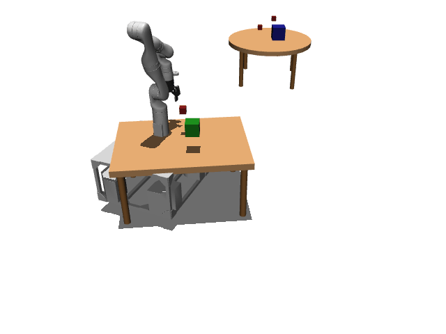

# TidyBot3D

**Random Action Stats**: Total Reward: -0.25, Success: No, Steps: 25

## Description
A 3D mobile manipulation environment using the TidyBot platform.

The robot has a holonomic mobile base with powered casters and a Kinova Gen3 arm.
Scene type: lab2_kitchen with 2 objects.

The robot can control:
- Base pose (x, y, theta)
- Arm position (x, y, z)
- Arm orientation (quaternion)
- Gripper position (open/close)

## Available Variants
This environment has variants that differ in scene type and number of objects. Scene types include 'ground', 'cabinet', etc. The number of objects varies across variants.

- [`kinder/TidyBot3D-table-o5-v0`](variants/TidyBot3D/TidyBot3D-table-o5.md) (table-o5)
- [`kinder/TidyBot3D-tool_use-lab2_kitchen-o50-sweep_the_blocks_to_the_right_side_of_the_kitchen_island-v0`](variants/TidyBot3D/TidyBot3D-tool_use-lab2_kitchen-o50-sweep_the_blocks_to_the_right_side_of_the_kitchen_island.md) (tool_use-lab2_kitchen-o50-sweep_the_blocks_to_the_right_side_of_the_kitchen_island)
- [`kinder/TidyBot3D-tool_use-lab2_kitchen-o1-move_the_bowl_to_top_drawer_of_the_kitchen_cabinet-v0`](variants/TidyBot3D/TidyBot3D-tool_use-lab2_kitchen-o1-move_the_bowl_to_top_drawer_of_the_kitchen_cabinet.md) (tool_use-lab2_kitchen-o1-move_the_bowl_to_top_drawer_of_the_kitchen_cabinet)
- [`kinder/TidyBot3D-tool_use-lab2_kitchen-o5-scoop_the_blocks_from_the_yellow_bin_to_the_green_bin-v0`](variants/TidyBot3D/TidyBot3D-tool_use-lab2_kitchen-o5-scoop_the_blocks_from_the_yellow_bin_to_the_green_bin.md) (tool_use-lab2_kitchen-o5-scoop_the_blocks_from_the_yellow_bin_to_the_green_bin)
- [`kinder/TidyBot3D-tool_use-lab2_kitchen-o50-sweep_the_blocks_to_the_left_side_of_the_kitchen_island-v0`](variants/TidyBot3D/TidyBot3D-tool_use-lab2_kitchen-o50-sweep_the_blocks_to_the_left_side_of_the_kitchen_island.md) (tool_use-lab2_kitchen-o50-sweep_the_blocks_to_the_left_side_of_the_kitchen_island)
- [`kinder/TidyBot3D-tool_use-lab2_kitchen-o50-sweep_the_blocks_to_the_right_side_of_the_kitchen_counter-v0`](variants/TidyBot3D/TidyBot3D-tool_use-lab2_kitchen-o50-sweep_the_blocks_to_the_right_side_of_the_kitchen_counter.md) (tool_use-lab2_kitchen-o50-sweep_the_blocks_to_the_right_side_of_the_kitchen_counter)
- [`kinder/TidyBot3D-tool_use-lab2_kitchen-o5-sweep_the_blocks_into_the_top_drawer_of_the_kitchen_island-v0`](variants/TidyBot3D/TidyBot3D-tool_use-lab2_kitchen-o5-sweep_the_blocks_into_the_top_drawer_of_the_kitchen_island.md) (tool_use-lab2_kitchen-o5-sweep_the_blocks_into_the_top_drawer_of_the_kitchen_island)
- [`kinder/TidyBot3D-navigate-namo-o1-v0`](variants/TidyBot3D/TidyBot3D-navigate-namo-o1.md) (navigate-namo-o1)
- [`kinder/TidyBot3D-ground-o1-v0`](variants/TidyBot3D/TidyBot3D-ground-o1.md) (ground-o1)
- [`kinder/TidyBot3D-cupboard_real-o1-v0`](variants/TidyBot3D/TidyBot3D-cupboard_real-o1.md) (cupboard_real-o1)
- [`kinder/TidyBot3D-dynamic-lab2-o3-balance_beam-v0`](variants/TidyBot3D/TidyBot3D-dynamic-lab2-o3-balance_beam.md) (dynamic-lab2-o3-balance_beam)
- [`kinder/TidyBot3D-dynamic-lab2-o2-toss_the_blocks_into_the_bin-v0`](variants/TidyBot3D/TidyBot3D-dynamic-lab2-o2-toss_the_blocks_into_the_bin.md) (dynamic-lab2-o2-toss_the_blocks_into_the_bin)
- [`kinder/TidyBot3D-dynamic-lab2-o1-toss_the_blocks_into_the_bin-v0`](variants/TidyBot3D/TidyBot3D-dynamic-lab2-o1-toss_the_blocks_into_the_bin.md) (dynamic-lab2-o1-toss_the_blocks_into_the_bin)
- [`kinder/TidyBot3D-rearrange-lab2_kitchen-o1-put_the_boxed_drink_on_the_left_side_of_the_bowl-v0`](variants/TidyBot3D/TidyBot3D-rearrange-lab2_kitchen-o1-put_the_boxed_drink_on_the_left_side_of_the_bowl.md) (rearrange-lab2_kitchen-o1-put_the_boxed_drink_on_the_left_side_of_the_bowl)
- [`kinder/TidyBot3D-rearrange-lab2_kitchen-o1-put_the_boxed_drink_on_the_right_side_of_the_bowl-v0`](variants/TidyBot3D/TidyBot3D-rearrange-lab2_kitchen-o1-put_the_boxed_drink_on_the_right_side_of_the_bowl.md) (rearrange-lab2_kitchen-o1-put_the_boxed_drink_on_the_right_side_of_the_bowl)
- [`kinder/TidyBot3D-rearrange-lab2_kitchen-o1-put_the_boxed_drink_next_to_the_bowl-v0`](variants/TidyBot3D/TidyBot3D-rearrange-lab2_kitchen-o1-put_the_boxed_drink_next_to_the_bowl.md) (rearrange-lab2_kitchen-o1-put_the_boxed_drink_next_to_the_bowl)
- [`kinder/TidyBot3D-rearrange-lab2_kitchen-o2-put_the_can_in_front_of_and_the_boxed_drink_behind_the_bowl-v0`](variants/TidyBot3D/TidyBot3D-rearrange-lab2_kitchen-o2-put_the_can_in_front_of_and_the_boxed_drink_behind_the_bowl.md) (rearrange-lab2_kitchen-o2-put_the_can_in_front_of_and_the_boxed_drink_behind_the_bowl)
- [`kinder/TidyBot3D-rearrange-lab2_kitchen-o1-put_the_boxed_drink_behind_the_bowl-v0`](variants/TidyBot3D/TidyBot3D-rearrange-lab2_kitchen-o1-put_the_boxed_drink_behind_the_bowl.md) (rearrange-lab2_kitchen-o1-put_the_boxed_drink_behind_the_bowl)
- [`kinder/TidyBot3D-rearrange-lab2_kitchen-o2-put_the_boxed_drink_on_the_left_and_the_can_on_the_right_side_of_the_bowl-v0`](variants/TidyBot3D/TidyBot3D-rearrange-lab2_kitchen-o2-put_the_boxed_drink_on_the_left_and_the_can_on_the_right_side_of_the_bowl.md) (rearrange-lab2_kitchen-o2-put_the_boxed_drink_on_the_left_and_the_can_on_the_right_side_of_the_bowl)
- [`kinder/TidyBot3D-rearrange-lab2_kitchen-o2-put_the_boxed_drink_and_the_can_next_to_the_bowl-v0`](variants/TidyBot3D/TidyBot3D-rearrange-lab2_kitchen-o2-put_the_boxed_drink_and_the_can_next_to_the_bowl.md) (rearrange-lab2_kitchen-o2-put_the_boxed_drink_and_the_can_next_to_the_bowl)
- [`kinder/TidyBot3D-rearrange-lab2_kitchen-o2-put_the_boxed_drink_in_front_of_and_the_can_behind_the_bowl-v0`](variants/TidyBot3D/TidyBot3D-rearrange-lab2_kitchen-o2-put_the_boxed_drink_in_front_of_and_the_can_behind_the_bowl.md) (rearrange-lab2_kitchen-o2-put_the_boxed_drink_in_front_of_and_the_can_behind_the_bowl)
- [`kinder/TidyBot3D-rearrange-lab2_kitchen-o2-put_the_can_on_the_left_and_the_boxed_drink_on_the_right_side_of_the_bowl-v0`](variants/TidyBot3D/TidyBot3D-rearrange-lab2_kitchen-o2-put_the_can_on_the_left_and_the_boxed_drink_on_the_right_side_of_the_bowl.md) (rearrange-lab2_kitchen-o2-put_the_can_on_the_left_and_the_boxed_drink_on_the_right_side_of_the_bowl)
- [`kinder/TidyBot3D-rearrange-lab2_kitchen-o1-put_the_boxed_drink_in_front_of_the_bowl-v0`](variants/TidyBot3D/TidyBot3D-rearrange-lab2_kitchen-o1-put_the_boxed_drink_in_front_of_the_bowl.md) (rearrange-lab2_kitchen-o1-put_the_boxed_drink_in_front_of_the_bowl)
- [`kinder/TidyBot3D-sort-lab2-o1-fit_the_blocks_in_the_cupboard-v0`](variants/TidyBot3D/TidyBot3D-sort-lab2-o1-fit_the_blocks_in_the_cupboard.md) (sort-lab2-o1-fit_the_blocks_in_the_cupboard)
- [`kinder/TidyBot3D-sort-lab2-o2-fit_the_blocks_in_the_cupboard-v0`](variants/TidyBot3D/TidyBot3D-sort-lab2-o2-fit_the_blocks_in_the_cupboard.md) (sort-lab2-o2-fit_the_blocks_in_the_cupboard)
- [`kinder/TidyBot3D-sort-lab2-o20-sort_the_cluttered_blocks_into_bowls-v0`](variants/TidyBot3D/TidyBot3D-sort-lab2-o20-sort_the_cluttered_blocks_into_bowls.md) (sort-lab2-o20-sort_the_cluttered_blocks_into_bowls)
- [`kinder/TidyBot3D-sort-lab2-o12-sort_the_blocks_into_the_cupboard-v0`](variants/TidyBot3D/TidyBot3D-sort-lab2-o12-sort_the_blocks_into_the_cupboard.md) (sort-lab2-o12-sort_the_blocks_into_the_cupboard)
- [`kinder/TidyBot3D-sort-lab2-o6-fit_the_blocks_in_the_cupboard-v0`](variants/TidyBot3D/TidyBot3D-sort-lab2-o6-fit_the_blocks_in_the_cupboard.md) (sort-lab2-o6-fit_the_blocks_in_the_cupboard)
- [`kinder/TidyBot3D-ground-o7-v0`](variants/TidyBot3D/TidyBot3D-ground-o7.md) (ground-o7)
- [`kinder/TidyBot3D-table-o3-v0`](variants/TidyBot3D/TidyBot3D-table-o3.md) (table-o3)
- [`kinder/TidyBot3D-cupboard-o8-v0`](variants/TidyBot3D/TidyBot3D-cupboard-o8.md) (cupboard-o8)
- [`kinder/TidyBot3D-balance-o4-v0`](variants/TidyBot3D/TidyBot3D-balance-o4.md) (balance-o4)
- [`kinder/TidyBot3D-ground-o5-v0`](variants/TidyBot3D/TidyBot3D-ground-o5.md) (ground-o5)
- [`kinder/TidyBot3D-cupboard_real-o4-v0`](variants/TidyBot3D/TidyBot3D-cupboard_real-o4.md) (cupboard_real-o4)
- [`kinder/TidyBot3D-cupboard_real-o8-v0`](variants/TidyBot3D/TidyBot3D-cupboard_real-o8.md) (cupboard_real-o8)
- [`kinder/TidyBot3D-table-o7-v0`](variants/TidyBot3D/TidyBot3D-table-o7.md) (table-o7)
- [`kinder/TidyBot3D-ground-o3-v0`](variants/TidyBot3D/TidyBot3D-ground-o3.md) (ground-o3)
- [`kinder/TidyBot3D-cupboard_real-o2-v0`](variants/TidyBot3D/TidyBot3D-cupboard_real-o2.md) (cupboard_real-o2)
- [`kinder/TidyBot3D-base_motion-o1-v0`](variants/TidyBot3D/TidyBot3D-base_motion-o1.md) (base_motion-o1)

## Initial State Distribution

## Example Demonstration
*(No demonstration GIFs available)*

## Observation Space
*(Differs per variant, see individual variant pages)*

## Action Space
Actions: base pos and yaw (3), arm joints (7), gripper pos (1)

## Rewards
Reward function depends on the specific task:
- Object stacking: Reward for successfully stacking objects
- Drawer/cabinet tasks: Reward for opening/closing and placing objects
- General manipulation: Reward for successful pick-and-place operations

Currently returns a small negative reward (-0.01) per timestep to encourage exploration.

## References
TidyBot++: An Open-Source Holonomic Mobile Manipulator
for Robot Learning
- Jimmy Wu, William Chong, Robert Holmberg, Aaditya Prasad, Yihuai Gao,
  Oussama Khatib, Shuran Song, Szymon Rusinkiewicz, Jeannette Bohg
- Conference on Robot Learning (CoRL), 2024

https://github.com/tidybot2/tidybot2
