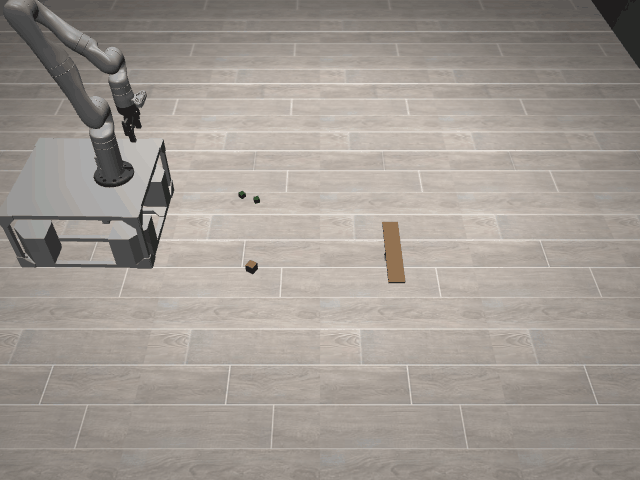

# BalanceBeam3D-o3

## Usage
```python
import kinder
env = kinder.make("kinder/BalanceBeam3D-o3-v0")
```

## Description
This variant uses the 'ground' scene type with 3 objects.

## Initial State Distribution


## Random Action Behavior


**Random Action Stats**: Total Reward: -0.25, Success: No, Steps: 25

## Example Demonstration
*(No demonstration GIFs available)*

## Observation Space
The entries of an array in this Box space correspond to the following object features:
| **Index** | **Object** | **Feature** |
| --- | --- | --- |
| 0 | large_block | x |
| 1 | large_block | y |
| 2 | large_block | z |
| 3 | large_block | qw |
| 4 | large_block | qx |
| 5 | large_block | qy |
| 6 | large_block | qz |
| 7 | large_block | vx |
| 8 | large_block | vy |
| 9 | large_block | vz |
| 10 | large_block | wx |
| 11 | large_block | wy |
| 12 | large_block | wz |
| 13 | large_block | bb_x |
| 14 | large_block | bb_y |
| 15 | large_block | bb_z |
| 16 | robot | pos_base_x |
| 17 | robot | pos_base_y |
| 18 | robot | pos_base_rot |
| 19 | robot | pos_arm_joint1 |
| 20 | robot | pos_arm_joint2 |
| 21 | robot | pos_arm_joint3 |
| 22 | robot | pos_arm_joint4 |
| 23 | robot | pos_arm_joint5 |
| 24 | robot | pos_arm_joint6 |
| 25 | robot | pos_arm_joint7 |
| 26 | robot | pos_gripper |
| 27 | robot | vel_base_x |
| 28 | robot | vel_base_y |
| 29 | robot | vel_base_rot |
| 30 | robot | vel_arm_joint1 |
| 31 | robot | vel_arm_joint2 |
| 32 | robot | vel_arm_joint3 |
| 33 | robot | vel_arm_joint4 |
| 34 | robot | vel_arm_joint5 |
| 35 | robot | vel_arm_joint6 |
| 36 | robot | vel_arm_joint7 |
| 37 | robot | vel_gripper |
| 38 | seesaw_1 | x |
| 39 | seesaw_1 | y |
| 40 | seesaw_1 | z |
| 41 | seesaw_1 | qw |
| 42 | seesaw_1 | qx |
| 43 | seesaw_1 | qy |
| 44 | seesaw_1 | qz |
| 45 | seesaw_1 | vx |
| 46 | seesaw_1 | vy |
| 47 | seesaw_1 | vz |
| 48 | seesaw_1 | wx |
| 49 | seesaw_1 | wy |
| 50 | seesaw_1 | wz |
| 51 | seesaw_1 | bb_x |
| 52 | seesaw_1 | bb_y |
| 53 | seesaw_1 | bb_z |
| 54 | small_block_1 | x |
| 55 | small_block_1 | y |
| 56 | small_block_1 | z |
| 57 | small_block_1 | qw |
| 58 | small_block_1 | qx |
| 59 | small_block_1 | qy |
| 60 | small_block_1 | qz |
| 61 | small_block_1 | vx |
| 62 | small_block_1 | vy |
| 63 | small_block_1 | vz |
| 64 | small_block_1 | wx |
| 65 | small_block_1 | wy |
| 66 | small_block_1 | wz |
| 67 | small_block_1 | bb_x |
| 68 | small_block_1 | bb_y |
| 69 | small_block_1 | bb_z |
| 70 | small_block_2 | x |
| 71 | small_block_2 | y |
| 72 | small_block_2 | z |
| 73 | small_block_2 | qw |
| 74 | small_block_2 | qx |
| 75 | small_block_2 | qy |
| 76 | small_block_2 | qz |
| 77 | small_block_2 | vx |
| 78 | small_block_2 | vy |
| 79 | small_block_2 | vz |
| 80 | small_block_2 | wx |
| 81 | small_block_2 | wy |
| 82 | small_block_2 | wz |
| 83 | small_block_2 | bb_x |
| 84 | small_block_2 | bb_y |
| 85 | small_block_2 | bb_z |
