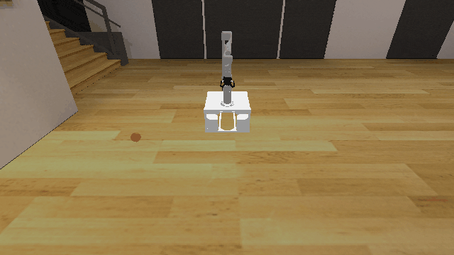
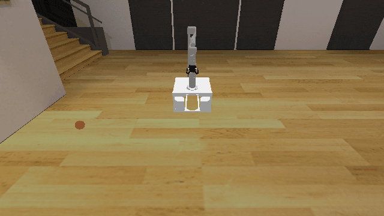

# BaseMotion3D

## Usage
```python
import kinder
env = kinder.make("kinder/BaseMotion3D-v0")
```

## Description
No variant-specific description available.

## Initial State Distribution


## Random Action Behavior


**Random Action Stats**: Total Reward: -25.00, Success: No, Steps: 25

## Example Demonstration


**Demo Stats**: Total Reward: -10.00, Success: Yes, Steps: 10

## Observation Space
The entries of an array in this Box space correspond to the following object features:
| **Index** | **Object** | **Feature** |
| --- | --- | --- |
| 0 | robot | pos_base_x |
| 1 | robot | pos_base_y |
| 2 | robot | pos_base_rot |
| 3 | robot | joint_1 |
| 4 | robot | joint_2 |
| 5 | robot | joint_3 |
| 6 | robot | joint_4 |
| 7 | robot | joint_5 |
| 8 | robot | joint_6 |
| 9 | robot | joint_7 |
| 10 | robot | finger_state |
| 11 | robot | grasp_active |
| 12 | robot | grasp_tf_x |
| 13 | robot | grasp_tf_y |
| 14 | robot | grasp_tf_z |
| 15 | robot | grasp_tf_qx |
| 16 | robot | grasp_tf_qy |
| 17 | robot | grasp_tf_qz |
| 18 | robot | grasp_tf_qw |
| 19 | target | x |
| 20 | target | y |
| 21 | target | z |
