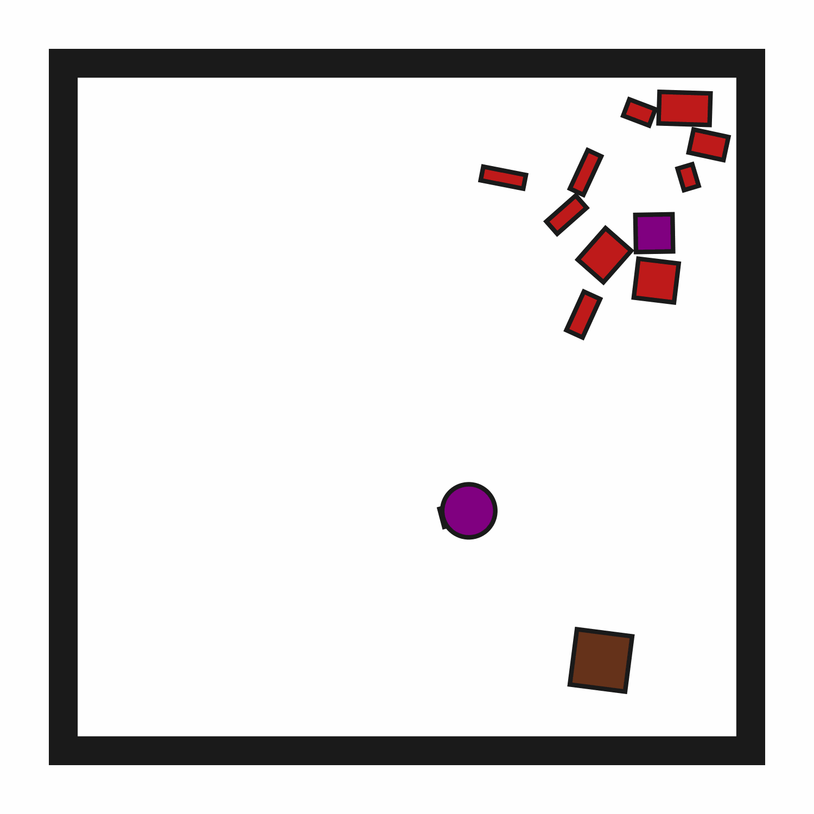

# ClutteredRetrieval2D-o10

## Usage
```python
import kinder
env = kinder.make("kinder/ClutteredRetrieval2D-o10-v0")
```

## Description
This variant has 10 obstructions.

## Initial State Distribution


## Random Action Behavior


**Random Action Stats**: Total Reward: -25.00, Success: No, Steps: 25

## Example Demonstration


**Demo Stats**: Total Reward: -259.00, Success: Yes, Steps: 259

## Observation Space
The entries of an array in this Box space correspond to the following object features:
| **Index** | **Object** | **Feature** |
| --- | --- | --- |
| 0 | robot | x |
| 1 | robot | y |
| 2 | robot | theta |
| 3 | robot | base_radius |
| 4 | robot | arm_joint |
| 5 | robot | arm_length |
| 6 | robot | vacuum |
| 7 | robot | gripper_height |
| 8 | robot | gripper_width |
| 9 | target_block | x |
| 10 | target_block | y |
| 11 | target_block | theta |
| 12 | target_block | static |
| 13 | target_block | color_r |
| 14 | target_block | color_g |
| 15 | target_block | color_b |
| 16 | target_block | z_order |
| 17 | target_block | width |
| 18 | target_block | height |
| 19 | target_region | x |
| 20 | target_region | y |
| 21 | target_region | theta |
| 22 | target_region | static |
| 23 | target_region | color_r |
| 24 | target_region | color_g |
| 25 | target_region | color_b |
| 26 | target_region | z_order |
| 27 | target_region | width |
| 28 | target_region | height |
| 29 | obstruction0 | x |
| 30 | obstruction0 | y |
| 31 | obstruction0 | theta |
| 32 | obstruction0 | static |
| 33 | obstruction0 | color_r |
| 34 | obstruction0 | color_g |
| 35 | obstruction0 | color_b |
| 36 | obstruction0 | z_order |
| 37 | obstruction0 | width |
| 38 | obstruction0 | height |
| 39 | obstruction1 | x |
| 40 | obstruction1 | y |
| 41 | obstruction1 | theta |
| 42 | obstruction1 | static |
| 43 | obstruction1 | color_r |
| 44 | obstruction1 | color_g |
| 45 | obstruction1 | color_b |
| 46 | obstruction1 | z_order |
| 47 | obstruction1 | width |
| 48 | obstruction1 | height |
| 49 | obstruction2 | x |
| 50 | obstruction2 | y |
| 51 | obstruction2 | theta |
| 52 | obstruction2 | static |
| 53 | obstruction2 | color_r |
| 54 | obstruction2 | color_g |
| 55 | obstruction2 | color_b |
| 56 | obstruction2 | z_order |
| 57 | obstruction2 | width |
| 58 | obstruction2 | height |
| 59 | obstruction3 | x |
| 60 | obstruction3 | y |
| 61 | obstruction3 | theta |
| 62 | obstruction3 | static |
| 63 | obstruction3 | color_r |
| 64 | obstruction3 | color_g |
| 65 | obstruction3 | color_b |
| 66 | obstruction3 | z_order |
| 67 | obstruction3 | width |
| 68 | obstruction3 | height |
| 69 | obstruction4 | x |
| 70 | obstruction4 | y |
| 71 | obstruction4 | theta |
| 72 | obstruction4 | static |
| 73 | obstruction4 | color_r |
| 74 | obstruction4 | color_g |
| 75 | obstruction4 | color_b |
| 76 | obstruction4 | z_order |
| 77 | obstruction4 | width |
| 78 | obstruction4 | height |
| 79 | obstruction5 | x |
| 80 | obstruction5 | y |
| 81 | obstruction5 | theta |
| 82 | obstruction5 | static |
| 83 | obstruction5 | color_r |
| 84 | obstruction5 | color_g |
| 85 | obstruction5 | color_b |
| 86 | obstruction5 | z_order |
| 87 | obstruction5 | width |
| 88 | obstruction5 | height |
| 89 | obstruction6 | x |
| 90 | obstruction6 | y |
| 91 | obstruction6 | theta |
| 92 | obstruction6 | static |
| 93 | obstruction6 | color_r |
| 94 | obstruction6 | color_g |
| 95 | obstruction6 | color_b |
| 96 | obstruction6 | z_order |
| 97 | obstruction6 | width |
| 98 | obstruction6 | height |
| 99 | obstruction7 | x |
| 100 | obstruction7 | y |
| 101 | obstruction7 | theta |
| 102 | obstruction7 | static |
| 103 | obstruction7 | color_r |
| 104 | obstruction7 | color_g |
| 105 | obstruction7 | color_b |
| 106 | obstruction7 | z_order |
| 107 | obstruction7 | width |
| 108 | obstruction7 | height |
| 109 | obstruction8 | x |
| 110 | obstruction8 | y |
| 111 | obstruction8 | theta |
| 112 | obstruction8 | static |
| 113 | obstruction8 | color_r |
| 114 | obstruction8 | color_g |
| 115 | obstruction8 | color_b |
| 116 | obstruction8 | z_order |
| 117 | obstruction8 | width |
| 118 | obstruction8 | height |
| 119 | obstruction9 | x |
| 120 | obstruction9 | y |
| 121 | obstruction9 | theta |
| 122 | obstruction9 | static |
| 123 | obstruction9 | color_r |
| 124 | obstruction9 | color_g |
| 125 | obstruction9 | color_b |
| 126 | obstruction9 | z_order |
| 127 | obstruction9 | width |
| 128 | obstruction9 | height |
