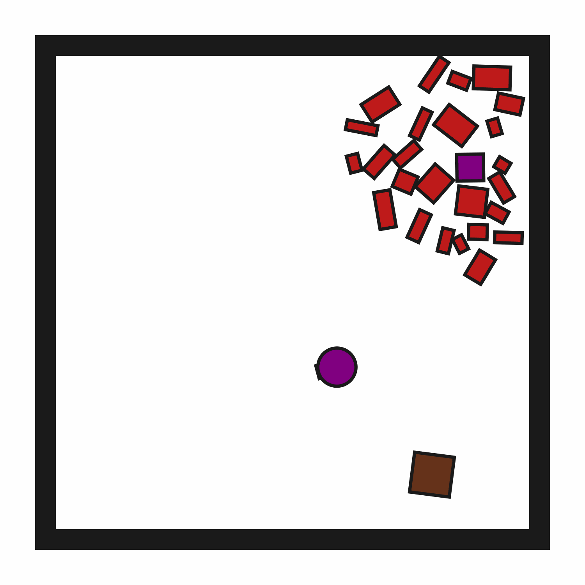

# ClutteredRetrieval2D-o25

## Usage
```python
import kinder
env = kinder.make("kinder/ClutteredRetrieval2D-o25-v0")
```

## Description
This variant has 25 obstructions.

## Initial State Distribution


## Random Action Behavior


**Random Action Stats**: Total Reward: -25.00, Success: No, Steps: 25

## Example Demonstration
*(No demonstration GIFs available)*

## Observation Space
The entries of an array in this Box space correspond to the following object features:
| **Index** | **Object** | **Feature** |
| --- | --- | --- |
| 0 | robot | x |
| 1 | robot | y |
| 2 | robot | theta |
| 3 | robot | base_radius |
| 4 | robot | arm_joint |
| 5 | robot | arm_length |
| 6 | robot | vacuum |
| 7 | robot | gripper_height |
| 8 | robot | gripper_width |
| 9 | target_block | x |
| 10 | target_block | y |
| 11 | target_block | theta |
| 12 | target_block | static |
| 13 | target_block | color_r |
| 14 | target_block | color_g |
| 15 | target_block | color_b |
| 16 | target_block | z_order |
| 17 | target_block | width |
| 18 | target_block | height |
| 19 | target_region | x |
| 20 | target_region | y |
| 21 | target_region | theta |
| 22 | target_region | static |
| 23 | target_region | color_r |
| 24 | target_region | color_g |
| 25 | target_region | color_b |
| 26 | target_region | z_order |
| 27 | target_region | width |
| 28 | target_region | height |
| 29 | obstruction0 | x |
| 30 | obstruction0 | y |
| 31 | obstruction0 | theta |
| 32 | obstruction0 | static |
| 33 | obstruction0 | color_r |
| 34 | obstruction0 | color_g |
| 35 | obstruction0 | color_b |
| 36 | obstruction0 | z_order |
| 37 | obstruction0 | width |
| 38 | obstruction0 | height |
| 39 | obstruction1 | x |
| 40 | obstruction1 | y |
| 41 | obstruction1 | theta |
| 42 | obstruction1 | static |
| 43 | obstruction1 | color_r |
| 44 | obstruction1 | color_g |
| 45 | obstruction1 | color_b |
| 46 | obstruction1 | z_order |
| 47 | obstruction1 | width |
| 48 | obstruction1 | height |
| 49 | obstruction10 | x |
| 50 | obstruction10 | y |
| 51 | obstruction10 | theta |
| 52 | obstruction10 | static |
| 53 | obstruction10 | color_r |
| 54 | obstruction10 | color_g |
| 55 | obstruction10 | color_b |
| 56 | obstruction10 | z_order |
| 57 | obstruction10 | width |
| 58 | obstruction10 | height |
| 59 | obstruction11 | x |
| 60 | obstruction11 | y |
| 61 | obstruction11 | theta |
| 62 | obstruction11 | static |
| 63 | obstruction11 | color_r |
| 64 | obstruction11 | color_g |
| 65 | obstruction11 | color_b |
| 66 | obstruction11 | z_order |
| 67 | obstruction11 | width |
| 68 | obstruction11 | height |
| 69 | obstruction12 | x |
| 70 | obstruction12 | y |
| 71 | obstruction12 | theta |
| 72 | obstruction12 | static |
| 73 | obstruction12 | color_r |
| 74 | obstruction12 | color_g |
| 75 | obstruction12 | color_b |
| 76 | obstruction12 | z_order |
| 77 | obstruction12 | width |
| 78 | obstruction12 | height |
| 79 | obstruction13 | x |
| 80 | obstruction13 | y |
| 81 | obstruction13 | theta |
| 82 | obstruction13 | static |
| 83 | obstruction13 | color_r |
| 84 | obstruction13 | color_g |
| 85 | obstruction13 | color_b |
| 86 | obstruction13 | z_order |
| 87 | obstruction13 | width |
| 88 | obstruction13 | height |
| 89 | obstruction14 | x |
| 90 | obstruction14 | y |
| 91 | obstruction14 | theta |
| 92 | obstruction14 | static |
| 93 | obstruction14 | color_r |
| 94 | obstruction14 | color_g |
| 95 | obstruction14 | color_b |
| 96 | obstruction14 | z_order |
| 97 | obstruction14 | width |
| 98 | obstruction14 | height |
| 99 | obstruction15 | x |
| 100 | obstruction15 | y |
| 101 | obstruction15 | theta |
| 102 | obstruction15 | static |
| 103 | obstruction15 | color_r |
| 104 | obstruction15 | color_g |
| 105 | obstruction15 | color_b |
| 106 | obstruction15 | z_order |
| 107 | obstruction15 | width |
| 108 | obstruction15 | height |
| 109 | obstruction16 | x |
| 110 | obstruction16 | y |
| 111 | obstruction16 | theta |
| 112 | obstruction16 | static |
| 113 | obstruction16 | color_r |
| 114 | obstruction16 | color_g |
| 115 | obstruction16 | color_b |
| 116 | obstruction16 | z_order |
| 117 | obstruction16 | width |
| 118 | obstruction16 | height |
| 119 | obstruction17 | x |
| 120 | obstruction17 | y |
| 121 | obstruction17 | theta |
| 122 | obstruction17 | static |
| 123 | obstruction17 | color_r |
| 124 | obstruction17 | color_g |
| 125 | obstruction17 | color_b |
| 126 | obstruction17 | z_order |
| 127 | obstruction17 | width |
| 128 | obstruction17 | height |
| 129 | obstruction18 | x |
| 130 | obstruction18 | y |
| 131 | obstruction18 | theta |
| 132 | obstruction18 | static |
| 133 | obstruction18 | color_r |
| 134 | obstruction18 | color_g |
| 135 | obstruction18 | color_b |
| 136 | obstruction18 | z_order |
| 137 | obstruction18 | width |
| 138 | obstruction18 | height |
| 139 | obstruction19 | x |
| 140 | obstruction19 | y |
| 141 | obstruction19 | theta |
| 142 | obstruction19 | static |
| 143 | obstruction19 | color_r |
| 144 | obstruction19 | color_g |
| 145 | obstruction19 | color_b |
| 146 | obstruction19 | z_order |
| 147 | obstruction19 | width |
| 148 | obstruction19 | height |
| 149 | obstruction2 | x |
| 150 | obstruction2 | y |
| 151 | obstruction2 | theta |
| 152 | obstruction2 | static |
| 153 | obstruction2 | color_r |
| 154 | obstruction2 | color_g |
| 155 | obstruction2 | color_b |
| 156 | obstruction2 | z_order |
| 157 | obstruction2 | width |
| 158 | obstruction2 | height |
| 159 | obstruction20 | x |
| 160 | obstruction20 | y |
| 161 | obstruction20 | theta |
| 162 | obstruction20 | static |
| 163 | obstruction20 | color_r |
| 164 | obstruction20 | color_g |
| 165 | obstruction20 | color_b |
| 166 | obstruction20 | z_order |
| 167 | obstruction20 | width |
| 168 | obstruction20 | height |
| 169 | obstruction21 | x |
| 170 | obstruction21 | y |
| 171 | obstruction21 | theta |
| 172 | obstruction21 | static |
| 173 | obstruction21 | color_r |
| 174 | obstruction21 | color_g |
| 175 | obstruction21 | color_b |
| 176 | obstruction21 | z_order |
| 177 | obstruction21 | width |
| 178 | obstruction21 | height |
| 179 | obstruction22 | x |
| 180 | obstruction22 | y |
| 181 | obstruction22 | theta |
| 182 | obstruction22 | static |
| 183 | obstruction22 | color_r |
| 184 | obstruction22 | color_g |
| 185 | obstruction22 | color_b |
| 186 | obstruction22 | z_order |
| 187 | obstruction22 | width |
| 188 | obstruction22 | height |
| 189 | obstruction23 | x |
| 190 | obstruction23 | y |
| 191 | obstruction23 | theta |
| 192 | obstruction23 | static |
| 193 | obstruction23 | color_r |
| 194 | obstruction23 | color_g |
| 195 | obstruction23 | color_b |
| 196 | obstruction23 | z_order |
| 197 | obstruction23 | width |
| 198 | obstruction23 | height |
| 199 | obstruction24 | x |
| 200 | obstruction24 | y |
| 201 | obstruction24 | theta |
| 202 | obstruction24 | static |
| 203 | obstruction24 | color_r |
| 204 | obstruction24 | color_g |
| 205 | obstruction24 | color_b |
| 206 | obstruction24 | z_order |
| 207 | obstruction24 | width |
| 208 | obstruction24 | height |
| 209 | obstruction3 | x |
| 210 | obstruction3 | y |
| 211 | obstruction3 | theta |
| 212 | obstruction3 | static |
| 213 | obstruction3 | color_r |
| 214 | obstruction3 | color_g |
| 215 | obstruction3 | color_b |
| 216 | obstruction3 | z_order |
| 217 | obstruction3 | width |
| 218 | obstruction3 | height |
| 219 | obstruction4 | x |
| 220 | obstruction4 | y |
| 221 | obstruction4 | theta |
| 222 | obstruction4 | static |
| 223 | obstruction4 | color_r |
| 224 | obstruction4 | color_g |
| 225 | obstruction4 | color_b |
| 226 | obstruction4 | z_order |
| 227 | obstruction4 | width |
| 228 | obstruction4 | height |
| 229 | obstruction5 | x |
| 230 | obstruction5 | y |
| 231 | obstruction5 | theta |
| 232 | obstruction5 | static |
| 233 | obstruction5 | color_r |
| 234 | obstruction5 | color_g |
| 235 | obstruction5 | color_b |
| 236 | obstruction5 | z_order |
| 237 | obstruction5 | width |
| 238 | obstruction5 | height |
| 239 | obstruction6 | x |
| 240 | obstruction6 | y |
| 241 | obstruction6 | theta |
| 242 | obstruction6 | static |
| 243 | obstruction6 | color_r |
| 244 | obstruction6 | color_g |
| 245 | obstruction6 | color_b |
| 246 | obstruction6 | z_order |
| 247 | obstruction6 | width |
| 248 | obstruction6 | height |
| 249 | obstruction7 | x |
| 250 | obstruction7 | y |
| 251 | obstruction7 | theta |
| 252 | obstruction7 | static |
| 253 | obstruction7 | color_r |
| 254 | obstruction7 | color_g |
| 255 | obstruction7 | color_b |
| 256 | obstruction7 | z_order |
| 257 | obstruction7 | width |
| 258 | obstruction7 | height |
| 259 | obstruction8 | x |
| 260 | obstruction8 | y |
| 261 | obstruction8 | theta |
| 262 | obstruction8 | static |
| 263 | obstruction8 | color_r |
| 264 | obstruction8 | color_g |
| 265 | obstruction8 | color_b |
| 266 | obstruction8 | z_order |
| 267 | obstruction8 | width |
| 268 | obstruction8 | height |
| 269 | obstruction9 | x |
| 270 | obstruction9 | y |
| 271 | obstruction9 | theta |
| 272 | obstruction9 | static |
| 273 | obstruction9 | color_r |
| 274 | obstruction9 | color_g |
| 275 | obstruction9 | color_b |
| 276 | obstruction9 | z_order |
| 277 | obstruction9 | width |
| 278 | obstruction9 | height |
