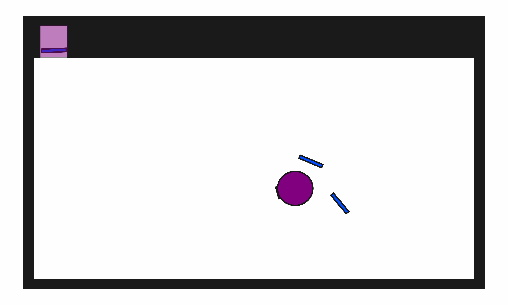

# ClutteredStorage2D-b3

## Usage
```python
import kinder
env = kinder.make("kinder/ClutteredStorage2D-b3-v0")
```

## Description
This variant has 3 blocks (1 initially in the shelf, 2 initially outside).

## Initial State Distribution


## Random Action Behavior


**Random Action Stats**: Total Reward: -25.00, Success: No, Steps: 25

## Example Demonstration
*(No demonstration GIFs available)*

## Observation Space
The entries of an array in this Box space correspond to the following object features:
| **Index** | **Object** | **Feature** |
| --- | --- | --- |
| 0 | robot | x |
| 1 | robot | y |
| 2 | robot | theta |
| 3 | robot | base_radius |
| 4 | robot | arm_joint |
| 5 | robot | arm_length |
| 6 | robot | vacuum |
| 7 | robot | gripper_height |
| 8 | robot | gripper_width |
| 9 | shelf | x |
| 10 | shelf | y |
| 11 | shelf | theta |
| 12 | shelf | static |
| 13 | shelf | color_r |
| 14 | shelf | color_g |
| 15 | shelf | color_b |
| 16 | shelf | z_order |
| 17 | shelf | width |
| 18 | shelf | height |
| 19 | shelf | x1 |
| 20 | shelf | y1 |
| 21 | shelf | theta1 |
| 22 | shelf | width1 |
| 23 | shelf | height1 |
| 24 | shelf | z_order1 |
| 25 | shelf | color_r1 |
| 26 | shelf | color_g1 |
| 27 | shelf | color_b1 |
| 28 | block0 | x |
| 29 | block0 | y |
| 30 | block0 | theta |
| 31 | block0 | static |
| 32 | block0 | color_r |
| 33 | block0 | color_g |
| 34 | block0 | color_b |
| 35 | block0 | z_order |
| 36 | block0 | width |
| 37 | block0 | height |
| 38 | block1 | x |
| 39 | block1 | y |
| 40 | block1 | theta |
| 41 | block1 | static |
| 42 | block1 | color_r |
| 43 | block1 | color_g |
| 44 | block1 | color_b |
| 45 | block1 | z_order |
| 46 | block1 | width |
| 47 | block1 | height |
| 48 | block2 | x |
| 49 | block2 | y |
| 50 | block2 | theta |
| 51 | block2 | static |
| 52 | block2 | color_r |
| 53 | block2 | color_g |
| 54 | block2 | color_b |
| 55 | block2 | z_order |
| 56 | block2 | width |
| 57 | block2 | height |
