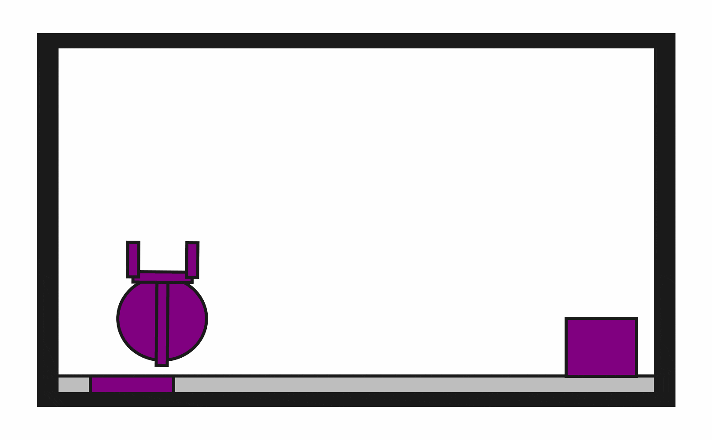

# DynObstruction2D-o0

## Usage
```python
import kinder
env = kinder.make("kinder/DynObstruction2D-o0-v0")
```

## Description
This variant has no obstructions.

## Initial State Distribution


## Random Action Behavior


**Random Action Stats**: Total Reward: -25.00, Success: No, Steps: 25

## Example Demonstration
*(No demonstration GIFs available)*

## Observation Space
The entries of an array in this Box space correspond to the following object features:
| **Index** | **Object** | **Feature** |
| --- | --- | --- |
| 0 | target_surface | x |
| 1 | target_surface | y |
| 2 | target_surface | theta |
| 3 | target_surface | vx |
| 4 | target_surface | vy |
| 5 | target_surface | omega |
| 6 | target_surface | static |
| 7 | target_surface | held |
| 8 | target_surface | color_r |
| 9 | target_surface | color_g |
| 10 | target_surface | color_b |
| 11 | target_surface | z_order |
| 12 | target_surface | width |
| 13 | target_surface | height |
| 14 | target_block | x |
| 15 | target_block | y |
| 16 | target_block | theta |
| 17 | target_block | vx |
| 18 | target_block | vy |
| 19 | target_block | omega |
| 20 | target_block | static |
| 21 | target_block | held |
| 22 | target_block | color_r |
| 23 | target_block | color_g |
| 24 | target_block | color_b |
| 25 | target_block | z_order |
| 26 | target_block | width |
| 27 | target_block | height |
| 28 | target_block | mass |
| 29 | robot | x |
| 30 | robot | y |
| 31 | robot | theta |
| 32 | robot | vx_base |
| 33 | robot | vy_base |
| 34 | robot | omega_base |
| 35 | robot | vx_arm |
| 36 | robot | vy_arm |
| 37 | robot | omega_arm |
| 38 | robot | vx_gripper_l |
| 39 | robot | vy_gripper_l |
| 40 | robot | omega_gripper_l |
| 41 | robot | vx_gripper_r |
| 42 | robot | vy_gripper_r |
| 43 | robot | omega_gripper_r |
| 44 | robot | static |
| 45 | robot | base_radius |
| 46 | robot | arm_joint |
| 47 | robot | arm_length |
| 48 | robot | gripper_base_width |
| 49 | robot | gripper_base_height |
| 50 | robot | finger_gap |
| 51 | robot | finger_height |
| 52 | robot | finger_width |
