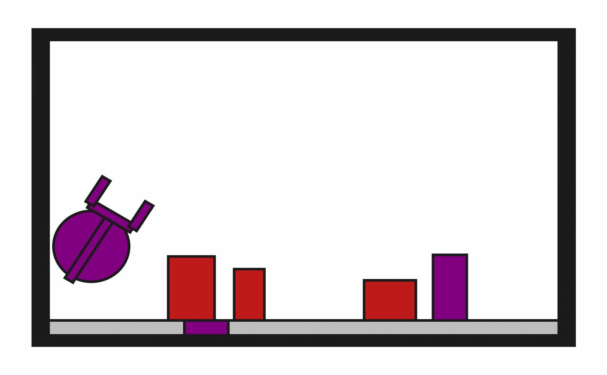

# DynObstruction2D-o3

## Usage
```python
import kinder
env = kinder.make("kinder/DynObstruction2D-o3-v0")
```

## Description
This variant has 3 obstructions.

## Initial State Distribution


## Random Action Behavior


**Random Action Stats**: Total Reward: -25.00, Success: No, Steps: 25

## Example Demonstration


**Demo Stats**: Total Reward: -181.00, Success: Yes, Steps: 181

## Observation Space
The entries of an array in this Box space correspond to the following object features:
| **Index** | **Object** | **Feature** |
| --- | --- | --- |
| 0 | target_surface | x |
| 1 | target_surface | y |
| 2 | target_surface | theta |
| 3 | target_surface | vx |
| 4 | target_surface | vy |
| 5 | target_surface | omega |
| 6 | target_surface | static |
| 7 | target_surface | held |
| 8 | target_surface | color_r |
| 9 | target_surface | color_g |
| 10 | target_surface | color_b |
| 11 | target_surface | z_order |
| 12 | target_surface | width |
| 13 | target_surface | height |
| 14 | target_block | x |
| 15 | target_block | y |
| 16 | target_block | theta |
| 17 | target_block | vx |
| 18 | target_block | vy |
| 19 | target_block | omega |
| 20 | target_block | static |
| 21 | target_block | held |
| 22 | target_block | color_r |
| 23 | target_block | color_g |
| 24 | target_block | color_b |
| 25 | target_block | z_order |
| 26 | target_block | width |
| 27 | target_block | height |
| 28 | target_block | mass |
| 29 | obstruction0 | x |
| 30 | obstruction0 | y |
| 31 | obstruction0 | theta |
| 32 | obstruction0 | vx |
| 33 | obstruction0 | vy |
| 34 | obstruction0 | omega |
| 35 | obstruction0 | static |
| 36 | obstruction0 | held |
| 37 | obstruction0 | color_r |
| 38 | obstruction0 | color_g |
| 39 | obstruction0 | color_b |
| 40 | obstruction0 | z_order |
| 41 | obstruction0 | width |
| 42 | obstruction0 | height |
| 43 | obstruction0 | mass |
| 44 | obstruction1 | x |
| 45 | obstruction1 | y |
| 46 | obstruction1 | theta |
| 47 | obstruction1 | vx |
| 48 | obstruction1 | vy |
| 49 | obstruction1 | omega |
| 50 | obstruction1 | static |
| 51 | obstruction1 | held |
| 52 | obstruction1 | color_r |
| 53 | obstruction1 | color_g |
| 54 | obstruction1 | color_b |
| 55 | obstruction1 | z_order |
| 56 | obstruction1 | width |
| 57 | obstruction1 | height |
| 58 | obstruction1 | mass |
| 59 | obstruction2 | x |
| 60 | obstruction2 | y |
| 61 | obstruction2 | theta |
| 62 | obstruction2 | vx |
| 63 | obstruction2 | vy |
| 64 | obstruction2 | omega |
| 65 | obstruction2 | static |
| 66 | obstruction2 | held |
| 67 | obstruction2 | color_r |
| 68 | obstruction2 | color_g |
| 69 | obstruction2 | color_b |
| 70 | obstruction2 | z_order |
| 71 | obstruction2 | width |
| 72 | obstruction2 | height |
| 73 | obstruction2 | mass |
| 74 | robot | x |
| 75 | robot | y |
| 76 | robot | theta |
| 77 | robot | vx_base |
| 78 | robot | vy_base |
| 79 | robot | omega_base |
| 80 | robot | vx_arm |
| 81 | robot | vy_arm |
| 82 | robot | omega_arm |
| 83 | robot | vx_gripper_l |
| 84 | robot | vy_gripper_l |
| 85 | robot | omega_gripper_l |
| 86 | robot | vx_gripper_r |
| 87 | robot | vy_gripper_r |
| 88 | robot | omega_gripper_r |
| 89 | robot | static |
| 90 | robot | base_radius |
| 91 | robot | arm_joint |
| 92 | robot | arm_length |
| 93 | robot | gripper_base_width |
| 94 | robot | gripper_base_height |
| 95 | robot | finger_gap |
| 96 | robot | finger_height |
| 97 | robot | finger_width |
