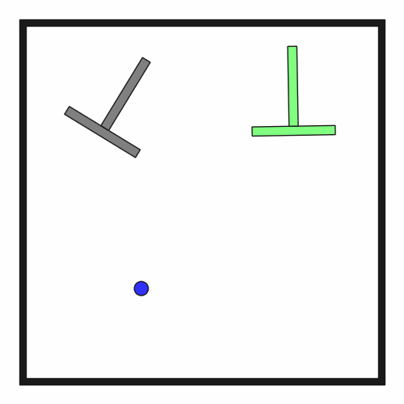

# DynPushT2D-t1

## Usage
```python
import kinder
env = kinder.make("kinder/DynPushT2D-t1-v0")
```

## Description
This variant has a T-shaped block to push to a goal pose.

## Initial State Distribution


## Random Action Behavior


**Random Action Stats**: Total Reward: -25.00, Success: No, Steps: 25

## Example Demonstration


**Demo Stats**: Total Reward: -576.00, Success: Yes, Steps: 576

## Observation Space
The entries of an array in this Box space correspond to the following object features:
| **Index** | **Object** | **Feature** |
| --- | --- | --- |
| 0 | tblock | x |
| 1 | tblock | y |
| 2 | tblock | theta |
| 3 | tblock | vx |
| 4 | tblock | vy |
| 5 | tblock | omega |
| 6 | tblock | static |
| 7 | tblock | held |
| 8 | tblock | color_r |
| 9 | tblock | color_g |
| 10 | tblock | color_b |
| 11 | tblock | z_order |
| 12 | tblock | width |
| 13 | tblock | length_horizontal |
| 14 | tblock | length_vertical |
| 15 | tblock | mass |
| 16 | robot | x |
| 17 | robot | y |
| 18 | robot | theta |
| 19 | robot | vx |
| 20 | robot | vy |
| 21 | robot | omega |
| 22 | robot | static |
| 23 | robot | held |
| 24 | robot | color_r |
| 25 | robot | color_g |
| 26 | robot | color_b |
| 27 | robot | z_order |
| 28 | robot | radius |
| 29 | goal_tblock | x |
| 30 | goal_tblock | y |
| 31 | goal_tblock | theta |
| 32 | goal_tblock | vx |
| 33 | goal_tblock | vy |
| 34 | goal_tblock | omega |
| 35 | goal_tblock | static |
| 36 | goal_tblock | held |
| 37 | goal_tblock | color_r |
| 38 | goal_tblock | color_g |
| 39 | goal_tblock | color_b |
| 40 | goal_tblock | z_order |
| 41 | goal_tblock | width |
| 42 | goal_tblock | length_horizontal |
| 43 | goal_tblock | length_vertical |
| 44 | goal_tblock | mass |
