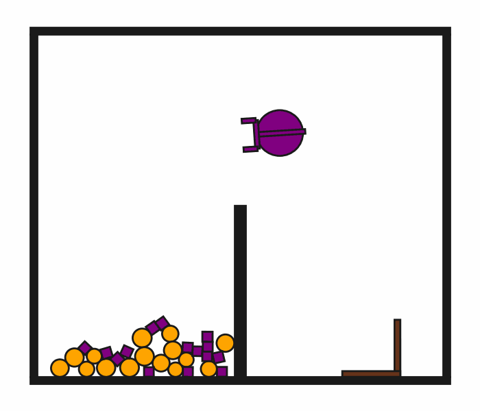

# DynScoopPour2D-o30

## Usage
```python
import kinder
env = kinder.make("kinder/DynScoopPour2D-o30-v0")
```

## Description
This variant has 30 small objects (15 circles, 15 squares).

## Initial State Distribution


## Random Action Behavior


**Random Action Stats**: Total Reward: -25.00, Success: No, Steps: 25

## Example Demonstration


**Demo Stats**: Total Reward: -810.00, Success: No, Steps: 810

## Observation Space
The entries of an array in this Box space correspond to the following object features:
| **Index** | **Object** | **Feature** |
| --- | --- | --- |
| 0 | robot | x |
| 1 | robot | y |
| 2 | robot | theta |
| 3 | robot | vx_base |
| 4 | robot | vy_base |
| 5 | robot | omega_base |
| 6 | robot | vx_arm |
| 7 | robot | vy_arm |
| 8 | robot | omega_arm |
| 9 | robot | vx_gripper_l |
| 10 | robot | vy_gripper_l |
| 11 | robot | omega_gripper_l |
| 12 | robot | vx_gripper_r |
| 13 | robot | vy_gripper_r |
| 14 | robot | omega_gripper_r |
| 15 | robot | static |
| 16 | robot | base_radius |
| 17 | robot | arm_joint |
| 18 | robot | arm_length |
| 19 | robot | gripper_base_width |
| 20 | robot | gripper_base_height |
| 21 | robot | finger_gap |
| 22 | robot | finger_height |
| 23 | robot | finger_width |
| 24 | hook | x |
| 25 | hook | y |
| 26 | hook | theta |
| 27 | hook | vx |
| 28 | hook | vy |
| 29 | hook | omega |
| 30 | hook | static |
| 31 | hook | held |
| 32 | hook | color_r |
| 33 | hook | color_g |
| 34 | hook | color_b |
| 35 | hook | z_order |
| 36 | hook | width |
| 37 | hook | length_side1 |
| 38 | hook | length_side2 |
| 39 | hook | mass |
| 40 | small_circle0 | x |
| 41 | small_circle0 | y |
| 42 | small_circle0 | theta |
| 43 | small_circle0 | vx |
| 44 | small_circle0 | vy |
| 45 | small_circle0 | omega |
| 46 | small_circle0 | static |
| 47 | small_circle0 | held |
| 48 | small_circle0 | color_r |
| 49 | small_circle0 | color_g |
| 50 | small_circle0 | color_b |
| 51 | small_circle0 | z_order |
| 52 | small_circle0 | radius |
| 53 | small_circle0 | mass |
| 54 | small_circle1 | x |
| 55 | small_circle1 | y |
| 56 | small_circle1 | theta |
| 57 | small_circle1 | vx |
| 58 | small_circle1 | vy |
| 59 | small_circle1 | omega |
| 60 | small_circle1 | static |
| 61 | small_circle1 | held |
| 62 | small_circle1 | color_r |
| 63 | small_circle1 | color_g |
| 64 | small_circle1 | color_b |
| 65 | small_circle1 | z_order |
| 66 | small_circle1 | radius |
| 67 | small_circle1 | mass |
| 68 | small_circle10 | x |
| 69 | small_circle10 | y |
| 70 | small_circle10 | theta |
| 71 | small_circle10 | vx |
| 72 | small_circle10 | vy |
| 73 | small_circle10 | omega |
| 74 | small_circle10 | static |
| 75 | small_circle10 | held |
| 76 | small_circle10 | color_r |
| 77 | small_circle10 | color_g |
| 78 | small_circle10 | color_b |
| 79 | small_circle10 | z_order |
| 80 | small_circle10 | radius |
| 81 | small_circle10 | mass |
| 82 | small_circle11 | x |
| 83 | small_circle11 | y |
| 84 | small_circle11 | theta |
| 85 | small_circle11 | vx |
| 86 | small_circle11 | vy |
| 87 | small_circle11 | omega |
| 88 | small_circle11 | static |
| 89 | small_circle11 | held |
| 90 | small_circle11 | color_r |
| 91 | small_circle11 | color_g |
| 92 | small_circle11 | color_b |
| 93 | small_circle11 | z_order |
| 94 | small_circle11 | radius |
| 95 | small_circle11 | mass |
| 96 | small_circle12 | x |
| 97 | small_circle12 | y |
| 98 | small_circle12 | theta |
| 99 | small_circle12 | vx |
| 100 | small_circle12 | vy |
| 101 | small_circle12 | omega |
| 102 | small_circle12 | static |
| 103 | small_circle12 | held |
| 104 | small_circle12 | color_r |
| 105 | small_circle12 | color_g |
| 106 | small_circle12 | color_b |
| 107 | small_circle12 | z_order |
| 108 | small_circle12 | radius |
| 109 | small_circle12 | mass |
| 110 | small_circle13 | x |
| 111 | small_circle13 | y |
| 112 | small_circle13 | theta |
| 113 | small_circle13 | vx |
| 114 | small_circle13 | vy |
| 115 | small_circle13 | omega |
| 116 | small_circle13 | static |
| 117 | small_circle13 | held |
| 118 | small_circle13 | color_r |
| 119 | small_circle13 | color_g |
| 120 | small_circle13 | color_b |
| 121 | small_circle13 | z_order |
| 122 | small_circle13 | radius |
| 123 | small_circle13 | mass |
| 124 | small_circle14 | x |
| 125 | small_circle14 | y |
| 126 | small_circle14 | theta |
| 127 | small_circle14 | vx |
| 128 | small_circle14 | vy |
| 129 | small_circle14 | omega |
| 130 | small_circle14 | static |
| 131 | small_circle14 | held |
| 132 | small_circle14 | color_r |
| 133 | small_circle14 | color_g |
| 134 | small_circle14 | color_b |
| 135 | small_circle14 | z_order |
| 136 | small_circle14 | radius |
| 137 | small_circle14 | mass |
| 138 | small_circle2 | x |
| 139 | small_circle2 | y |
| 140 | small_circle2 | theta |
| 141 | small_circle2 | vx |
| 142 | small_circle2 | vy |
| 143 | small_circle2 | omega |
| 144 | small_circle2 | static |
| 145 | small_circle2 | held |
| 146 | small_circle2 | color_r |
| 147 | small_circle2 | color_g |
| 148 | small_circle2 | color_b |
| 149 | small_circle2 | z_order |
| 150 | small_circle2 | radius |
| 151 | small_circle2 | mass |
| 152 | small_circle3 | x |
| 153 | small_circle3 | y |
| 154 | small_circle3 | theta |
| 155 | small_circle3 | vx |
| 156 | small_circle3 | vy |
| 157 | small_circle3 | omega |
| 158 | small_circle3 | static |
| 159 | small_circle3 | held |
| 160 | small_circle3 | color_r |
| 161 | small_circle3 | color_g |
| 162 | small_circle3 | color_b |
| 163 | small_circle3 | z_order |
| 164 | small_circle3 | radius |
| 165 | small_circle3 | mass |
| 166 | small_circle4 | x |
| 167 | small_circle4 | y |
| 168 | small_circle4 | theta |
| 169 | small_circle4 | vx |
| 170 | small_circle4 | vy |
| 171 | small_circle4 | omega |
| 172 | small_circle4 | static |
| 173 | small_circle4 | held |
| 174 | small_circle4 | color_r |
| 175 | small_circle4 | color_g |
| 176 | small_circle4 | color_b |
| 177 | small_circle4 | z_order |
| 178 | small_circle4 | radius |
| 179 | small_circle4 | mass |
| 180 | small_circle5 | x |
| 181 | small_circle5 | y |
| 182 | small_circle5 | theta |
| 183 | small_circle5 | vx |
| 184 | small_circle5 | vy |
| 185 | small_circle5 | omega |
| 186 | small_circle5 | static |
| 187 | small_circle5 | held |
| 188 | small_circle5 | color_r |
| 189 | small_circle5 | color_g |
| 190 | small_circle5 | color_b |
| 191 | small_circle5 | z_order |
| 192 | small_circle5 | radius |
| 193 | small_circle5 | mass |
| 194 | small_circle6 | x |
| 195 | small_circle6 | y |
| 196 | small_circle6 | theta |
| 197 | small_circle6 | vx |
| 198 | small_circle6 | vy |
| 199 | small_circle6 | omega |
| 200 | small_circle6 | static |
| 201 | small_circle6 | held |
| 202 | small_circle6 | color_r |
| 203 | small_circle6 | color_g |
| 204 | small_circle6 | color_b |
| 205 | small_circle6 | z_order |
| 206 | small_circle6 | radius |
| 207 | small_circle6 | mass |
| 208 | small_circle7 | x |
| 209 | small_circle7 | y |
| 210 | small_circle7 | theta |
| 211 | small_circle7 | vx |
| 212 | small_circle7 | vy |
| 213 | small_circle7 | omega |
| 214 | small_circle7 | static |
| 215 | small_circle7 | held |
| 216 | small_circle7 | color_r |
| 217 | small_circle7 | color_g |
| 218 | small_circle7 | color_b |
| 219 | small_circle7 | z_order |
| 220 | small_circle7 | radius |
| 221 | small_circle7 | mass |
| 222 | small_circle8 | x |
| 223 | small_circle8 | y |
| 224 | small_circle8 | theta |
| 225 | small_circle8 | vx |
| 226 | small_circle8 | vy |
| 227 | small_circle8 | omega |
| 228 | small_circle8 | static |
| 229 | small_circle8 | held |
| 230 | small_circle8 | color_r |
| 231 | small_circle8 | color_g |
| 232 | small_circle8 | color_b |
| 233 | small_circle8 | z_order |
| 234 | small_circle8 | radius |
| 235 | small_circle8 | mass |
| 236 | small_circle9 | x |
| 237 | small_circle9 | y |
| 238 | small_circle9 | theta |
| 239 | small_circle9 | vx |
| 240 | small_circle9 | vy |
| 241 | small_circle9 | omega |
| 242 | small_circle9 | static |
| 243 | small_circle9 | held |
| 244 | small_circle9 | color_r |
| 245 | small_circle9 | color_g |
| 246 | small_circle9 | color_b |
| 247 | small_circle9 | z_order |
| 248 | small_circle9 | radius |
| 249 | small_circle9 | mass |
| 250 | small_square0 | x |
| 251 | small_square0 | y |
| 252 | small_square0 | theta |
| 253 | small_square0 | vx |
| 254 | small_square0 | vy |
| 255 | small_square0 | omega |
| 256 | small_square0 | static |
| 257 | small_square0 | held |
| 258 | small_square0 | color_r |
| 259 | small_square0 | color_g |
| 260 | small_square0 | color_b |
| 261 | small_square0 | z_order |
| 262 | small_square0 | size |
| 263 | small_square0 | mass |
| 264 | small_square1 | x |
| 265 | small_square1 | y |
| 266 | small_square1 | theta |
| 267 | small_square1 | vx |
| 268 | small_square1 | vy |
| 269 | small_square1 | omega |
| 270 | small_square1 | static |
| 271 | small_square1 | held |
| 272 | small_square1 | color_r |
| 273 | small_square1 | color_g |
| 274 | small_square1 | color_b |
| 275 | small_square1 | z_order |
| 276 | small_square1 | size |
| 277 | small_square1 | mass |
| 278 | small_square10 | x |
| 279 | small_square10 | y |
| 280 | small_square10 | theta |
| 281 | small_square10 | vx |
| 282 | small_square10 | vy |
| 283 | small_square10 | omega |
| 284 | small_square10 | static |
| 285 | small_square10 | held |
| 286 | small_square10 | color_r |
| 287 | small_square10 | color_g |
| 288 | small_square10 | color_b |
| 289 | small_square10 | z_order |
| 290 | small_square10 | size |
| 291 | small_square10 | mass |
| 292 | small_square11 | x |
| 293 | small_square11 | y |
| 294 | small_square11 | theta |
| 295 | small_square11 | vx |
| 296 | small_square11 | vy |
| 297 | small_square11 | omega |
| 298 | small_square11 | static |
| 299 | small_square11 | held |
| 300 | small_square11 | color_r |
| 301 | small_square11 | color_g |
| 302 | small_square11 | color_b |
| 303 | small_square11 | z_order |
| 304 | small_square11 | size |
| 305 | small_square11 | mass |
| 306 | small_square12 | x |
| 307 | small_square12 | y |
| 308 | small_square12 | theta |
| 309 | small_square12 | vx |
| 310 | small_square12 | vy |
| 311 | small_square12 | omega |
| 312 | small_square12 | static |
| 313 | small_square12 | held |
| 314 | small_square12 | color_r |
| 315 | small_square12 | color_g |
| 316 | small_square12 | color_b |
| 317 | small_square12 | z_order |
| 318 | small_square12 | size |
| 319 | small_square12 | mass |
| 320 | small_square13 | x |
| 321 | small_square13 | y |
| 322 | small_square13 | theta |
| 323 | small_square13 | vx |
| 324 | small_square13 | vy |
| 325 | small_square13 | omega |
| 326 | small_square13 | static |
| 327 | small_square13 | held |
| 328 | small_square13 | color_r |
| 329 | small_square13 | color_g |
| 330 | small_square13 | color_b |
| 331 | small_square13 | z_order |
| 332 | small_square13 | size |
| 333 | small_square13 | mass |
| 334 | small_square14 | x |
| 335 | small_square14 | y |
| 336 | small_square14 | theta |
| 337 | small_square14 | vx |
| 338 | small_square14 | vy |
| 339 | small_square14 | omega |
| 340 | small_square14 | static |
| 341 | small_square14 | held |
| 342 | small_square14 | color_r |
| 343 | small_square14 | color_g |
| 344 | small_square14 | color_b |
| 345 | small_square14 | z_order |
| 346 | small_square14 | size |
| 347 | small_square14 | mass |
| 348 | small_square2 | x |
| 349 | small_square2 | y |
| 350 | small_square2 | theta |
| 351 | small_square2 | vx |
| 352 | small_square2 | vy |
| 353 | small_square2 | omega |
| 354 | small_square2 | static |
| 355 | small_square2 | held |
| 356 | small_square2 | color_r |
| 357 | small_square2 | color_g |
| 358 | small_square2 | color_b |
| 359 | small_square2 | z_order |
| 360 | small_square2 | size |
| 361 | small_square2 | mass |
| 362 | small_square3 | x |
| 363 | small_square3 | y |
| 364 | small_square3 | theta |
| 365 | small_square3 | vx |
| 366 | small_square3 | vy |
| 367 | small_square3 | omega |
| 368 | small_square3 | static |
| 369 | small_square3 | held |
| 370 | small_square3 | color_r |
| 371 | small_square3 | color_g |
| 372 | small_square3 | color_b |
| 373 | small_square3 | z_order |
| 374 | small_square3 | size |
| 375 | small_square3 | mass |
| 376 | small_square4 | x |
| 377 | small_square4 | y |
| 378 | small_square4 | theta |
| 379 | small_square4 | vx |
| 380 | small_square4 | vy |
| 381 | small_square4 | omega |
| 382 | small_square4 | static |
| 383 | small_square4 | held |
| 384 | small_square4 | color_r |
| 385 | small_square4 | color_g |
| 386 | small_square4 | color_b |
| 387 | small_square4 | z_order |
| 388 | small_square4 | size |
| 389 | small_square4 | mass |
| 390 | small_square5 | x |
| 391 | small_square5 | y |
| 392 | small_square5 | theta |
| 393 | small_square5 | vx |
| 394 | small_square5 | vy |
| 395 | small_square5 | omega |
| 396 | small_square5 | static |
| 397 | small_square5 | held |
| 398 | small_square5 | color_r |
| 399 | small_square5 | color_g |
| 400 | small_square5 | color_b |
| 401 | small_square5 | z_order |
| 402 | small_square5 | size |
| 403 | small_square5 | mass |
| 404 | small_square6 | x |
| 405 | small_square6 | y |
| 406 | small_square6 | theta |
| 407 | small_square6 | vx |
| 408 | small_square6 | vy |
| 409 | small_square6 | omega |
| 410 | small_square6 | static |
| 411 | small_square6 | held |
| 412 | small_square6 | color_r |
| 413 | small_square6 | color_g |
| 414 | small_square6 | color_b |
| 415 | small_square6 | z_order |
| 416 | small_square6 | size |
| 417 | small_square6 | mass |
| 418 | small_square7 | x |
| 419 | small_square7 | y |
| 420 | small_square7 | theta |
| 421 | small_square7 | vx |
| 422 | small_square7 | vy |
| 423 | small_square7 | omega |
| 424 | small_square7 | static |
| 425 | small_square7 | held |
| 426 | small_square7 | color_r |
| 427 | small_square7 | color_g |
| 428 | small_square7 | color_b |
| 429 | small_square7 | z_order |
| 430 | small_square7 | size |
| 431 | small_square7 | mass |
| 432 | small_square8 | x |
| 433 | small_square8 | y |
| 434 | small_square8 | theta |
| 435 | small_square8 | vx |
| 436 | small_square8 | vy |
| 437 | small_square8 | omega |
| 438 | small_square8 | static |
| 439 | small_square8 | held |
| 440 | small_square8 | color_r |
| 441 | small_square8 | color_g |
| 442 | small_square8 | color_b |
| 443 | small_square8 | z_order |
| 444 | small_square8 | size |
| 445 | small_square8 | mass |
| 446 | small_square9 | x |
| 447 | small_square9 | y |
| 448 | small_square9 | theta |
| 449 | small_square9 | vx |
| 450 | small_square9 | vy |
| 451 | small_square9 | omega |
| 452 | small_square9 | static |
| 453 | small_square9 | held |
| 454 | small_square9 | color_r |
| 455 | small_square9 | color_g |
| 456 | small_square9 | color_b |
| 457 | small_square9 | z_order |
| 458 | small_square9 | size |
| 459 | small_square9 | mass |
