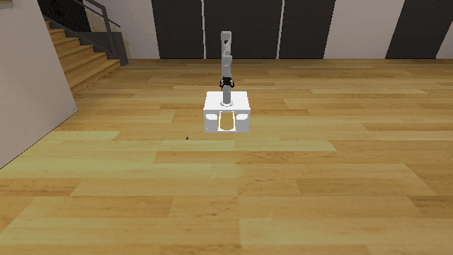

# Ground3D-o1

## Usage
```python
import kinder
env = kinder.make("kinder/Ground3D-o1-v0")
```

## Description
This variant has 1 cube on the ground.

## Initial State Distribution


## Random Action Behavior


**Random Action Stats**: Total Reward: -25.00, Success: No, Steps: 25

## Example Demonstration
*(No demonstration GIFs available)*

## Observation Space
The entries of an array in this Box space correspond to the following object features:
| **Index** | **Object** | **Feature** |
| --- | --- | --- |
| 0 | robot | pos_base_x |
| 1 | robot | pos_base_y |
| 2 | robot | pos_base_rot |
| 3 | robot | joint_1 |
| 4 | robot | joint_2 |
| 5 | robot | joint_3 |
| 6 | robot | joint_4 |
| 7 | robot | joint_5 |
| 8 | robot | joint_6 |
| 9 | robot | joint_7 |
| 10 | robot | finger_state |
| 11 | robot | grasp_active |
| 12 | robot | grasp_tf_x |
| 13 | robot | grasp_tf_y |
| 14 | robot | grasp_tf_z |
| 15 | robot | grasp_tf_qx |
| 16 | robot | grasp_tf_qy |
| 17 | robot | grasp_tf_qz |
| 18 | robot | grasp_tf_qw |
| 19 | cube0 | pose_x |
| 20 | cube0 | pose_y |
| 21 | cube0 | pose_z |
| 22 | cube0 | pose_qx |
| 23 | cube0 | pose_qy |
| 24 | cube0 | pose_qz |
| 25 | cube0 | pose_qw |
| 26 | cube0 | grasp_active |
| 27 | cube0 | object_type |
| 28 | cube0 | half_extent_x |
| 29 | cube0 | half_extent_y |
| 30 | cube0 | half_extent_z |
