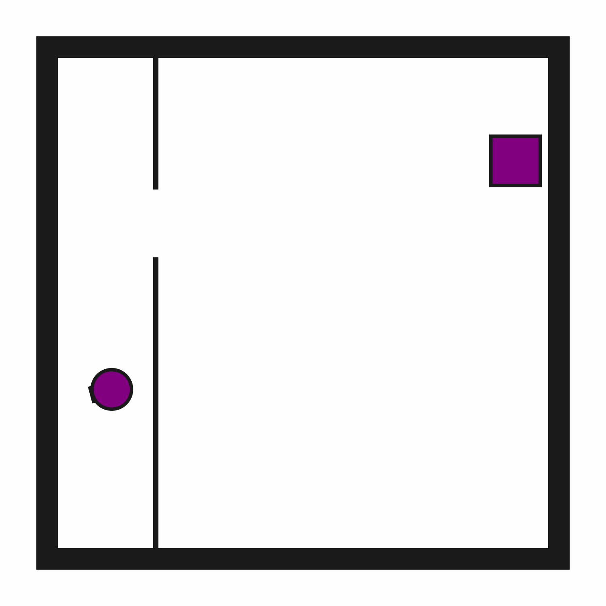
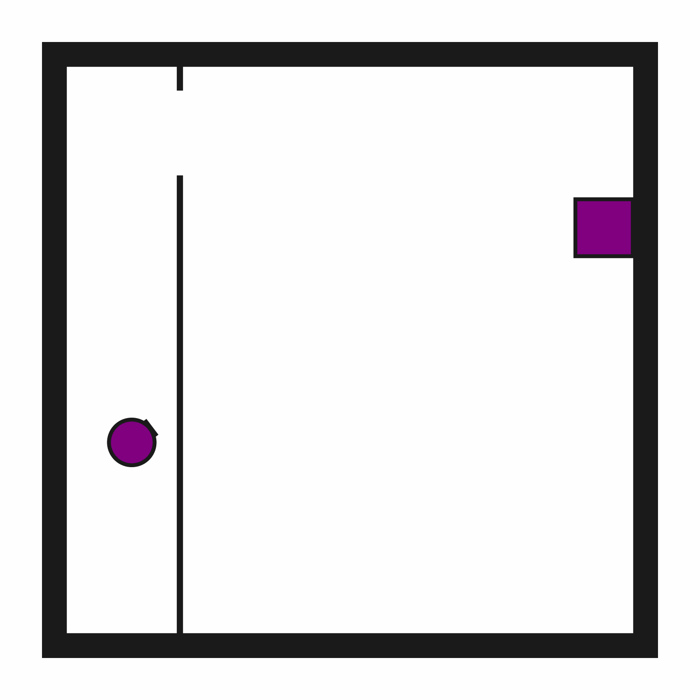

# Motion2D-p1

## Usage
```python
import kinder
env = kinder.make("kinder/Motion2D-p1-v0")
```

## Description
This variant has 1 narrow passage.

## Initial State Distribution


## Random Action Behavior


**Random Action Stats**: Total Reward: -25.00, Success: No, Steps: 25

## Example Demonstration


**Demo Stats**: Total Reward: -69.00, Success: Yes, Steps: 69

## Observation Space
The entries of an array in this Box space correspond to the following object features:
| **Index** | **Object** | **Feature** |
| --- | --- | --- |
| 0 | robot | x |
| 1 | robot | y |
| 2 | robot | theta |
| 3 | robot | base_radius |
| 4 | robot | arm_joint |
| 5 | robot | arm_length |
| 6 | robot | vacuum |
| 7 | robot | gripper_height |
| 8 | robot | gripper_width |
| 9 | target_region | x |
| 10 | target_region | y |
| 11 | target_region | theta |
| 12 | target_region | static |
| 13 | target_region | color_r |
| 14 | target_region | color_g |
| 15 | target_region | color_b |
| 16 | target_region | z_order |
| 17 | target_region | width |
| 18 | target_region | height |
| 19 | obstacle0 | x |
| 20 | obstacle0 | y |
| 21 | obstacle0 | theta |
| 22 | obstacle0 | static |
| 23 | obstacle0 | color_r |
| 24 | obstacle0 | color_g |
| 25 | obstacle0 | color_b |
| 26 | obstacle0 | z_order |
| 27 | obstacle0 | width |
| 28 | obstacle0 | height |
| 29 | obstacle1 | x |
| 30 | obstacle1 | y |
| 31 | obstacle1 | theta |
| 32 | obstacle1 | static |
| 33 | obstacle1 | color_r |
| 34 | obstacle1 | color_g |
| 35 | obstacle1 | color_b |
| 36 | obstacle1 | z_order |
| 37 | obstacle1 | width |
| 38 | obstacle1 | height |
