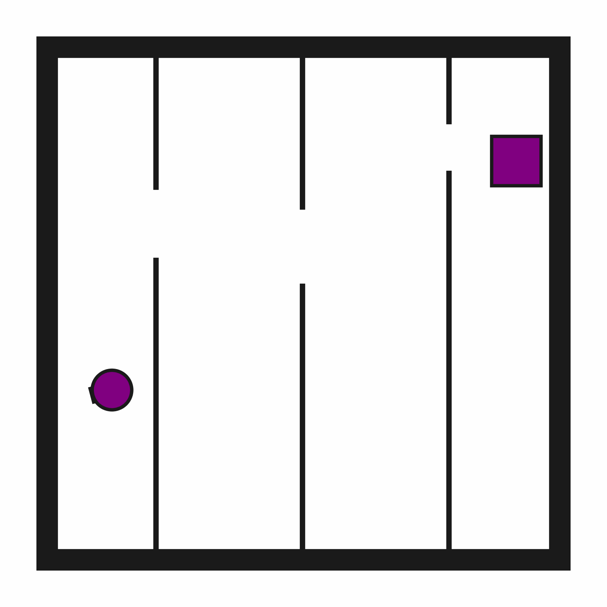

# Motion2D-p3

## Usage
```python
import kinder
env = kinder.make("kinder/Motion2D-p3-v0")
```

## Description
This variant has 3 narrow passages.

## Initial State Distribution


## Random Action Behavior


**Random Action Stats**: Total Reward: -25.00, Success: No, Steps: 25

## Example Demonstration


**Demo Stats**: Total Reward: -108.00, Success: Yes, Steps: 108

## Observation Space
The entries of an array in this Box space correspond to the following object features:
| **Index** | **Object** | **Feature** |
| --- | --- | --- |
| 0 | robot | x |
| 1 | robot | y |
| 2 | robot | theta |
| 3 | robot | base_radius |
| 4 | robot | arm_joint |
| 5 | robot | arm_length |
| 6 | robot | vacuum |
| 7 | robot | gripper_height |
| 8 | robot | gripper_width |
| 9 | target_region | x |
| 10 | target_region | y |
| 11 | target_region | theta |
| 12 | target_region | static |
| 13 | target_region | color_r |
| 14 | target_region | color_g |
| 15 | target_region | color_b |
| 16 | target_region | z_order |
| 17 | target_region | width |
| 18 | target_region | height |
| 19 | obstacle0 | x |
| 20 | obstacle0 | y |
| 21 | obstacle0 | theta |
| 22 | obstacle0 | static |
| 23 | obstacle0 | color_r |
| 24 | obstacle0 | color_g |
| 25 | obstacle0 | color_b |
| 26 | obstacle0 | z_order |
| 27 | obstacle0 | width |
| 28 | obstacle0 | height |
| 29 | obstacle1 | x |
| 30 | obstacle1 | y |
| 31 | obstacle1 | theta |
| 32 | obstacle1 | static |
| 33 | obstacle1 | color_r |
| 34 | obstacle1 | color_g |
| 35 | obstacle1 | color_b |
| 36 | obstacle1 | z_order |
| 37 | obstacle1 | width |
| 38 | obstacle1 | height |
| 39 | obstacle2 | x |
| 40 | obstacle2 | y |
| 41 | obstacle2 | theta |
| 42 | obstacle2 | static |
| 43 | obstacle2 | color_r |
| 44 | obstacle2 | color_g |
| 45 | obstacle2 | color_b |
| 46 | obstacle2 | z_order |
| 47 | obstacle2 | width |
| 48 | obstacle2 | height |
| 49 | obstacle3 | x |
| 50 | obstacle3 | y |
| 51 | obstacle3 | theta |
| 52 | obstacle3 | static |
| 53 | obstacle3 | color_r |
| 54 | obstacle3 | color_g |
| 55 | obstacle3 | color_b |
| 56 | obstacle3 | z_order |
| 57 | obstacle3 | width |
| 58 | obstacle3 | height |
| 59 | obstacle4 | x |
| 60 | obstacle4 | y |
| 61 | obstacle4 | theta |
| 62 | obstacle4 | static |
| 63 | obstacle4 | color_r |
| 64 | obstacle4 | color_g |
| 65 | obstacle4 | color_b |
| 66 | obstacle4 | z_order |
| 67 | obstacle4 | width |
| 68 | obstacle4 | height |
| 69 | obstacle5 | x |
| 70 | obstacle5 | y |
| 71 | obstacle5 | theta |
| 72 | obstacle5 | static |
| 73 | obstacle5 | color_r |
| 74 | obstacle5 | color_g |
| 75 | obstacle5 | color_b |
| 76 | obstacle5 | z_order |
| 77 | obstacle5 | width |
| 78 | obstacle5 | height |
