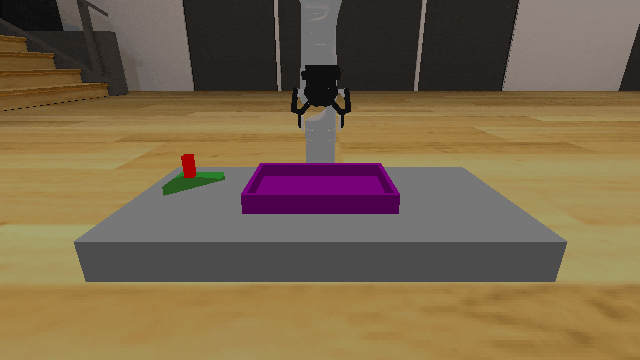

# Packing3D-p1

## Usage
```python
import kinder
env = kinder.make("kinder/Packing3D-p1-v0")
```

## Description
This variant has 1 part to pack into the rack.

## Initial State Distribution


## Random Action Behavior


**Random Action Stats**: Total Reward: -25.00, Success: No, Steps: 25

## Example Demonstration
*(No demonstration GIFs available)*

## Observation Space
The entries of an array in this Box space correspond to the following object features:
| **Index** | **Object** | **Feature** |
| --- | --- | --- |
| 0 | robot | pos_base_x |
| 1 | robot | pos_base_y |
| 2 | robot | pos_base_rot |
| 3 | robot | joint_1 |
| 4 | robot | joint_2 |
| 5 | robot | joint_3 |
| 6 | robot | joint_4 |
| 7 | robot | joint_5 |
| 8 | robot | joint_6 |
| 9 | robot | joint_7 |
| 10 | robot | finger_state |
| 11 | robot | grasp_active |
| 12 | robot | grasp_tf_x |
| 13 | robot | grasp_tf_y |
| 14 | robot | grasp_tf_z |
| 15 | robot | grasp_tf_qx |
| 16 | robot | grasp_tf_qy |
| 17 | robot | grasp_tf_qz |
| 18 | robot | grasp_tf_qw |
| 19 | rack | pose_x |
| 20 | rack | pose_y |
| 21 | rack | pose_z |
| 22 | rack | pose_qx |
| 23 | rack | pose_qy |
| 24 | rack | pose_qz |
| 25 | rack | pose_qw |
| 26 | rack | grasp_active |
| 27 | rack | object_type |
| 28 | rack | half_extent_x |
| 29 | rack | half_extent_y |
| 30 | rack | half_extent_z |
| 31 | part0 | pose_x |
| 32 | part0 | pose_y |
| 33 | part0 | pose_z |
| 34 | part0 | pose_qx |
| 35 | part0 | pose_qy |
| 36 | part0 | pose_qz |
| 37 | part0 | pose_qw |
| 38 | part0 | grasp_active |
| 39 | part0 | triangle_type |
| 40 | part0 | side_a |
| 41 | part0 | side_b |
| 42 | part0 | depth |
