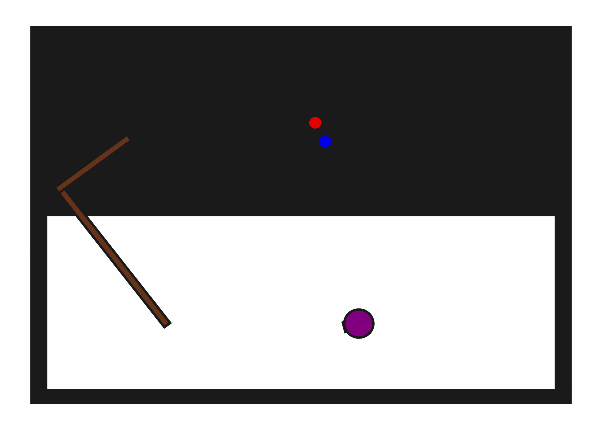

# PushPullHook2D

## Usage
```python
import kinder
env = kinder.make("kinder/PushPullHook2D-v0")
```

## Description
This variant has one hook, one movable button, and one target button.

## Initial State Distribution


## Random Action Behavior


**Random Action Stats**: Total Reward: -25.00, Success: No, Steps: 25

## Example Demonstration


**Demo Stats**: Total Reward: -113.00, Success: Yes, Steps: 114

## Observation Space
The entries of an array in this Box space correspond to the following object features:
| **Index** | **Object** | **Feature** |
| --- | --- | --- |
| 0 | robot | x |
| 1 | robot | y |
| 2 | robot | theta |
| 3 | robot | base_radius |
| 4 | robot | arm_joint |
| 5 | robot | arm_length |
| 6 | robot | vacuum |
| 7 | robot | gripper_height |
| 8 | robot | gripper_width |
| 9 | hook | x |
| 10 | hook | y |
| 11 | hook | theta |
| 12 | hook | static |
| 13 | hook | color_r |
| 14 | hook | color_g |
| 15 | hook | color_b |
| 16 | hook | z_order |
| 17 | hook | width |
| 18 | hook | length_side1 |
| 19 | hook | length_side2 |
| 20 | movable_button | x |
| 21 | movable_button | y |
| 22 | movable_button | theta |
| 23 | movable_button | static |
| 24 | movable_button | color_r |
| 25 | movable_button | color_g |
| 26 | movable_button | color_b |
| 27 | movable_button | z_order |
| 28 | movable_button | radius |
| 29 | target_button | x |
| 30 | target_button | y |
| 31 | target_button | theta |
| 32 | target_button | static |
| 33 | target_button | color_r |
| 34 | target_button | color_g |
| 35 | target_button | color_b |
| 36 | target_button | z_order |
| 37 | target_button | radius |
