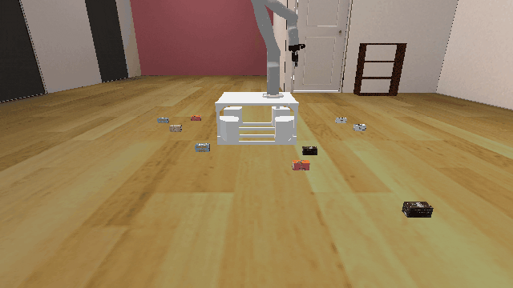
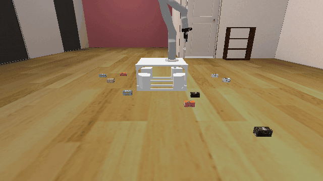

# Shelf3D-o10

## Usage
```python
import kinder
env = kinder.make("kinder/Shelf3D-o10-v0")
```

## Description
This variant has 10 objects to place on the shelf.

## Initial State Distribution


## Random Action Behavior


**Random Action Stats**: Total Reward: -25.00, Success: No, Steps: 25

## Example Demonstration
*(No demonstration GIFs available)*

## Observation Space
The entries of an array in this Box space correspond to the following object features:
| **Index** | **Object** | **Feature** |
| --- | --- | --- |
| 0 | robot | pos_base_x |
| 1 | robot | pos_base_y |
| 2 | robot | pos_base_rot |
| 3 | robot | joint_1 |
| 4 | robot | joint_2 |
| 5 | robot | joint_3 |
| 6 | robot | joint_4 |
| 7 | robot | joint_5 |
| 8 | robot | joint_6 |
| 9 | robot | joint_7 |
| 10 | robot | finger_state |
| 11 | robot | grasp_active |
| 12 | robot | grasp_tf_x |
| 13 | robot | grasp_tf_y |
| 14 | robot | grasp_tf_z |
| 15 | robot | grasp_tf_qx |
| 16 | robot | grasp_tf_qy |
| 17 | robot | grasp_tf_qz |
| 18 | robot | grasp_tf_qw |
| 19 | shelf | pose_x |
| 20 | shelf | pose_y |
| 21 | shelf | pose_z |
| 22 | shelf | pose_qx |
| 23 | shelf | pose_qy |
| 24 | shelf | pose_qz |
| 25 | shelf | pose_qw |
| 26 | cube0 | pose_x |
| 27 | cube0 | pose_y |
| 28 | cube0 | pose_z |
| 29 | cube0 | pose_qx |
| 30 | cube0 | pose_qy |
| 31 | cube0 | pose_qz |
| 32 | cube0 | pose_qw |
| 33 | cube0 | grasp_active |
| 34 | cube0 | object_type |
| 35 | cube0 | half_extent_x |
| 36 | cube0 | half_extent_y |
| 37 | cube0 | half_extent_z |
| 38 | cube1 | pose_x |
| 39 | cube1 | pose_y |
| 40 | cube1 | pose_z |
| 41 | cube1 | pose_qx |
| 42 | cube1 | pose_qy |
| 43 | cube1 | pose_qz |
| 44 | cube1 | pose_qw |
| 45 | cube1 | grasp_active |
| 46 | cube1 | object_type |
| 47 | cube1 | half_extent_x |
| 48 | cube1 | half_extent_y |
| 49 | cube1 | half_extent_z |
| 50 | cube2 | pose_x |
| 51 | cube2 | pose_y |
| 52 | cube2 | pose_z |
| 53 | cube2 | pose_qx |
| 54 | cube2 | pose_qy |
| 55 | cube2 | pose_qz |
| 56 | cube2 | pose_qw |
| 57 | cube2 | grasp_active |
| 58 | cube2 | object_type |
| 59 | cube2 | half_extent_x |
| 60 | cube2 | half_extent_y |
| 61 | cube2 | half_extent_z |
| 62 | cube3 | pose_x |
| 63 | cube3 | pose_y |
| 64 | cube3 | pose_z |
| 65 | cube3 | pose_qx |
| 66 | cube3 | pose_qy |
| 67 | cube3 | pose_qz |
| 68 | cube3 | pose_qw |
| 69 | cube3 | grasp_active |
| 70 | cube3 | object_type |
| 71 | cube3 | half_extent_x |
| 72 | cube3 | half_extent_y |
| 73 | cube3 | half_extent_z |
| 74 | cube4 | pose_x |
| 75 | cube4 | pose_y |
| 76 | cube4 | pose_z |
| 77 | cube4 | pose_qx |
| 78 | cube4 | pose_qy |
| 79 | cube4 | pose_qz |
| 80 | cube4 | pose_qw |
| 81 | cube4 | grasp_active |
| 82 | cube4 | object_type |
| 83 | cube4 | half_extent_x |
| 84 | cube4 | half_extent_y |
| 85 | cube4 | half_extent_z |
| 86 | cube5 | pose_x |
| 87 | cube5 | pose_y |
| 88 | cube5 | pose_z |
| 89 | cube5 | pose_qx |
| 90 | cube5 | pose_qy |
| 91 | cube5 | pose_qz |
| 92 | cube5 | pose_qw |
| 93 | cube5 | grasp_active |
| 94 | cube5 | object_type |
| 95 | cube5 | half_extent_x |
| 96 | cube5 | half_extent_y |
| 97 | cube5 | half_extent_z |
| 98 | cube6 | pose_x |
| 99 | cube6 | pose_y |
| 100 | cube6 | pose_z |
| 101 | cube6 | pose_qx |
| 102 | cube6 | pose_qy |
| 103 | cube6 | pose_qz |
| 104 | cube6 | pose_qw |
| 105 | cube6 | grasp_active |
| 106 | cube6 | object_type |
| 107 | cube6 | half_extent_x |
| 108 | cube6 | half_extent_y |
| 109 | cube6 | half_extent_z |
| 110 | cube7 | pose_x |
| 111 | cube7 | pose_y |
| 112 | cube7 | pose_z |
| 113 | cube7 | pose_qx |
| 114 | cube7 | pose_qy |
| 115 | cube7 | pose_qz |
| 116 | cube7 | pose_qw |
| 117 | cube7 | grasp_active |
| 118 | cube7 | object_type |
| 119 | cube7 | half_extent_x |
| 120 | cube7 | half_extent_y |
| 121 | cube7 | half_extent_z |
| 122 | cube8 | pose_x |
| 123 | cube8 | pose_y |
| 124 | cube8 | pose_z |
| 125 | cube8 | pose_qx |
| 126 | cube8 | pose_qy |
| 127 | cube8 | pose_qz |
| 128 | cube8 | pose_qw |
| 129 | cube8 | grasp_active |
| 130 | cube8 | object_type |
| 131 | cube8 | half_extent_x |
| 132 | cube8 | half_extent_y |
| 133 | cube8 | half_extent_z |
| 134 | cube9 | pose_x |
| 135 | cube9 | pose_y |
| 136 | cube9 | pose_z |
| 137 | cube9 | pose_qx |
| 138 | cube9 | pose_qy |
| 139 | cube9 | pose_qz |
| 140 | cube9 | pose_qw |
| 141 | cube9 | grasp_active |
| 142 | cube9 | object_type |
| 143 | cube9 | half_extent_x |
| 144 | cube9 | half_extent_y |
| 145 | cube9 | half_extent_z |
