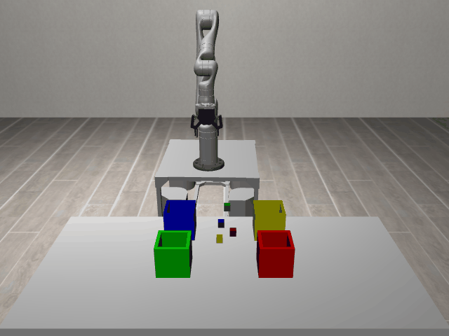

# SortClutteredBlocks3D-o4-sort_the_cluttered_blocks_into_bins

## Usage
```python
import kinder
env = kinder.make("kinder/SortClutteredBlocks3D-o4-sort_the_cluttered_blocks_into_bins-v0")
```

## Description
This variant uses the 'ground' scene type with 3 objects.

## Initial State Distribution


## Random Action Behavior


**Random Action Stats**: Total Reward: -0.25, Success: No, Steps: 25

## Example Demonstration
*(No demonstration GIFs available)*

## Observation Space
The entries of an array in this Box space correspond to the following object features:
| **Index** | **Object** | **Feature** |
| --- | --- | --- |
| 0 | bin_blue | x |
| 1 | bin_blue | y |
| 2 | bin_blue | z |
| 3 | bin_blue | qw |
| 4 | bin_blue | qx |
| 5 | bin_blue | qy |
| 6 | bin_blue | qz |
| 7 | bin_blue | vx |
| 8 | bin_blue | vy |
| 9 | bin_blue | vz |
| 10 | bin_blue | wx |
| 11 | bin_blue | wy |
| 12 | bin_blue | wz |
| 13 | bin_blue | bb_x |
| 14 | bin_blue | bb_y |
| 15 | bin_blue | bb_z |
| 16 | bin_green | x |
| 17 | bin_green | y |
| 18 | bin_green | z |
| 19 | bin_green | qw |
| 20 | bin_green | qx |
| 21 | bin_green | qy |
| 22 | bin_green | qz |
| 23 | bin_green | vx |
| 24 | bin_green | vy |
| 25 | bin_green | vz |
| 26 | bin_green | wx |
| 27 | bin_green | wy |
| 28 | bin_green | wz |
| 29 | bin_green | bb_x |
| 30 | bin_green | bb_y |
| 31 | bin_green | bb_z |
| 32 | bin_red | x |
| 33 | bin_red | y |
| 34 | bin_red | z |
| 35 | bin_red | qw |
| 36 | bin_red | qx |
| 37 | bin_red | qy |
| 38 | bin_red | qz |
| 39 | bin_red | vx |
| 40 | bin_red | vy |
| 41 | bin_red | vz |
| 42 | bin_red | wx |
| 43 | bin_red | wy |
| 44 | bin_red | wz |
| 45 | bin_red | bb_x |
| 46 | bin_red | bb_y |
| 47 | bin_red | bb_z |
| 48 | bin_yellow | x |
| 49 | bin_yellow | y |
| 50 | bin_yellow | z |
| 51 | bin_yellow | qw |
| 52 | bin_yellow | qx |
| 53 | bin_yellow | qy |
| 54 | bin_yellow | qz |
| 55 | bin_yellow | vx |
| 56 | bin_yellow | vy |
| 57 | bin_yellow | vz |
| 58 | bin_yellow | wx |
| 59 | bin_yellow | wy |
| 60 | bin_yellow | wz |
| 61 | bin_yellow | bb_x |
| 62 | bin_yellow | bb_y |
| 63 | bin_yellow | bb_z |
| 64 | cube1 | x |
| 65 | cube1 | y |
| 66 | cube1 | z |
| 67 | cube1 | qw |
| 68 | cube1 | qx |
| 69 | cube1 | qy |
| 70 | cube1 | qz |
| 71 | cube1 | vx |
| 72 | cube1 | vy |
| 73 | cube1 | vz |
| 74 | cube1 | wx |
| 75 | cube1 | wy |
| 76 | cube1 | wz |
| 77 | cube1 | bb_x |
| 78 | cube1 | bb_y |
| 79 | cube1 | bb_z |
| 80 | cube2 | x |
| 81 | cube2 | y |
| 82 | cube2 | z |
| 83 | cube2 | qw |
| 84 | cube2 | qx |
| 85 | cube2 | qy |
| 86 | cube2 | qz |
| 87 | cube2 | vx |
| 88 | cube2 | vy |
| 89 | cube2 | vz |
| 90 | cube2 | wx |
| 91 | cube2 | wy |
| 92 | cube2 | wz |
| 93 | cube2 | bb_x |
| 94 | cube2 | bb_y |
| 95 | cube2 | bb_z |
| 96 | cube3 | x |
| 97 | cube3 | y |
| 98 | cube3 | z |
| 99 | cube3 | qw |
| 100 | cube3 | qx |
| 101 | cube3 | qy |
| 102 | cube3 | qz |
| 103 | cube3 | vx |
| 104 | cube3 | vy |
| 105 | cube3 | vz |
| 106 | cube3 | wx |
| 107 | cube3 | wy |
| 108 | cube3 | wz |
| 109 | cube3 | bb_x |
| 110 | cube3 | bb_y |
| 111 | cube3 | bb_z |
| 112 | cube4 | x |
| 113 | cube4 | y |
| 114 | cube4 | z |
| 115 | cube4 | qw |
| 116 | cube4 | qx |
| 117 | cube4 | qy |
| 118 | cube4 | qz |
| 119 | cube4 | vx |
| 120 | cube4 | vy |
| 121 | cube4 | vz |
| 122 | cube4 | wx |
| 123 | cube4 | wy |
| 124 | cube4 | wz |
| 125 | cube4 | bb_x |
| 126 | cube4 | bb_y |
| 127 | cube4 | bb_z |
| 128 | robot | pos_base_x |
| 129 | robot | pos_base_y |
| 130 | robot | pos_base_rot |
| 131 | robot | pos_arm_joint1 |
| 132 | robot | pos_arm_joint2 |
| 133 | robot | pos_arm_joint3 |
| 134 | robot | pos_arm_joint4 |
| 135 | robot | pos_arm_joint5 |
| 136 | robot | pos_arm_joint6 |
| 137 | robot | pos_arm_joint7 |
| 138 | robot | pos_gripper |
| 139 | robot | vel_base_x |
| 140 | robot | vel_base_y |
| 141 | robot | vel_base_rot |
| 142 | robot | vel_arm_joint1 |
| 143 | robot | vel_arm_joint2 |
| 144 | robot | vel_arm_joint3 |
| 145 | robot | vel_arm_joint4 |
| 146 | robot | vel_arm_joint5 |
| 147 | robot | vel_arm_joint6 |
| 148 | robot | vel_arm_joint7 |
| 149 | robot | vel_gripper |
| 150 | table_1 | x |
| 151 | table_1 | y |
| 152 | table_1 | z |
| 153 | table_1 | qw |
| 154 | table_1 | qx |
| 155 | table_1 | qy |
| 156 | table_1 | qz |
