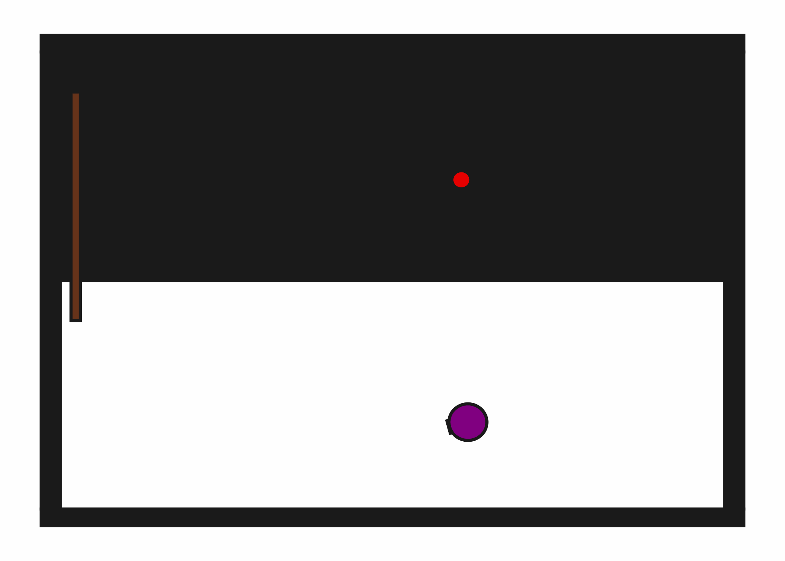
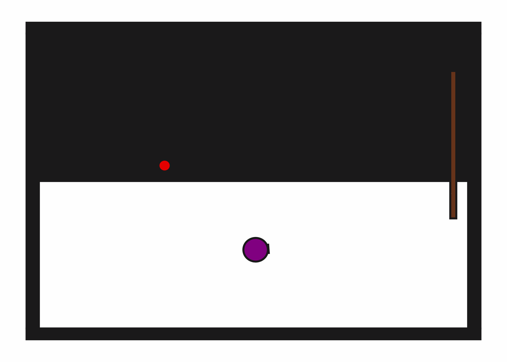

# StickButton2D-b1

## Usage
```python
import kinder
env = kinder.make("kinder/StickButton2D-b1-v0")
```

## Description
This variant has 1 button to press.

## Initial State Distribution


## Random Action Behavior


**Random Action Stats**: Total Reward: -25.00, Success: No, Steps: 25

## Example Demonstration


**Demo Stats**: Total Reward: -161.00, Success: Yes, Steps: 161

## Observation Space
The entries of an array in this Box space correspond to the following object features:
| **Index** | **Object** | **Feature** |
| --- | --- | --- |
| 0 | robot | x |
| 1 | robot | y |
| 2 | robot | theta |
| 3 | robot | base_radius |
| 4 | robot | arm_joint |
| 5 | robot | arm_length |
| 6 | robot | vacuum |
| 7 | robot | gripper_height |
| 8 | robot | gripper_width |
| 9 | stick | x |
| 10 | stick | y |
| 11 | stick | theta |
| 12 | stick | static |
| 13 | stick | color_r |
| 14 | stick | color_g |
| 15 | stick | color_b |
| 16 | stick | z_order |
| 17 | stick | width |
| 18 | stick | height |
| 19 | button0 | x |
| 20 | button0 | y |
| 21 | button0 | theta |
| 22 | button0 | static |
| 23 | button0 | color_r |
| 24 | button0 | color_g |
| 25 | button0 | color_b |
| 26 | button0 | z_order |
| 27 | button0 | radius |
