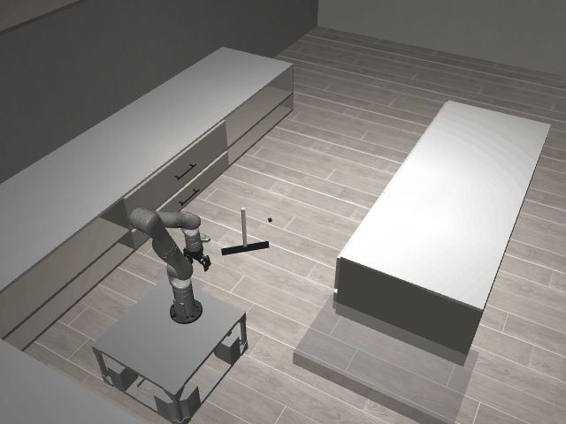

# SweepSimple3D-o1-sweep_the_blocks_to_the_left_side_of_the_kitchen_island

## Usage
```python
import kinder
env = kinder.make("kinder/SweepSimple3D-o1-sweep_the_blocks_to_the_left_side_of_the_kitchen_island-v0")
```

## Description
This variant uses the 'ground' scene type with 3 objects.

## Initial State Distribution


## Random Action Behavior


**Random Action Stats**: Total Reward: -0.25, Success: No, Steps: 25

## Example Demonstration
*(No demonstration GIFs available)*

## Observation Space
The entries of an array in this Box space correspond to the following object features:
| **Index** | **Object** | **Feature** |
| --- | --- | --- |
| 0 | cube_0 | x |
| 1 | cube_0 | y |
| 2 | cube_0 | z |
| 3 | cube_0 | qw |
| 4 | cube_0 | qx |
| 5 | cube_0 | qy |
| 6 | cube_0 | qz |
| 7 | cube_0 | vx |
| 8 | cube_0 | vy |
| 9 | cube_0 | vz |
| 10 | cube_0 | wx |
| 11 | cube_0 | wy |
| 12 | cube_0 | wz |
| 13 | cube_0 | bb_x |
| 14 | cube_0 | bb_y |
| 15 | cube_0 | bb_z |
| 16 | kitchen_cooking_area | x |
| 17 | kitchen_cooking_area | y |
| 18 | kitchen_cooking_area | z |
| 19 | kitchen_cooking_area | qw |
| 20 | kitchen_cooking_area | qx |
| 21 | kitchen_cooking_area | qy |
| 22 | kitchen_cooking_area | qz |
| 23 | kitchen_cooking_area_upper | x |
| 24 | kitchen_cooking_area_upper | y |
| 25 | kitchen_cooking_area_upper | z |
| 26 | kitchen_cooking_area_upper | qw |
| 27 | kitchen_cooking_area_upper | qx |
| 28 | kitchen_cooking_area_upper | qy |
| 29 | kitchen_cooking_area_upper | qz |
| 30 | kitchen_island | x |
| 31 | kitchen_island | y |
| 32 | kitchen_island | z |
| 33 | kitchen_island | qw |
| 34 | kitchen_island | qx |
| 35 | kitchen_island | qy |
| 36 | kitchen_island | qz |
| 37 | kitchen_left_corner | x |
| 38 | kitchen_left_corner | y |
| 39 | kitchen_left_corner | z |
| 40 | kitchen_left_corner | qw |
| 41 | kitchen_left_corner | qx |
| 42 | kitchen_left_corner | qy |
| 43 | kitchen_left_corner | qz |
| 44 | kitchen_left_side | x |
| 45 | kitchen_left_side | y |
| 46 | kitchen_left_side | z |
| 47 | kitchen_left_side | qw |
| 48 | kitchen_left_side | qx |
| 49 | kitchen_left_side | qy |
| 50 | kitchen_left_side | qz |
| 51 | robot | pos_base_x |
| 52 | robot | pos_base_y |
| 53 | robot | pos_base_rot |
| 54 | robot | pos_arm_joint1 |
| 55 | robot | pos_arm_joint2 |
| 56 | robot | pos_arm_joint3 |
| 57 | robot | pos_arm_joint4 |
| 58 | robot | pos_arm_joint5 |
| 59 | robot | pos_arm_joint6 |
| 60 | robot | pos_arm_joint7 |
| 61 | robot | pos_gripper |
| 62 | robot | vel_base_x |
| 63 | robot | vel_base_y |
| 64 | robot | vel_base_rot |
| 65 | robot | vel_arm_joint1 |
| 66 | robot | vel_arm_joint2 |
| 67 | robot | vel_arm_joint3 |
| 68 | robot | vel_arm_joint4 |
| 69 | robot | vel_arm_joint5 |
| 70 | robot | vel_arm_joint6 |
| 71 | robot | vel_arm_joint7 |
| 72 | robot | vel_gripper |
| 73 | wiper_0 | x |
| 74 | wiper_0 | y |
| 75 | wiper_0 | z |
| 76 | wiper_0 | qw |
| 77 | wiper_0 | qx |
| 78 | wiper_0 | qy |
| 79 | wiper_0 | qz |
| 80 | wiper_0 | vx |
| 81 | wiper_0 | vy |
| 82 | wiper_0 | vz |
| 83 | wiper_0 | wx |
| 84 | wiper_0 | wy |
| 85 | wiper_0 | wz |
| 86 | wiper_0 | bb_x |
| 87 | wiper_0 | bb_y |
| 88 | wiper_0 | bb_z |
