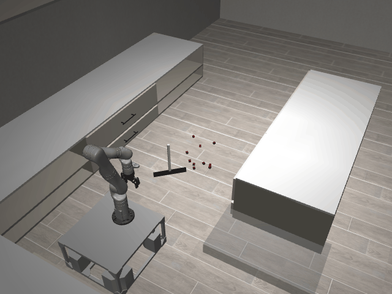

# SweepSimple3D-o10-sweep_the_blocks_to_the_left_side_of_the_kitchen_island

## Usage
```python
import kinder
env = kinder.make("kinder/SweepSimple3D-o10-sweep_the_blocks_to_the_left_side_of_the_kitchen_island-v0")
```

## Description
This variant uses the 'ground' scene type with 3 objects.

## Initial State Distribution


## Random Action Behavior


**Random Action Stats**: Total Reward: -0.25, Success: No, Steps: 25

## Example Demonstration
*(No demonstration GIFs available)*

## Observation Space
The entries of an array in this Box space correspond to the following object features:
| **Index** | **Object** | **Feature** |
| --- | --- | --- |
| 0 | cube_0 | x |
| 1 | cube_0 | y |
| 2 | cube_0 | z |
| 3 | cube_0 | qw |
| 4 | cube_0 | qx |
| 5 | cube_0 | qy |
| 6 | cube_0 | qz |
| 7 | cube_0 | vx |
| 8 | cube_0 | vy |
| 9 | cube_0 | vz |
| 10 | cube_0 | wx |
| 11 | cube_0 | wy |
| 12 | cube_0 | wz |
| 13 | cube_0 | bb_x |
| 14 | cube_0 | bb_y |
| 15 | cube_0 | bb_z |
| 16 | cube_1 | x |
| 17 | cube_1 | y |
| 18 | cube_1 | z |
| 19 | cube_1 | qw |
| 20 | cube_1 | qx |
| 21 | cube_1 | qy |
| 22 | cube_1 | qz |
| 23 | cube_1 | vx |
| 24 | cube_1 | vy |
| 25 | cube_1 | vz |
| 26 | cube_1 | wx |
| 27 | cube_1 | wy |
| 28 | cube_1 | wz |
| 29 | cube_1 | bb_x |
| 30 | cube_1 | bb_y |
| 31 | cube_1 | bb_z |
| 32 | cube_2 | x |
| 33 | cube_2 | y |
| 34 | cube_2 | z |
| 35 | cube_2 | qw |
| 36 | cube_2 | qx |
| 37 | cube_2 | qy |
| 38 | cube_2 | qz |
| 39 | cube_2 | vx |
| 40 | cube_2 | vy |
| 41 | cube_2 | vz |
| 42 | cube_2 | wx |
| 43 | cube_2 | wy |
| 44 | cube_2 | wz |
| 45 | cube_2 | bb_x |
| 46 | cube_2 | bb_y |
| 47 | cube_2 | bb_z |
| 48 | cube_3 | x |
| 49 | cube_3 | y |
| 50 | cube_3 | z |
| 51 | cube_3 | qw |
| 52 | cube_3 | qx |
| 53 | cube_3 | qy |
| 54 | cube_3 | qz |
| 55 | cube_3 | vx |
| 56 | cube_3 | vy |
| 57 | cube_3 | vz |
| 58 | cube_3 | wx |
| 59 | cube_3 | wy |
| 60 | cube_3 | wz |
| 61 | cube_3 | bb_x |
| 62 | cube_3 | bb_y |
| 63 | cube_3 | bb_z |
| 64 | cube_4 | x |
| 65 | cube_4 | y |
| 66 | cube_4 | z |
| 67 | cube_4 | qw |
| 68 | cube_4 | qx |
| 69 | cube_4 | qy |
| 70 | cube_4 | qz |
| 71 | cube_4 | vx |
| 72 | cube_4 | vy |
| 73 | cube_4 | vz |
| 74 | cube_4 | wx |
| 75 | cube_4 | wy |
| 76 | cube_4 | wz |
| 77 | cube_4 | bb_x |
| 78 | cube_4 | bb_y |
| 79 | cube_4 | bb_z |
| 80 | cube_5 | x |
| 81 | cube_5 | y |
| 82 | cube_5 | z |
| 83 | cube_5 | qw |
| 84 | cube_5 | qx |
| 85 | cube_5 | qy |
| 86 | cube_5 | qz |
| 87 | cube_5 | vx |
| 88 | cube_5 | vy |
| 89 | cube_5 | vz |
| 90 | cube_5 | wx |
| 91 | cube_5 | wy |
| 92 | cube_5 | wz |
| 93 | cube_5 | bb_x |
| 94 | cube_5 | bb_y |
| 95 | cube_5 | bb_z |
| 96 | cube_6 | x |
| 97 | cube_6 | y |
| 98 | cube_6 | z |
| 99 | cube_6 | qw |
| 100 | cube_6 | qx |
| 101 | cube_6 | qy |
| 102 | cube_6 | qz |
| 103 | cube_6 | vx |
| 104 | cube_6 | vy |
| 105 | cube_6 | vz |
| 106 | cube_6 | wx |
| 107 | cube_6 | wy |
| 108 | cube_6 | wz |
| 109 | cube_6 | bb_x |
| 110 | cube_6 | bb_y |
| 111 | cube_6 | bb_z |
| 112 | cube_7 | x |
| 113 | cube_7 | y |
| 114 | cube_7 | z |
| 115 | cube_7 | qw |
| 116 | cube_7 | qx |
| 117 | cube_7 | qy |
| 118 | cube_7 | qz |
| 119 | cube_7 | vx |
| 120 | cube_7 | vy |
| 121 | cube_7 | vz |
| 122 | cube_7 | wx |
| 123 | cube_7 | wy |
| 124 | cube_7 | wz |
| 125 | cube_7 | bb_x |
| 126 | cube_7 | bb_y |
| 127 | cube_7 | bb_z |
| 128 | cube_8 | x |
| 129 | cube_8 | y |
| 130 | cube_8 | z |
| 131 | cube_8 | qw |
| 132 | cube_8 | qx |
| 133 | cube_8 | qy |
| 134 | cube_8 | qz |
| 135 | cube_8 | vx |
| 136 | cube_8 | vy |
| 137 | cube_8 | vz |
| 138 | cube_8 | wx |
| 139 | cube_8 | wy |
| 140 | cube_8 | wz |
| 141 | cube_8 | bb_x |
| 142 | cube_8 | bb_y |
| 143 | cube_8 | bb_z |
| 144 | cube_9 | x |
| 145 | cube_9 | y |
| 146 | cube_9 | z |
| 147 | cube_9 | qw |
| 148 | cube_9 | qx |
| 149 | cube_9 | qy |
| 150 | cube_9 | qz |
| 151 | cube_9 | vx |
| 152 | cube_9 | vy |
| 153 | cube_9 | vz |
| 154 | cube_9 | wx |
| 155 | cube_9 | wy |
| 156 | cube_9 | wz |
| 157 | cube_9 | bb_x |
| 158 | cube_9 | bb_y |
| 159 | cube_9 | bb_z |
| 160 | kitchen_cooking_area | x |
| 161 | kitchen_cooking_area | y |
| 162 | kitchen_cooking_area | z |
| 163 | kitchen_cooking_area | qw |
| 164 | kitchen_cooking_area | qx |
| 165 | kitchen_cooking_area | qy |
| 166 | kitchen_cooking_area | qz |
| 167 | kitchen_cooking_area_upper | x |
| 168 | kitchen_cooking_area_upper | y |
| 169 | kitchen_cooking_area_upper | z |
| 170 | kitchen_cooking_area_upper | qw |
| 171 | kitchen_cooking_area_upper | qx |
| 172 | kitchen_cooking_area_upper | qy |
| 173 | kitchen_cooking_area_upper | qz |
| 174 | kitchen_island | x |
| 175 | kitchen_island | y |
| 176 | kitchen_island | z |
| 177 | kitchen_island | qw |
| 178 | kitchen_island | qx |
| 179 | kitchen_island | qy |
| 180 | kitchen_island | qz |
| 181 | kitchen_left_corner | x |
| 182 | kitchen_left_corner | y |
| 183 | kitchen_left_corner | z |
| 184 | kitchen_left_corner | qw |
| 185 | kitchen_left_corner | qx |
| 186 | kitchen_left_corner | qy |
| 187 | kitchen_left_corner | qz |
| 188 | kitchen_left_side | x |
| 189 | kitchen_left_side | y |
| 190 | kitchen_left_side | z |
| 191 | kitchen_left_side | qw |
| 192 | kitchen_left_side | qx |
| 193 | kitchen_left_side | qy |
| 194 | kitchen_left_side | qz |
| 195 | robot | pos_base_x |
| 196 | robot | pos_base_y |
| 197 | robot | pos_base_rot |
| 198 | robot | pos_arm_joint1 |
| 199 | robot | pos_arm_joint2 |
| 200 | robot | pos_arm_joint3 |
| 201 | robot | pos_arm_joint4 |
| 202 | robot | pos_arm_joint5 |
| 203 | robot | pos_arm_joint6 |
| 204 | robot | pos_arm_joint7 |
| 205 | robot | pos_gripper |
| 206 | robot | vel_base_x |
| 207 | robot | vel_base_y |
| 208 | robot | vel_base_rot |
| 209 | robot | vel_arm_joint1 |
| 210 | robot | vel_arm_joint2 |
| 211 | robot | vel_arm_joint3 |
| 212 | robot | vel_arm_joint4 |
| 213 | robot | vel_arm_joint5 |
| 214 | robot | vel_arm_joint6 |
| 215 | robot | vel_arm_joint7 |
| 216 | robot | vel_gripper |
| 217 | wiper_0 | x |
| 218 | wiper_0 | y |
| 219 | wiper_0 | z |
| 220 | wiper_0 | qw |
| 221 | wiper_0 | qx |
| 222 | wiper_0 | qy |
| 223 | wiper_0 | qz |
| 224 | wiper_0 | vx |
| 225 | wiper_0 | vy |
| 226 | wiper_0 | vz |
| 227 | wiper_0 | wx |
| 228 | wiper_0 | wy |
| 229 | wiper_0 | wz |
| 230 | wiper_0 | bb_x |
| 231 | wiper_0 | bb_y |
| 232 | wiper_0 | bb_z |
