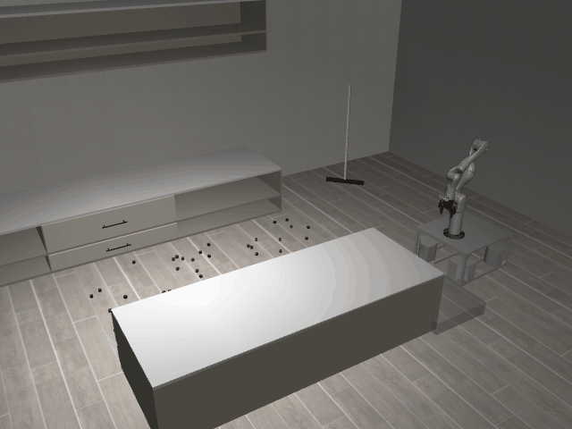

# SweepSimple3D-o50-sweep_the_blocks_to_the_right_side_of_the_kitchen_island

## Usage
```python
import kinder
env = kinder.make("kinder/SweepSimple3D-o50-sweep_the_blocks_to_the_right_side_of_the_kitchen_island-v0")
```

## Description
This variant uses the 'ground' scene type with 3 objects.

## Initial State Distribution


## Random Action Behavior


**Random Action Stats**: Total Reward: -0.25, Success: No, Steps: 25

## Example Demonstration
*(No demonstration GIFs available)*

## Observation Space
The entries of an array in this Box space correspond to the following object features:
| **Index** | **Object** | **Feature** |
| --- | --- | --- |
| 0 | cube_0 | x |
| 1 | cube_0 | y |
| 2 | cube_0 | z |
| 3 | cube_0 | qw |
| 4 | cube_0 | qx |
| 5 | cube_0 | qy |
| 6 | cube_0 | qz |
| 7 | cube_0 | vx |
| 8 | cube_0 | vy |
| 9 | cube_0 | vz |
| 10 | cube_0 | wx |
| 11 | cube_0 | wy |
| 12 | cube_0 | wz |
| 13 | cube_0 | bb_x |
| 14 | cube_0 | bb_y |
| 15 | cube_0 | bb_z |
| 16 | cube_1 | x |
| 17 | cube_1 | y |
| 18 | cube_1 | z |
| 19 | cube_1 | qw |
| 20 | cube_1 | qx |
| 21 | cube_1 | qy |
| 22 | cube_1 | qz |
| 23 | cube_1 | vx |
| 24 | cube_1 | vy |
| 25 | cube_1 | vz |
| 26 | cube_1 | wx |
| 27 | cube_1 | wy |
| 28 | cube_1 | wz |
| 29 | cube_1 | bb_x |
| 30 | cube_1 | bb_y |
| 31 | cube_1 | bb_z |
| 32 | cube_10 | x |
| 33 | cube_10 | y |
| 34 | cube_10 | z |
| 35 | cube_10 | qw |
| 36 | cube_10 | qx |
| 37 | cube_10 | qy |
| 38 | cube_10 | qz |
| 39 | cube_10 | vx |
| 40 | cube_10 | vy |
| 41 | cube_10 | vz |
| 42 | cube_10 | wx |
| 43 | cube_10 | wy |
| 44 | cube_10 | wz |
| 45 | cube_10 | bb_x |
| 46 | cube_10 | bb_y |
| 47 | cube_10 | bb_z |
| 48 | cube_11 | x |
| 49 | cube_11 | y |
| 50 | cube_11 | z |
| 51 | cube_11 | qw |
| 52 | cube_11 | qx |
| 53 | cube_11 | qy |
| 54 | cube_11 | qz |
| 55 | cube_11 | vx |
| 56 | cube_11 | vy |
| 57 | cube_11 | vz |
| 58 | cube_11 | wx |
| 59 | cube_11 | wy |
| 60 | cube_11 | wz |
| 61 | cube_11 | bb_x |
| 62 | cube_11 | bb_y |
| 63 | cube_11 | bb_z |
| 64 | cube_12 | x |
| 65 | cube_12 | y |
| 66 | cube_12 | z |
| 67 | cube_12 | qw |
| 68 | cube_12 | qx |
| 69 | cube_12 | qy |
| 70 | cube_12 | qz |
| 71 | cube_12 | vx |
| 72 | cube_12 | vy |
| 73 | cube_12 | vz |
| 74 | cube_12 | wx |
| 75 | cube_12 | wy |
| 76 | cube_12 | wz |
| 77 | cube_12 | bb_x |
| 78 | cube_12 | bb_y |
| 79 | cube_12 | bb_z |
| 80 | cube_13 | x |
| 81 | cube_13 | y |
| 82 | cube_13 | z |
| 83 | cube_13 | qw |
| 84 | cube_13 | qx |
| 85 | cube_13 | qy |
| 86 | cube_13 | qz |
| 87 | cube_13 | vx |
| 88 | cube_13 | vy |
| 89 | cube_13 | vz |
| 90 | cube_13 | wx |
| 91 | cube_13 | wy |
| 92 | cube_13 | wz |
| 93 | cube_13 | bb_x |
| 94 | cube_13 | bb_y |
| 95 | cube_13 | bb_z |
| 96 | cube_14 | x |
| 97 | cube_14 | y |
| 98 | cube_14 | z |
| 99 | cube_14 | qw |
| 100 | cube_14 | qx |
| 101 | cube_14 | qy |
| 102 | cube_14 | qz |
| 103 | cube_14 | vx |
| 104 | cube_14 | vy |
| 105 | cube_14 | vz |
| 106 | cube_14 | wx |
| 107 | cube_14 | wy |
| 108 | cube_14 | wz |
| 109 | cube_14 | bb_x |
| 110 | cube_14 | bb_y |
| 111 | cube_14 | bb_z |
| 112 | cube_15 | x |
| 113 | cube_15 | y |
| 114 | cube_15 | z |
| 115 | cube_15 | qw |
| 116 | cube_15 | qx |
| 117 | cube_15 | qy |
| 118 | cube_15 | qz |
| 119 | cube_15 | vx |
| 120 | cube_15 | vy |
| 121 | cube_15 | vz |
| 122 | cube_15 | wx |
| 123 | cube_15 | wy |
| 124 | cube_15 | wz |
| 125 | cube_15 | bb_x |
| 126 | cube_15 | bb_y |
| 127 | cube_15 | bb_z |
| 128 | cube_16 | x |
| 129 | cube_16 | y |
| 130 | cube_16 | z |
| 131 | cube_16 | qw |
| 132 | cube_16 | qx |
| 133 | cube_16 | qy |
| 134 | cube_16 | qz |
| 135 | cube_16 | vx |
| 136 | cube_16 | vy |
| 137 | cube_16 | vz |
| 138 | cube_16 | wx |
| 139 | cube_16 | wy |
| 140 | cube_16 | wz |
| 141 | cube_16 | bb_x |
| 142 | cube_16 | bb_y |
| 143 | cube_16 | bb_z |
| 144 | cube_17 | x |
| 145 | cube_17 | y |
| 146 | cube_17 | z |
| 147 | cube_17 | qw |
| 148 | cube_17 | qx |
| 149 | cube_17 | qy |
| 150 | cube_17 | qz |
| 151 | cube_17 | vx |
| 152 | cube_17 | vy |
| 153 | cube_17 | vz |
| 154 | cube_17 | wx |
| 155 | cube_17 | wy |
| 156 | cube_17 | wz |
| 157 | cube_17 | bb_x |
| 158 | cube_17 | bb_y |
| 159 | cube_17 | bb_z |
| 160 | cube_18 | x |
| 161 | cube_18 | y |
| 162 | cube_18 | z |
| 163 | cube_18 | qw |
| 164 | cube_18 | qx |
| 165 | cube_18 | qy |
| 166 | cube_18 | qz |
| 167 | cube_18 | vx |
| 168 | cube_18 | vy |
| 169 | cube_18 | vz |
| 170 | cube_18 | wx |
| 171 | cube_18 | wy |
| 172 | cube_18 | wz |
| 173 | cube_18 | bb_x |
| 174 | cube_18 | bb_y |
| 175 | cube_18 | bb_z |
| 176 | cube_19 | x |
| 177 | cube_19 | y |
| 178 | cube_19 | z |
| 179 | cube_19 | qw |
| 180 | cube_19 | qx |
| 181 | cube_19 | qy |
| 182 | cube_19 | qz |
| 183 | cube_19 | vx |
| 184 | cube_19 | vy |
| 185 | cube_19 | vz |
| 186 | cube_19 | wx |
| 187 | cube_19 | wy |
| 188 | cube_19 | wz |
| 189 | cube_19 | bb_x |
| 190 | cube_19 | bb_y |
| 191 | cube_19 | bb_z |
| 192 | cube_2 | x |
| 193 | cube_2 | y |
| 194 | cube_2 | z |
| 195 | cube_2 | qw |
| 196 | cube_2 | qx |
| 197 | cube_2 | qy |
| 198 | cube_2 | qz |
| 199 | cube_2 | vx |
| 200 | cube_2 | vy |
| 201 | cube_2 | vz |
| 202 | cube_2 | wx |
| 203 | cube_2 | wy |
| 204 | cube_2 | wz |
| 205 | cube_2 | bb_x |
| 206 | cube_2 | bb_y |
| 207 | cube_2 | bb_z |
| 208 | cube_20 | x |
| 209 | cube_20 | y |
| 210 | cube_20 | z |
| 211 | cube_20 | qw |
| 212 | cube_20 | qx |
| 213 | cube_20 | qy |
| 214 | cube_20 | qz |
| 215 | cube_20 | vx |
| 216 | cube_20 | vy |
| 217 | cube_20 | vz |
| 218 | cube_20 | wx |
| 219 | cube_20 | wy |
| 220 | cube_20 | wz |
| 221 | cube_20 | bb_x |
| 222 | cube_20 | bb_y |
| 223 | cube_20 | bb_z |
| 224 | cube_21 | x |
| 225 | cube_21 | y |
| 226 | cube_21 | z |
| 227 | cube_21 | qw |
| 228 | cube_21 | qx |
| 229 | cube_21 | qy |
| 230 | cube_21 | qz |
| 231 | cube_21 | vx |
| 232 | cube_21 | vy |
| 233 | cube_21 | vz |
| 234 | cube_21 | wx |
| 235 | cube_21 | wy |
| 236 | cube_21 | wz |
| 237 | cube_21 | bb_x |
| 238 | cube_21 | bb_y |
| 239 | cube_21 | bb_z |
| 240 | cube_22 | x |
| 241 | cube_22 | y |
| 242 | cube_22 | z |
| 243 | cube_22 | qw |
| 244 | cube_22 | qx |
| 245 | cube_22 | qy |
| 246 | cube_22 | qz |
| 247 | cube_22 | vx |
| 248 | cube_22 | vy |
| 249 | cube_22 | vz |
| 250 | cube_22 | wx |
| 251 | cube_22 | wy |
| 252 | cube_22 | wz |
| 253 | cube_22 | bb_x |
| 254 | cube_22 | bb_y |
| 255 | cube_22 | bb_z |
| 256 | cube_23 | x |
| 257 | cube_23 | y |
| 258 | cube_23 | z |
| 259 | cube_23 | qw |
| 260 | cube_23 | qx |
| 261 | cube_23 | qy |
| 262 | cube_23 | qz |
| 263 | cube_23 | vx |
| 264 | cube_23 | vy |
| 265 | cube_23 | vz |
| 266 | cube_23 | wx |
| 267 | cube_23 | wy |
| 268 | cube_23 | wz |
| 269 | cube_23 | bb_x |
| 270 | cube_23 | bb_y |
| 271 | cube_23 | bb_z |
| 272 | cube_24 | x |
| 273 | cube_24 | y |
| 274 | cube_24 | z |
| 275 | cube_24 | qw |
| 276 | cube_24 | qx |
| 277 | cube_24 | qy |
| 278 | cube_24 | qz |
| 279 | cube_24 | vx |
| 280 | cube_24 | vy |
| 281 | cube_24 | vz |
| 282 | cube_24 | wx |
| 283 | cube_24 | wy |
| 284 | cube_24 | wz |
| 285 | cube_24 | bb_x |
| 286 | cube_24 | bb_y |
| 287 | cube_24 | bb_z |
| 288 | cube_25 | x |
| 289 | cube_25 | y |
| 290 | cube_25 | z |
| 291 | cube_25 | qw |
| 292 | cube_25 | qx |
| 293 | cube_25 | qy |
| 294 | cube_25 | qz |
| 295 | cube_25 | vx |
| 296 | cube_25 | vy |
| 297 | cube_25 | vz |
| 298 | cube_25 | wx |
| 299 | cube_25 | wy |
| 300 | cube_25 | wz |
| 301 | cube_25 | bb_x |
| 302 | cube_25 | bb_y |
| 303 | cube_25 | bb_z |
| 304 | cube_26 | x |
| 305 | cube_26 | y |
| 306 | cube_26 | z |
| 307 | cube_26 | qw |
| 308 | cube_26 | qx |
| 309 | cube_26 | qy |
| 310 | cube_26 | qz |
| 311 | cube_26 | vx |
| 312 | cube_26 | vy |
| 313 | cube_26 | vz |
| 314 | cube_26 | wx |
| 315 | cube_26 | wy |
| 316 | cube_26 | wz |
| 317 | cube_26 | bb_x |
| 318 | cube_26 | bb_y |
| 319 | cube_26 | bb_z |
| 320 | cube_27 | x |
| 321 | cube_27 | y |
| 322 | cube_27 | z |
| 323 | cube_27 | qw |
| 324 | cube_27 | qx |
| 325 | cube_27 | qy |
| 326 | cube_27 | qz |
| 327 | cube_27 | vx |
| 328 | cube_27 | vy |
| 329 | cube_27 | vz |
| 330 | cube_27 | wx |
| 331 | cube_27 | wy |
| 332 | cube_27 | wz |
| 333 | cube_27 | bb_x |
| 334 | cube_27 | bb_y |
| 335 | cube_27 | bb_z |
| 336 | cube_28 | x |
| 337 | cube_28 | y |
| 338 | cube_28 | z |
| 339 | cube_28 | qw |
| 340 | cube_28 | qx |
| 341 | cube_28 | qy |
| 342 | cube_28 | qz |
| 343 | cube_28 | vx |
| 344 | cube_28 | vy |
| 345 | cube_28 | vz |
| 346 | cube_28 | wx |
| 347 | cube_28 | wy |
| 348 | cube_28 | wz |
| 349 | cube_28 | bb_x |
| 350 | cube_28 | bb_y |
| 351 | cube_28 | bb_z |
| 352 | cube_29 | x |
| 353 | cube_29 | y |
| 354 | cube_29 | z |
| 355 | cube_29 | qw |
| 356 | cube_29 | qx |
| 357 | cube_29 | qy |
| 358 | cube_29 | qz |
| 359 | cube_29 | vx |
| 360 | cube_29 | vy |
| 361 | cube_29 | vz |
| 362 | cube_29 | wx |
| 363 | cube_29 | wy |
| 364 | cube_29 | wz |
| 365 | cube_29 | bb_x |
| 366 | cube_29 | bb_y |
| 367 | cube_29 | bb_z |
| 368 | cube_3 | x |
| 369 | cube_3 | y |
| 370 | cube_3 | z |
| 371 | cube_3 | qw |
| 372 | cube_3 | qx |
| 373 | cube_3 | qy |
| 374 | cube_3 | qz |
| 375 | cube_3 | vx |
| 376 | cube_3 | vy |
| 377 | cube_3 | vz |
| 378 | cube_3 | wx |
| 379 | cube_3 | wy |
| 380 | cube_3 | wz |
| 381 | cube_3 | bb_x |
| 382 | cube_3 | bb_y |
| 383 | cube_3 | bb_z |
| 384 | cube_30 | x |
| 385 | cube_30 | y |
| 386 | cube_30 | z |
| 387 | cube_30 | qw |
| 388 | cube_30 | qx |
| 389 | cube_30 | qy |
| 390 | cube_30 | qz |
| 391 | cube_30 | vx |
| 392 | cube_30 | vy |
| 393 | cube_30 | vz |
| 394 | cube_30 | wx |
| 395 | cube_30 | wy |
| 396 | cube_30 | wz |
| 397 | cube_30 | bb_x |
| 398 | cube_30 | bb_y |
| 399 | cube_30 | bb_z |
| 400 | cube_31 | x |
| 401 | cube_31 | y |
| 402 | cube_31 | z |
| 403 | cube_31 | qw |
| 404 | cube_31 | qx |
| 405 | cube_31 | qy |
| 406 | cube_31 | qz |
| 407 | cube_31 | vx |
| 408 | cube_31 | vy |
| 409 | cube_31 | vz |
| 410 | cube_31 | wx |
| 411 | cube_31 | wy |
| 412 | cube_31 | wz |
| 413 | cube_31 | bb_x |
| 414 | cube_31 | bb_y |
| 415 | cube_31 | bb_z |
| 416 | cube_32 | x |
| 417 | cube_32 | y |
| 418 | cube_32 | z |
| 419 | cube_32 | qw |
| 420 | cube_32 | qx |
| 421 | cube_32 | qy |
| 422 | cube_32 | qz |
| 423 | cube_32 | vx |
| 424 | cube_32 | vy |
| 425 | cube_32 | vz |
| 426 | cube_32 | wx |
| 427 | cube_32 | wy |
| 428 | cube_32 | wz |
| 429 | cube_32 | bb_x |
| 430 | cube_32 | bb_y |
| 431 | cube_32 | bb_z |
| 432 | cube_33 | x |
| 433 | cube_33 | y |
| 434 | cube_33 | z |
| 435 | cube_33 | qw |
| 436 | cube_33 | qx |
| 437 | cube_33 | qy |
| 438 | cube_33 | qz |
| 439 | cube_33 | vx |
| 440 | cube_33 | vy |
| 441 | cube_33 | vz |
| 442 | cube_33 | wx |
| 443 | cube_33 | wy |
| 444 | cube_33 | wz |
| 445 | cube_33 | bb_x |
| 446 | cube_33 | bb_y |
| 447 | cube_33 | bb_z |
| 448 | cube_34 | x |
| 449 | cube_34 | y |
| 450 | cube_34 | z |
| 451 | cube_34 | qw |
| 452 | cube_34 | qx |
| 453 | cube_34 | qy |
| 454 | cube_34 | qz |
| 455 | cube_34 | vx |
| 456 | cube_34 | vy |
| 457 | cube_34 | vz |
| 458 | cube_34 | wx |
| 459 | cube_34 | wy |
| 460 | cube_34 | wz |
| 461 | cube_34 | bb_x |
| 462 | cube_34 | bb_y |
| 463 | cube_34 | bb_z |
| 464 | cube_35 | x |
| 465 | cube_35 | y |
| 466 | cube_35 | z |
| 467 | cube_35 | qw |
| 468 | cube_35 | qx |
| 469 | cube_35 | qy |
| 470 | cube_35 | qz |
| 471 | cube_35 | vx |
| 472 | cube_35 | vy |
| 473 | cube_35 | vz |
| 474 | cube_35 | wx |
| 475 | cube_35 | wy |
| 476 | cube_35 | wz |
| 477 | cube_35 | bb_x |
| 478 | cube_35 | bb_y |
| 479 | cube_35 | bb_z |
| 480 | cube_36 | x |
| 481 | cube_36 | y |
| 482 | cube_36 | z |
| 483 | cube_36 | qw |
| 484 | cube_36 | qx |
| 485 | cube_36 | qy |
| 486 | cube_36 | qz |
| 487 | cube_36 | vx |
| 488 | cube_36 | vy |
| 489 | cube_36 | vz |
| 490 | cube_36 | wx |
| 491 | cube_36 | wy |
| 492 | cube_36 | wz |
| 493 | cube_36 | bb_x |
| 494 | cube_36 | bb_y |
| 495 | cube_36 | bb_z |
| 496 | cube_37 | x |
| 497 | cube_37 | y |
| 498 | cube_37 | z |
| 499 | cube_37 | qw |
| 500 | cube_37 | qx |
| 501 | cube_37 | qy |
| 502 | cube_37 | qz |
| 503 | cube_37 | vx |
| 504 | cube_37 | vy |
| 505 | cube_37 | vz |
| 506 | cube_37 | wx |
| 507 | cube_37 | wy |
| 508 | cube_37 | wz |
| 509 | cube_37 | bb_x |
| 510 | cube_37 | bb_y |
| 511 | cube_37 | bb_z |
| 512 | cube_38 | x |
| 513 | cube_38 | y |
| 514 | cube_38 | z |
| 515 | cube_38 | qw |
| 516 | cube_38 | qx |
| 517 | cube_38 | qy |
| 518 | cube_38 | qz |
| 519 | cube_38 | vx |
| 520 | cube_38 | vy |
| 521 | cube_38 | vz |
| 522 | cube_38 | wx |
| 523 | cube_38 | wy |
| 524 | cube_38 | wz |
| 525 | cube_38 | bb_x |
| 526 | cube_38 | bb_y |
| 527 | cube_38 | bb_z |
| 528 | cube_39 | x |
| 529 | cube_39 | y |
| 530 | cube_39 | z |
| 531 | cube_39 | qw |
| 532 | cube_39 | qx |
| 533 | cube_39 | qy |
| 534 | cube_39 | qz |
| 535 | cube_39 | vx |
| 536 | cube_39 | vy |
| 537 | cube_39 | vz |
| 538 | cube_39 | wx |
| 539 | cube_39 | wy |
| 540 | cube_39 | wz |
| 541 | cube_39 | bb_x |
| 542 | cube_39 | bb_y |
| 543 | cube_39 | bb_z |
| 544 | cube_4 | x |
| 545 | cube_4 | y |
| 546 | cube_4 | z |
| 547 | cube_4 | qw |
| 548 | cube_4 | qx |
| 549 | cube_4 | qy |
| 550 | cube_4 | qz |
| 551 | cube_4 | vx |
| 552 | cube_4 | vy |
| 553 | cube_4 | vz |
| 554 | cube_4 | wx |
| 555 | cube_4 | wy |
| 556 | cube_4 | wz |
| 557 | cube_4 | bb_x |
| 558 | cube_4 | bb_y |
| 559 | cube_4 | bb_z |
| 560 | cube_40 | x |
| 561 | cube_40 | y |
| 562 | cube_40 | z |
| 563 | cube_40 | qw |
| 564 | cube_40 | qx |
| 565 | cube_40 | qy |
| 566 | cube_40 | qz |
| 567 | cube_40 | vx |
| 568 | cube_40 | vy |
| 569 | cube_40 | vz |
| 570 | cube_40 | wx |
| 571 | cube_40 | wy |
| 572 | cube_40 | wz |
| 573 | cube_40 | bb_x |
| 574 | cube_40 | bb_y |
| 575 | cube_40 | bb_z |
| 576 | cube_41 | x |
| 577 | cube_41 | y |
| 578 | cube_41 | z |
| 579 | cube_41 | qw |
| 580 | cube_41 | qx |
| 581 | cube_41 | qy |
| 582 | cube_41 | qz |
| 583 | cube_41 | vx |
| 584 | cube_41 | vy |
| 585 | cube_41 | vz |
| 586 | cube_41 | wx |
| 587 | cube_41 | wy |
| 588 | cube_41 | wz |
| 589 | cube_41 | bb_x |
| 590 | cube_41 | bb_y |
| 591 | cube_41 | bb_z |
| 592 | cube_42 | x |
| 593 | cube_42 | y |
| 594 | cube_42 | z |
| 595 | cube_42 | qw |
| 596 | cube_42 | qx |
| 597 | cube_42 | qy |
| 598 | cube_42 | qz |
| 599 | cube_42 | vx |
| 600 | cube_42 | vy |
| 601 | cube_42 | vz |
| 602 | cube_42 | wx |
| 603 | cube_42 | wy |
| 604 | cube_42 | wz |
| 605 | cube_42 | bb_x |
| 606 | cube_42 | bb_y |
| 607 | cube_42 | bb_z |
| 608 | cube_43 | x |
| 609 | cube_43 | y |
| 610 | cube_43 | z |
| 611 | cube_43 | qw |
| 612 | cube_43 | qx |
| 613 | cube_43 | qy |
| 614 | cube_43 | qz |
| 615 | cube_43 | vx |
| 616 | cube_43 | vy |
| 617 | cube_43 | vz |
| 618 | cube_43 | wx |
| 619 | cube_43 | wy |
| 620 | cube_43 | wz |
| 621 | cube_43 | bb_x |
| 622 | cube_43 | bb_y |
| 623 | cube_43 | bb_z |
| 624 | cube_44 | x |
| 625 | cube_44 | y |
| 626 | cube_44 | z |
| 627 | cube_44 | qw |
| 628 | cube_44 | qx |
| 629 | cube_44 | qy |
| 630 | cube_44 | qz |
| 631 | cube_44 | vx |
| 632 | cube_44 | vy |
| 633 | cube_44 | vz |
| 634 | cube_44 | wx |
| 635 | cube_44 | wy |
| 636 | cube_44 | wz |
| 637 | cube_44 | bb_x |
| 638 | cube_44 | bb_y |
| 639 | cube_44 | bb_z |
| 640 | cube_45 | x |
| 641 | cube_45 | y |
| 642 | cube_45 | z |
| 643 | cube_45 | qw |
| 644 | cube_45 | qx |
| 645 | cube_45 | qy |
| 646 | cube_45 | qz |
| 647 | cube_45 | vx |
| 648 | cube_45 | vy |
| 649 | cube_45 | vz |
| 650 | cube_45 | wx |
| 651 | cube_45 | wy |
| 652 | cube_45 | wz |
| 653 | cube_45 | bb_x |
| 654 | cube_45 | bb_y |
| 655 | cube_45 | bb_z |
| 656 | cube_46 | x |
| 657 | cube_46 | y |
| 658 | cube_46 | z |
| 659 | cube_46 | qw |
| 660 | cube_46 | qx |
| 661 | cube_46 | qy |
| 662 | cube_46 | qz |
| 663 | cube_46 | vx |
| 664 | cube_46 | vy |
| 665 | cube_46 | vz |
| 666 | cube_46 | wx |
| 667 | cube_46 | wy |
| 668 | cube_46 | wz |
| 669 | cube_46 | bb_x |
| 670 | cube_46 | bb_y |
| 671 | cube_46 | bb_z |
| 672 | cube_47 | x |
| 673 | cube_47 | y |
| 674 | cube_47 | z |
| 675 | cube_47 | qw |
| 676 | cube_47 | qx |
| 677 | cube_47 | qy |
| 678 | cube_47 | qz |
| 679 | cube_47 | vx |
| 680 | cube_47 | vy |
| 681 | cube_47 | vz |
| 682 | cube_47 | wx |
| 683 | cube_47 | wy |
| 684 | cube_47 | wz |
| 685 | cube_47 | bb_x |
| 686 | cube_47 | bb_y |
| 687 | cube_47 | bb_z |
| 688 | cube_48 | x |
| 689 | cube_48 | y |
| 690 | cube_48 | z |
| 691 | cube_48 | qw |
| 692 | cube_48 | qx |
| 693 | cube_48 | qy |
| 694 | cube_48 | qz |
| 695 | cube_48 | vx |
| 696 | cube_48 | vy |
| 697 | cube_48 | vz |
| 698 | cube_48 | wx |
| 699 | cube_48 | wy |
| 700 | cube_48 | wz |
| 701 | cube_48 | bb_x |
| 702 | cube_48 | bb_y |
| 703 | cube_48 | bb_z |
| 704 | cube_49 | x |
| 705 | cube_49 | y |
| 706 | cube_49 | z |
| 707 | cube_49 | qw |
| 708 | cube_49 | qx |
| 709 | cube_49 | qy |
| 710 | cube_49 | qz |
| 711 | cube_49 | vx |
| 712 | cube_49 | vy |
| 713 | cube_49 | vz |
| 714 | cube_49 | wx |
| 715 | cube_49 | wy |
| 716 | cube_49 | wz |
| 717 | cube_49 | bb_x |
| 718 | cube_49 | bb_y |
| 719 | cube_49 | bb_z |
| 720 | cube_5 | x |
| 721 | cube_5 | y |
| 722 | cube_5 | z |
| 723 | cube_5 | qw |
| 724 | cube_5 | qx |
| 725 | cube_5 | qy |
| 726 | cube_5 | qz |
| 727 | cube_5 | vx |
| 728 | cube_5 | vy |
| 729 | cube_5 | vz |
| 730 | cube_5 | wx |
| 731 | cube_5 | wy |
| 732 | cube_5 | wz |
| 733 | cube_5 | bb_x |
| 734 | cube_5 | bb_y |
| 735 | cube_5 | bb_z |
| 736 | cube_6 | x |
| 737 | cube_6 | y |
| 738 | cube_6 | z |
| 739 | cube_6 | qw |
| 740 | cube_6 | qx |
| 741 | cube_6 | qy |
| 742 | cube_6 | qz |
| 743 | cube_6 | vx |
| 744 | cube_6 | vy |
| 745 | cube_6 | vz |
| 746 | cube_6 | wx |
| 747 | cube_6 | wy |
| 748 | cube_6 | wz |
| 749 | cube_6 | bb_x |
| 750 | cube_6 | bb_y |
| 751 | cube_6 | bb_z |
| 752 | cube_7 | x |
| 753 | cube_7 | y |
| 754 | cube_7 | z |
| 755 | cube_7 | qw |
| 756 | cube_7 | qx |
| 757 | cube_7 | qy |
| 758 | cube_7 | qz |
| 759 | cube_7 | vx |
| 760 | cube_7 | vy |
| 761 | cube_7 | vz |
| 762 | cube_7 | wx |
| 763 | cube_7 | wy |
| 764 | cube_7 | wz |
| 765 | cube_7 | bb_x |
| 766 | cube_7 | bb_y |
| 767 | cube_7 | bb_z |
| 768 | cube_8 | x |
| 769 | cube_8 | y |
| 770 | cube_8 | z |
| 771 | cube_8 | qw |
| 772 | cube_8 | qx |
| 773 | cube_8 | qy |
| 774 | cube_8 | qz |
| 775 | cube_8 | vx |
| 776 | cube_8 | vy |
| 777 | cube_8 | vz |
| 778 | cube_8 | wx |
| 779 | cube_8 | wy |
| 780 | cube_8 | wz |
| 781 | cube_8 | bb_x |
| 782 | cube_8 | bb_y |
| 783 | cube_8 | bb_z |
| 784 | cube_9 | x |
| 785 | cube_9 | y |
| 786 | cube_9 | z |
| 787 | cube_9 | qw |
| 788 | cube_9 | qx |
| 789 | cube_9 | qy |
| 790 | cube_9 | qz |
| 791 | cube_9 | vx |
| 792 | cube_9 | vy |
| 793 | cube_9 | vz |
| 794 | cube_9 | wx |
| 795 | cube_9 | wy |
| 796 | cube_9 | wz |
| 797 | cube_9 | bb_x |
| 798 | cube_9 | bb_y |
| 799 | cube_9 | bb_z |
| 800 | kitchen_cooking_area | x |
| 801 | kitchen_cooking_area | y |
| 802 | kitchen_cooking_area | z |
| 803 | kitchen_cooking_area | qw |
| 804 | kitchen_cooking_area | qx |
| 805 | kitchen_cooking_area | qy |
| 806 | kitchen_cooking_area | qz |
| 807 | kitchen_cooking_area_upper | x |
| 808 | kitchen_cooking_area_upper | y |
| 809 | kitchen_cooking_area_upper | z |
| 810 | kitchen_cooking_area_upper | qw |
| 811 | kitchen_cooking_area_upper | qx |
| 812 | kitchen_cooking_area_upper | qy |
| 813 | kitchen_cooking_area_upper | qz |
| 814 | kitchen_island | x |
| 815 | kitchen_island | y |
| 816 | kitchen_island | z |
| 817 | kitchen_island | qw |
| 818 | kitchen_island | qx |
| 819 | kitchen_island | qy |
| 820 | kitchen_island | qz |
| 821 | kitchen_left_corner | x |
| 822 | kitchen_left_corner | y |
| 823 | kitchen_left_corner | z |
| 824 | kitchen_left_corner | qw |
| 825 | kitchen_left_corner | qx |
| 826 | kitchen_left_corner | qy |
| 827 | kitchen_left_corner | qz |
| 828 | kitchen_left_side | x |
| 829 | kitchen_left_side | y |
| 830 | kitchen_left_side | z |
| 831 | kitchen_left_side | qw |
| 832 | kitchen_left_side | qx |
| 833 | kitchen_left_side | qy |
| 834 | kitchen_left_side | qz |
| 835 | robot | pos_base_x |
| 836 | robot | pos_base_y |
| 837 | robot | pos_base_rot |
| 838 | robot | pos_arm_joint1 |
| 839 | robot | pos_arm_joint2 |
| 840 | robot | pos_arm_joint3 |
| 841 | robot | pos_arm_joint4 |
| 842 | robot | pos_arm_joint5 |
| 843 | robot | pos_arm_joint6 |
| 844 | robot | pos_arm_joint7 |
| 845 | robot | pos_gripper |
| 846 | robot | vel_base_x |
| 847 | robot | vel_base_y |
| 848 | robot | vel_base_rot |
| 849 | robot | vel_arm_joint1 |
| 850 | robot | vel_arm_joint2 |
| 851 | robot | vel_arm_joint3 |
| 852 | robot | vel_arm_joint4 |
| 853 | robot | vel_arm_joint5 |
| 854 | robot | vel_arm_joint6 |
| 855 | robot | vel_arm_joint7 |
| 856 | robot | vel_gripper |
| 857 | wiper_0 | x |
| 858 | wiper_0 | y |
| 859 | wiper_0 | z |
| 860 | wiper_0 | qw |
| 861 | wiper_0 | qx |
| 862 | wiper_0 | qy |
| 863 | wiper_0 | qz |
| 864 | wiper_0 | vx |
| 865 | wiper_0 | vy |
| 866 | wiper_0 | vz |
| 867 | wiper_0 | wx |
| 868 | wiper_0 | wy |
| 869 | wiper_0 | wz |
| 870 | wiper_0 | bb_x |
| 871 | wiper_0 | bb_y |
| 872 | wiper_0 | bb_z |
